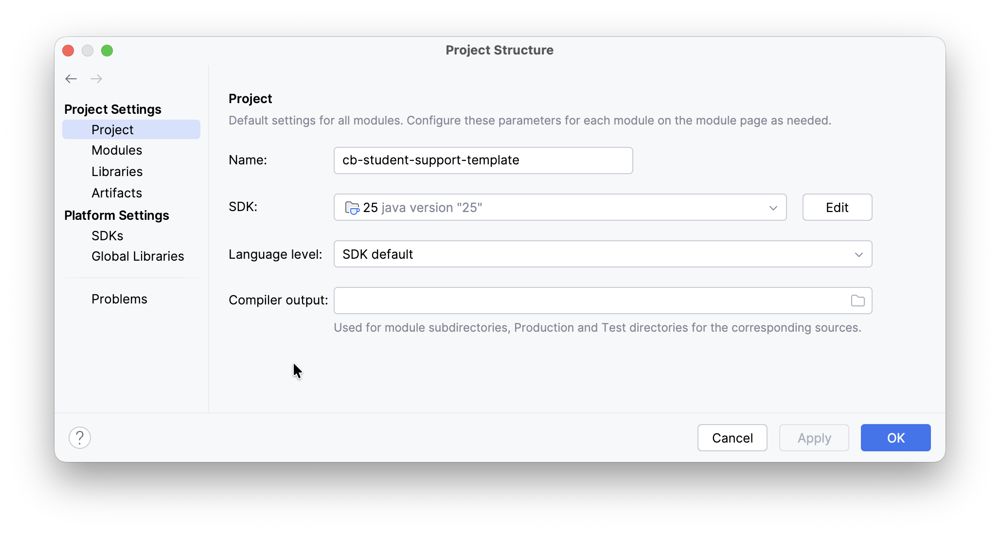
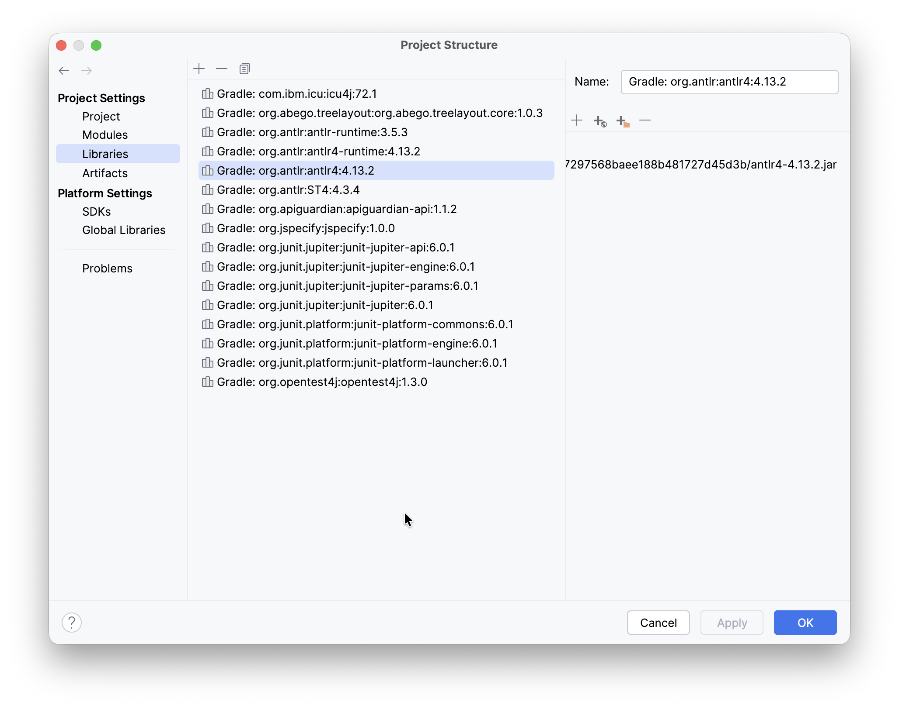
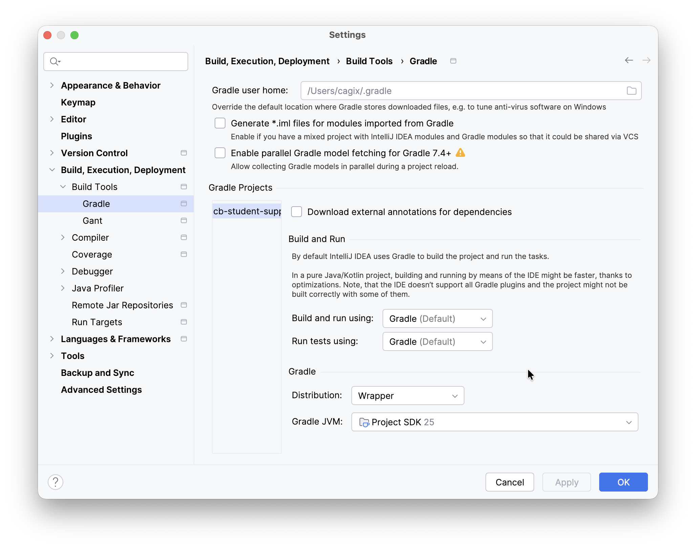

# Lexer mit ANTLR generieren

> [!IMPORTANT]
>
> <details open>
>
> <summary><strong>🎯 TL;DR</strong></summary>
>
> ANTLR ist ein Parser-Generator, der aus einer Grammatik einen Parser
> in verschiedenen Zielsprachen (Java, Python, C++, …) generieren kann.
>
> In der ANTLR-Grammatik werden die Parser-Regeln klein geschrieben, die
> Lexer-Regeln werden mit **Großbuchstaben** geschrieben. Jede
> Lexer-Regel liefert ein Token zurück, dabei ist der Tokenname die
> linke Seite der Regel. Wie bei Flex gewinnt der längste Match, und bei
> Gleichstand (mehrere längste Regeln matchen) gewinnt die zuerst
> definierte Regel.
>
> Die Lexer-Regeln können mit Aktionen annotiert werden, die beim
> Matchen der jeweiligen Regel abgearbeitet werden. Diese Aktionen
> müssen in der Zielprogrammiersprache formuliert werden, da sie in die
> generierte Lexerklasse in die jeweiligen Methoden eingebettet werden.
> </details>

> [!TIP]
>
> <details open>
>
> <summary><strong>🎦 Videos</strong></summary>
>
> - [VL Lexer mit ANTLR](https://youtu.be/dvx8RLirfp0)
> - [Demo ANTLR Basics](https://youtu.be/pbjGThqVLkU)
> - [Demo Verhalten Lexer-Regeln](https://youtu.be/vnJIm6S-898)
> - [Demo Lexer-Regeln mit Aktionen](https://youtu.be/bNpgqctiQM8)
>
> </details>

## Lexer: Erzeugen eines Token-Stroms aus einem Zeichenstrom

Aus dem Eingabe(-quell-)text

``` c
/* demo */
a= [5  , 6]     ;
```

erstellt der Lexer (oder auch Scanner genannt) eine Sequenz von Token:

    <ID, "a"> <ASSIGN> <LBRACK> <NUM, 5> <COMMA> <NUM, 6> <RBRACK> <SEMICOL>

- Input: Zeichenstrom (Eingabedatei o.ä.)
- Verarbeitung: Finden sinnvoller Sequenzen im Zeichenstrom (“Lexeme”),
  Einteilung in Kategorien und Erzeugen von Token (Paare: Typ/Name,
  Wert)
- Ausgabe: Tokenstrom

Normalerweise werden für spätere Phasen unwichtige Elemente wie
White-Space oder Kommentare entfernt.

Durch diese Vorverarbeitung wird eine höhere Abstraktionsstufe erreicht
und es können erste grobe Fehler gefunden werden. Dadurch kann der
Parser auf einer abstrakteren Stufe arbeiten und muss nicht mehr den
gesamten ursprünglichen Zeichenstrom verarbeiten.

*Anmerkung*: In dieser Phase steht die Geschwindigkeit stark im
Vordergrund: Der Lexer “sieht” *alle* Zeichen im Input. Deshalb findet
man häufig von Hand kodierte Lexer, obwohl die Erstellung der Lexer auch
durch Generatoren erledigt werden könnte …

*Anmerkung*: Die Token sind die Terminalsymbole in den Parserregeln
(Grammatik).

## Definition wichtiger Begriffe

- **Token**: Tupel (Tokenname, optional: Wert)

  Der Tokenname ist ein abstraktes Symbol, welches eine lexikalische
  Einheit repräsentiert (Kategorie). Die Tokennamen sind die
  Eingabesymbole für den Parser.

  Token werden i.d.R. einfach über ihren Namen referenziert. Token
  werden häufig zur Unterscheidung von anderen Symbolen in der Grammatik
  in Fettschrift oder mit großen Anfangsbuchstaben geschrieben.

  Ein Token kann einen Wert haben, etwa eine Zahl oder einen Bezeichner,
  der auf das zum Token gehörende Pattern gematcht hatte (also das
  Lexem). Wenn der Wert des Tokens eindeutig über den Namen bestimmt ist
  (im Beispiel oben beim Komma oder den Klammern), dann wird häufig auf
  den Wert verzichtet.

<!-- -->

- **Lexeme**: Sequenz von Zeichen im Eingabestrom, die auf ein
  Tokenpattern matcht und vom Lexer als Instanz dieses Tokens
  identifiziert wird.

<!-- -->

- **Pattern**: Beschreibung der Form eines Lexems

  Bei Schlüsselwörtern oder Klammern etc. sind dies die Schlüsselwörter
  oder Klammern selbst. Bei Zahlen oder Bezeichnern (Namen) werden
  i.d.R. reguläre Ausdrücke zur Beschreibung der Form des Lexems
  formuliert.

## Typische Muster für Erstellung von Token

1.  Schlüsselwörter

    - Ein eigenes Token (RE/DFA) für jedes Schlüsselwort, oder
    - Erkennung als Name (`ID`) und nachträglich Vergleich mit
      Wörterbuch sowie Korrektur des Tokentyps

    Wenn Schlüsselwörter über je ein eigenes Token abgebildet werden,
    benötigt man für jedes Schlüsselwort einen eigenen RE bzw. DFA. Die
    Erkennung als Bezeichner und das Nachschlagen in einem Wörterbuch
    (geeignete Hashtabelle) sowie die entsprechende nachträgliche
    Korrektur des Tokentyps kann die Anzahl der Zustände im Lexer
    signifikant reduzieren!

2.  Operatoren

    - Ein eigenes Token für jeden Operator, oder
    - Gemeinsames Token für jede Operatoren-Klasse

3.  Bezeichner: Ein gemeinsames Token für alle Namen

4.  Zahlen: Ein gemeinsames Token für alle numerischen Konstante (ggf.
    Integer und Float unterscheiden)

    Für Zahlen führt man oft ein Token “`NUM`” ein. Als Attribut
    speichert man das Lexem i.d.R. als String. Alternativ kann man
    (zusätzlich) das Lexem in eine Zahl konvertieren und als
    (zusätzliches) Attribut speichern. Dies kann in späteren Stufen viel
    Arbeit sparen.

5.  String-Literale: Ein gemeinsames Token

6.  Komma, Semikolon, Klammern, …: Je ein eigenes Token

7.  Regeln für White-Space und Kommentare etc. …

    Normalerweise benötigt man Kommentare und White-Spaces in den
    folgenden Stufen nicht und entfernt diese deshalb aus dem
    Eingabestrom. Dabei könnte man etwa White-Spaces in den Pattern der
    restlichen Token berücksichtigen, was die Pattern aber sehr komplex
    macht. Die Alternative sind zusätzliche Pattern, die auf die
    White-Space und anderen nicht benötigten Inhalt matchen und diesen
    “geräuschlos” entfernen. Mit diesen Pattern werden keine Token
    erzeugt, d.h. der Parser und die anderen Stufen bemerken nichts von
    diesem Inhalt.

    Gelegentlich benötigt man aber auch Informationen über White-Spaces,
    beispielsweise in Python. Dann müssen diese Token wie normale Token
    an den Parser weitergereicht werden.

Jedes Token hat i.d.R. ein Attribut, in dem das Lexem gespeichert wird.
Bei eindeutigen Token (etwa bei eigenen Token je Schlüsselwort oder bei
den Interpunktions-Token) kann man sich das Attribut auch sparen, da das
Lexem durch den Tokennamen eindeutig rekonstruierbar ist.

| Token | Beschreibung | Beispiel-Lexeme |
|:---|:---|:---|
| `if` | Zeichen `i` und `f` | `if` |
| `relop` | `<` oder `>` oder `<=` oder `>=` oder `==` oder `!=` | `<`, `<=` |
| `id` | Buchstabe, gefolgt von Buchstaben oder Ziffern | `pi`, `count`, `x3` |
| `num` | Numerische Konstante | `42`, `3.14159`, `0` |
| `literal` | Alle Zeichen außer `"`, in `"` eingeschlossen | `"core dumped"` |

*Anmerkung*: Wenn es mehrere matchende REs gibt, wird in der Regel das
längste Lexem bevorzugt. Wenn es mehrere gleich lange Alternativen gibt,
muss man mit Vorrangregeln bzgl. der Token arbeiten.

## “Hello World” mit ANTLR (Lexer)

``` antlr
grammar Hello;

start       : 'hello' GREETING ;

GREETING    : [a-zA-Z]+ ;
WHITESPACE  : [ \t\n]+ -> skip ;
```

<p align="right"><a href="https://github.com/Compiler-CampusMinden/CB-Vorlesung-Bachelor/blob/master/lecture/01-lexing/src/Hello.g4">Konsole: Hello (Classpath, Aliase, grun, Main, Dateien, Ausgabe)</a></p>

### Hinweis zur Grammatik (Regeln)

- `start` ist eine Parser-Regel =\> Eine Parser-Regel pro Grammatik wird
  benötigt, damit man den generierten Parser am Ende auch starten kann …
- Die anderen beiden Regeln (mit großem Anfangsbuchstaben) aus der
  obigen Grammatik zählen zum Lexer

### ANTLR einrichten

- Lokal für die Nutzung in der Konsole:

  - Es wird ein JDK benötigt. Installieren Sie am besten die aktuelle
    LTS-Version.
  - Aktuelle Version herunterladen:
    [antlr.org](https://www.antlr.org/download.html), für Java als
    Zielsprache: [“Complete ANTLR 4.x Java binaries
    jar”](https://www.antlr.org/download/antlr-4.13.2-complete.jar)
  - CLASSPATH setzen:
    `export CLASSPATH=".:/<pathToJar>/antlr-4.13.2-complete.jar:$CLASSPATH"`
  - Aliase einrichten (`.bashrc`):
    - `alias antlr='java org.antlr.v4.Tool'`
    - `alias grun='java org.antlr.v4.gui.TestRig'`

- Alternativ für Java-Projekte mit Gradle (empfehlenswert):

      plugins {
          id 'java'
          id 'antlr'
      }

      repositories {
          mavenCentral()
      }

      dependencies {
          antlr 'org.antlr:antlr4:4.13.2'
      }

  Der Eintrag in `plugins` sorgt dafür, dass Gradle beim Bauen des
  Java-Projekts die ANTLR-Grammatiken übersetzt, der Eintrag in
  `dependencies` lädt automatisch das Jar-File für ANTLR herunter und
  bindet es entsprechend im CLASSPATH ein.

- Alternativ das [ANTLR tool
  (JAR)](https://www.antlr.org/download/antlr-4.13.2-complete.jar)
  manuell herunterladen und in der IDE als Library hinzufügen (bitte nur
  als Hilfslösung, der Weg über das Build-Tool ist deutlich besser)

- Im Web ohne lokale Installation: [ANTLR Lab](http://lab.antlr.org/)
  (nur HTTP)

(vgl.
[github.com/antlr/antlr4/blob/master/doc/getting-started.md](https://github.com/antlr/antlr4/blob/master/doc/getting-started.md))

**Tip**: Für IntelliJ gibt es ein sehr gutes
[ANTLR-Plugin](https://plugins.jetbrains.com/plugin/7358-antlr-v4).
Dieses erlaubt das interaktive Experimentieren mit ANTLR-Grammatiken,
ohne dass man ANTLR selbst installiert haben muss oder Code geschrieben
haben muss. Für die Arbeit mit Grammatiken ist dieses Plugin unbedingt
empfehlenswert! (Für das normale Arbeiten sollten Sie aber die
Gradle-Konfiguration nutzen!)

**Hinweis**: Im Beispiel-Projekt
[student-support-code-template](https://github.com/Compiler-CampusMinden/student-support-code-template)
finden Sie ein fertig eingerichtetes Java-Projekt mit Gradle und ANTLR.
Sie können dieses Projekt als Template nutzen und in Ihrer IDE
importieren, d.h. Sie brauchen nur ein installiertes JDK (Version 25 ist
die aktuelle LTS) und eine Java-IDE, der Rest (Gradle, ANTLR) kommt über
die Einstellungen im Beispiel-Projekt. Durch die Gradle-Settings sollten
anschließend alle nötigen Einstellungen und Abhängigkeiten automatisch
in der IDE korrekt gesetzt bzw. aufgelöst werden. Im `Main.main()`
finden Sie eine kurze Demo, wie man einen generierten Lexer/Parser mit
einbindet und aufruft. Grammatiken können unter `src/main/antlr/`
abgelegt werden, wo sie automatisch vom ANTLR-Gradle-Plugin beim
Build-Prozess (`./gradlew build`) gefunden und bearbeitet werden. Die
daraus generierten ANTLR-Lexer und -Parser werden im Build-Ordner
`build/generated-src/antlr/main/` abgelegt und stehen in der IDE damit
automatisch zur Verfügung, ohne dass die generierten Dateien im
versionierten Source-Tree auftauchen und diesen “verschmutzen”.
**Wichtig**: So lange wie die generierten Dateien nicht erzeugt wurden,
zeigen die IDE für diese Klassen und Interfaces entsprechend Fehler an.
Ein Übersetzen des Projekts oder ein explizites
`./gradlew generateGrammarSource` generiert die fehlenden Dateien und
die Fehlermeldungen sollten verschwinden.

> [!IMPORTANT]
>
> **Hinweis**: Sorgen Sie dafür, dass Ihre IDE tatsächlich auch die
> **Projekteinstellungen von Gradle übernommen** hat und auch **mit
> Gradle baut**!
>
> 1.  Check, ob die **Projekteinstellungen** in IntelliJ passen:
>
>     1.  Menü `File > Project Structure > Project Settings > Project`
>         sollte für Ihr Projekt als SDK ein “Java 25” zeigen:
>
>         <picture><source media="(prefers-color-scheme: light)" srcset="images/ij-projectsettings-sdk_light.png"><source media="(prefers-color-scheme: dark)" srcset="images/ij-projectsettings-sdk_dark.png"></picture>
>
>     2.  Menü `File > Project Structure > Project Settings > Libraries`
>         sollte für Ihr Projekt Jar-Files für ANTLR4 zeigen:
>
>         <picture><source media="(prefers-color-scheme: light)" srcset="images/ij-projectsettings-libs_light.png"><source media="(prefers-color-scheme: dark)" srcset="images/ij-projectsettings-libs_dark.png"></picture>
>
> 2.  Check, ob **IntelliJ mit Gradle baut**:
>
>     Menü
>     `File > Settings > Build, Execution, Deployment > Build Tools > Gradle`
>     sollte auf Gradle umgestellt sein:
>
>     <picture><source media="(prefers-color-scheme: light)" srcset="images/ij-setting-gradlebuild_light.png"><source media="(prefers-color-scheme: dark)" srcset="images/ij-setting-gradlebuild_dark.png"></picture>
>
>     Unter **“Build & Run” sollte “Gradle”** ausgewählt sein, die
>     **“Distribution” sollte auf “Wrapper”** stehen, und als **“Gradle
>     JVM”** sollte die für das Projekt verwendete JVM eingestellt sein,
>     d.h. aktuell Java 25.
>
> Siehe auch
> [Compiler-CampusMinden/student-support-code-template](https://github.com/Compiler-CampusMinden/student-support-code-template/blob/master/README.md).

### “Hello World” übersetzen und ausführen

1.  Grammatik übersetzen und Code generieren: `antlr Hello.g4`
2.  Java-Code kompilieren: `javac *.java`
3.  Lexer ausführen:
    - `grun Hello start -tokens` (Grammatik “Hello”, Startregel “start”)

    - Alternativ mit kleinem Java-Programm:

      ``` java
      import org.antlr.v4.runtime.*;

      public class Main {
          public static void main(String[] args) throws Exception {
              CharStream input = CharStreams.fromString(IO.readln("?> "));
              Lexer l = new HelloLexer(input);
              Token t = l.nextToken();
              while (t.getType() != Token.EOF) {
                  System.out.println(t);
                  t = l.nextToken();
              }
          }
      }
      ```

### Generierte Dateien und Klassen

Nach dem Übersetzen finden sich folgende Dateien und Klassen vor:

    .
    |-- bin
    |   |-- HelloBaseListener.class
    |   |-- HelloBaseVisitor.class
    |   |-- HelloLexer.class
    |   |-- HelloListener.class
    |   |-- HelloParser.class
    |   |-- HelloParser$RContext.class
    |   |-- HelloVisitor.class
    |   |-- Main.class
    |-- Hello.g4
    |-- src
        |-- HelloBaseListener.java
        |-- HelloBaseVisitor.java
        |-- HelloLexer.java
        |-- HelloLexer.tokens
        |-- HelloListener.java
        |-- HelloParser.java
        |-- Hello.tokens
        |-- HelloVisitor.java
        |-- Main.java

*Anmerkung*: Die Ordnerstruktur wurde durch ein ANTLR-Plugin für Eclipse
erzeugt. Bei Ausführung in der Konsole liegen alle Dateien in einem
Ordner.

*Anmerkung*: Per Default werden nur die Listener angelegt, für die
Visitoren muss eine extra Option mitgegeben werden.

Die Dateien `Hello.tokens` und `HelloLexer.tokens` enthalten die Token
samt einer internen Nummer. (Der Inhalt beider Dateien ist identisch.)

Die Datei `HelloLexer.java` enthält den generierten Lexer, der eine
Spezialisierung der abstrakten Basisklasse `Lexer` darstellt. Über den
Konstruktor wird der zu scannende `CharStream` gesetzt. Über die Methode
`Lexer#nextToken()` kann man sich die erkannten Token der Reihe nach
zurückgeben lassen. (Diese Methode wird letztlich vom Parser benutzt.)

Die restlichen Dateien werden für den Parser und verschiedene Arten der
Traversierung des AST generiert (vgl. [AST-basierte
Interpreter](../06-interpretation/astdriven-part1.md)).

### Bedeutung der Ausgabe

Wenn man dem Hello-Lexer die Eingabe

    hello world
    <EOF>

(das `<EOF>` wird durch die Tastenkombination `STRG-D` erreicht) gibt,
dann lautet die Ausgabe

    $ grun Hello start -tokens
    hello world
    <EOF>
    [@0,0:4='hello',<'hello'>,1:0]
    [@1,6:10='world',<GREETING>,1:6]
    [@2,12:11='<EOF>',<EOF>,2:0]

Die erkannten Token werden jeweils auf einer eigenen Zeile ausgegeben.

- `@0`: Das erste Token (fortlaufend nummeriert, beginnend mit 0)
- `0:4`: Das Token umfasst die Zeichen 0 bis 4 im Eingabestrom
- `='hello'`: Das gefundene Lexem (Wert des Tokens)
- `<'hello'>`: Das Token (Name/Typ des Tokens)
- `1:0`: Das Token wurde in Zeile 1 gefunden (Start der Nummerierung mit
  Zeile 1), und startet in dieser Zeile an Position 0

Entsprechend bekommt man mit

    $ grun Hello start -tokens
    hello
      world

    <EOF>
    [@0,0:4='hello',<'hello'>,1:0]
    [@1,8:12='world',<GREETING>,2:2]
    [@2,15:14='<EOF>',<EOF>,4:0]

### ANTLR-Grammatik für die Lexer-Generierung

- Start der Grammatik mit dem Namen “`XYZ`” mit

      grammar XYZ;

  oder (nur Lexer)

      lexer grammar XYZ;

- Token und Lexer-Regeln starten mit *großen Anfangsbuchstaben*
  (Ausblick: Parser-Regeln starten mit kleinen Anfangsbuchstaben)

  Format: `TokenName : Alternative1 | ... | AlternativeN ;`

  Rekursive Lexer-Regeln sind erlaubt. **Achtung**: Es dürfen keine
  *links-rekursiven* Regeln genutzt werden, etwa wie `ID : ID '*' ID ;`
  … (Eine genauere Definition und die Transformation in
  nicht-linksrekursive Regeln siehe [CFG](../02-parsing/cfg.md)).

- Alle Literale werden in *einfache* Anführungszeichen eingeschlossen
  (es erfolgt keine Unterscheidung zwischen einzelnen Zeichen und
  Strings wie in anderen Sprachen)

- Zeichenmengen: `[a-z\n]` umfasst alle Zeichen von `'a'` bis `'z'`
  sowie `'\n'`

  `'a'..'z'` ist identisch zu `[a-z]`

- Schlüsselwörter: Die folgenden Strings stellen reservierte
  Schlüsselwörter dar und dürfen nicht als Token, Regel oder Label
  genutzt werden:

      import, fragment, lexer, parser, grammar, returns, locals, throws, catch, finally, mode, options, tokens

  *Anmerkung*: `rule` ist zwar kein Schlüsselwort, wird aber als
  Methodenname bei der Codegenerierung verwendet. =\> Wie ein
  Schlüsselwort behandeln!

(vgl.
[github.com/antlr/antlr4/blob/master/doc/lexicon.md](https://github.com/antlr/antlr4/blob/master/doc/lexicon.md))

### Greedy und Non-greedy Lexer-Regeln

Die regulären Ausdrücke `(...)?`, `(...)*` und `(...)+` sind *greedy*
und versuchen soviel Input wie möglich zu matchen.

Falls dies nicht sinnvoll sein sollte, kann man mit einem weiteren `?`
das Verhalten auf *non-greedy* umschalten. Allerdings können non-greedy
Regeln das Verhalten des Lexers u.U. schwer vorhersehbar machen!

Die Empfehlung ist, non-greedy Lexer-Regeln nur sparsam einzusetzen
(vgl.
[github.com/antlr/antlr4/blob/master/doc/wildcard.md](https://github.com/antlr/antlr4/blob/master/doc/wildcard.md)).

## Verhalten des Lexers

### 1. Längster Match

Primäres Ziel: Erkennen der längsten Zeichenkette

``` antlr
CHARS   : [a-z]+ ;
DIGITS  : [0-9]+ ;
FOO     : [a-z]+ [0-9]+ ;
```

Die Regel, die den längsten Match für die aktuelle Eingabesequenz
produziert, “gewinnt”.

Im Beispiel würde ein “foo42” als `FOO` erkannt und nicht als
`CHARS DIGITS`.

### 2. Reihenfolge

Reihenfolge in Grammatik definiert Priorität

``` antlr
FOO     : 'f' .*? 'r' ;
BAR     : 'foo' .*? 'bar' ;
```

Falls mehr als eine Lexer-Regel die selbe Inputsequenz matcht, dann hat
die in der Grammatik zuerst genannte Regel Priorität.

Im Beispiel würden für die Eingabe “foo42bar” beide Regeln den selben
längsten Match liefern - die Regel `FOO` ist in der Grammatik früher
definiert und “gewinnt”.

### 3. Non-greedy Regeln

Non-greedy Regeln versuchen *so wenig* Zeichen wie möglich zu matchen

``` antlr
FOO     : 'foo' .*? 'bar' ;
BAR     : 'bar' ;
```

Hier würde ein “foo42barbar” zu `FOO` gefolgt von `BAR` erkannt werden.

Achtung: Nach dem Abarbeiten einer non-greedy Sub-Regel in einer
Lexer-Regel gilt “*first match wins*”

`.*? ('4' | '42')`

=\> Der Teil `'42'` auf der rechten Seite ist “toter Code” (wegen der
non-greedy Sub-Regel `.*?`)!

Die Eingabe “x4” würde korrekt erkannt, währende “x42” nur als “x4”
erkannt wird und für die verbleibende “2” würde ein *token recognition
error* geworfen.

(vgl.
[github.com/antlr/antlr4/blob/master/doc/wildcard.md](https://github.com/antlr/antlr4/blob/master/doc/wildcard.md))

## Attribute und Aktionen

``` antlr
grammar Demo;

@header {
import java.util.*;
}

@members {
String s = "";
}

start   : TYPE ID '=' INT ';' ;

TYPE    : ('int' | 'float') {s = getText();} ;
INT     : [0-9]+            {System.out.println(s+":"+Integer.valueOf(getText()));};
ID      : [a-z]+            {setText(String.valueOf(getText().charAt(0)));} ;
WS      : [ \t\n]+ -> skip ;
```

### Attribute bei Token (Auswahl)

Token haben Attribute, die man abfragen kann. Dies umfasst u.a. folgende
Felder:

- `text`: Das gefundene Lexem als String
- `type`: Der Token-Typ als Integer
- `index`: Das wievielte Token (als Integer)

(vgl.
[github.com/antlr/antlr4/blob/master/doc/actions.md](https://github.com/antlr/antlr4/blob/master/doc/actions.md))

Zur Auswertung in den Lexer-Regeln muss man anders vorgehen als in
Parser-Regeln: Nach der Erstellung eines Tokens kann man die zum
Attribut gehörenden `getX()` und `setX()`-Methoden aufrufen, um die
Werte abzufragen oder zu ändern.

Dies passiert im obigen Beispiel für das Attribut `text`: Abfrage mit
`getText()`, Ändern/Setzen mit `setText()`.

Die Methodenaufrufe wirken sich immer auf das gerade erstellte Token
aus.

*Achtung*: Bei Aktionen in Parser-Regeln gelten andere Spielregeln!

### Aktionen mit den Lexer-Regeln

Aktionen für Lexer-Regeln sind Code-Blöcke in der Zielsprache,
eingeschlossen in geschweifte Klammern. Die Code-Blöcke werden direkt in
die generierten Lexer-Methoden kopiert.

Zusätzlich:

- `@header`: Package-Deklarationen und/oder Importe (wird vor der
  Klassendefinition eingefügt)
- `@members`: zusätzliche Attribute für die generierten Lexer- (und
  Parser-) Klassen.

Mit `@lexer::header` bzw. `@lexer::members` werden diese Codeblöcke nur
in den generierten Lexer eingefügt.

*Anmerkung*: Lexer-Aktionen müssen am Ende der äußersten Alternative
erscheinen. Wenn eine Lexer-Regel mehr als eine Alternative hat, müssen
diese in runde Klammern eingeschlossen werden.

(vgl.
[github.com/antlr/antlr4/blob/master/doc/grammars.md](https://github.com/antlr/antlr4/blob/master/doc/grammars.md))

## Wrap-Up

Lexer mit ANTLR generieren: Lexer-Regeln werden mit **Großbuchstaben**
geschrieben

- Längster Match gewinnt, Gleichstand: zuerst definierte Regel
- *non greedy*-Regeln: versuche so *wenig* Zeichen zu matchen wie
  möglich
- Aktionen beim Matchen

## 📖 Zum Nachlesen

- Parr ([2014](#ref-Parr2014))

> [!NOTE]
>
> <details>
>
> <summary><strong>✅ Lernziele</strong></summary>
>
> - k3: Ich kann Lexer-Regeln in ANTLR formulieren und einsetzen
> - k2: Ich kann das Verhalten des Lexers erklären, insbesondere längste
>   Matches und der Einfluss der Reihenfolge der Regeln
> - k3: Ich kann Lexer-Aktionen einsetzen
>
> </details>

> [!TIP]
>
> <details>
>
> <summary><strong>🏅 Challenges</strong></summary>
>
> **Token und Lexer-Regeln mit ANTLR**
>
> Formulieren Sie für ANTLR Lexer-Regeln, mit denen folgende Token
> erkannt werden:
>
> - White-Space: Leerzeichen, Tabs, Zeilenumbrüche
> - Vergleichsoperatoren: `<`, `>`, `<=`, `>=`, `==`, `<>`
> - If: `if`
> - Then: `then`
> - Else: `else`
> - Namen: Ein Buchstabe, gefolgt von beliebig vielen weiteren
>   Buchstaben und/oder Ziffern
> - Numerische Konstanten: Mindestens eine Ziffer, gefolgt von maximal
>   einem Paar bestehend aus einem Punkt und mindestens einer Ziffer,
>   gefolgt von maximal einem Paar bestehend aus dem Buchstaben “E”
>   gefolgt von einem “+” oder “-” und mindestens einer Ziffer.
>
> Formulieren Sie Hilfskonstrukte zur Verwendung in mehreren
> Lexer-Regeln als ANTLR-Fragmente.
>
> White-Spaces sollen entfernt werden und nicht als Token weitergereicht
> werden.
>
> **Real-World-Lexer mit ANTLR: Programmiersprache Lox**
>
> Betrachten Sie folgenden Code-Schnipsel in der Sprache
> [“Lox”](https://www.craftinginterpreters.com/the-lox-language.html):
>
>     fun fib(x) {
>         if (x == 0) {
>             return 0;
>         } else {
>             if (x == 1) {
>                 return 1;
>             } else {
>                 fib(x - 1) + fib(x - 2);
>             }
>         }
>     }
>
>     var wuppie = fib(4);
>
> Erstellen Sie für diese fiktive Sprache einen Lexer mit ANTLR. Die
> genauere Sprachdefinition finden Sie unter
> [craftinginterpreters.com/the-lox-language.html](https://www.craftinginterpreters.com/the-lox-language.html).
>
> **Pig-Latin mit ANTLR-Lexer**
>
> Schreiben Sie eine Lexer-Grammatik mit eingebetteten Aktionen für
> ANTLR sowie ein passendes Programm zur Einbindung des generierten
> Lexers, welches einen Text nach [Pig
> Latin](https://de.wikipedia.org/wiki/Pig_Latin) übersetzt:
>
> - Ist der erste Buchstabe eines Wortes ein Konsonant, schiebe ihn ans
>   Ende des Wortes und füge “ay” an.
> - Ist der erste Buchstabe eines Wortes ein Vokal, hänge an das Wort
>   ein “ay” an.
>
> **Lexing mit ANTLR**
>
> In einem Telefonbuch sind zeilenweise Namen und Telefonnummern
> gespeichert.
>
> Definieren Sie eine Lexer-Grammatik für ANTLR, mit der Sie die Zeilen
> einlesen können. Können Sie dabei verschiedene Formate der
> Telefonnummern berücksichtigen?
>
>     Heinz 030 5346 983
>     Kalle +49 30 1234 567
>     Lina +49.571.8385-255
>     Rosi (0571) 8385-268
>
> Können Sie die Grammatik so anpassen, dass Sie nur möglichst wenige
> verschiedene Token an den Parser weitergeben?
>
> Ergänzen Sie Ihre Grammatik um Lexer-Aktionen, so dass Sie die Zeilen,
> die Zeichen (in den Namen) und die Ziffern (in den Telefonnummern)
> zählen können.
>
> **Lexing mit ANTLR**
>
> IBAN für Deutschland bestehen aus dem Kürzel “DE” sowie einer
> zweistelligen Checksumme, gefolgt von 2x 4 Ziffern für die Bank
> (ehemalige Bankleitzahl) sowie 2x 4 Ziffern für die ehemalige
> Kontonummer sowie zwei weiteren Ziffern. Typisch sind zwei Formate:
>
> - Menschenlesbares Format: `DEcc bbbb bbbb kkkk kkkk xx`
> - Maschinenlesbares Format: `DEccbbbbbbbbkkkkkkkkxx`
>
> Definieren Sie eine Lexer-Grammatik für ANTLR, mit der Sie die
> verschiedenen IBAN-Formate für Deutschland einlesen können.
> </details>

------------------------------------------------------------------------

> [!NOTE]
>
> <details>
>
> <summary><strong>👀 Quellen</strong></summary>
>
> <div id="refs" class="references csl-bib-body hanging-indent">
>
> <div id="ref-Parr2014" class="csl-entry">
>
> Parr, T. 2014. *The Definitive ANTLR 4 Reference*. Pragmatic
> Bookshelf.
> <https://learning.oreilly.com/library/view/the-definitive-antlr/9781941222621/>.
>
> </div>
>
> </div>
>
> </details>

------------------------------------------------------------------------


Unless otherwise noted, this work is licensed under CC BY-SA 4.0.

<blockquote><p><sup><sub><strong>Last modified:</strong> 5b88ada (homework: remove Java as implementation language, 2025-11-19)<br></sub></sup></p></blockquote>
