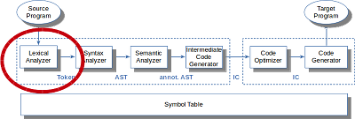

# Lexer: Handcodierte Implementierung

> [!IMPORTANT]
>
> <details open>
>
> <summary><strong>🎯 TL;DR</strong></summary>
>
> <picture><source media="(prefers-color-scheme: light)" srcset="images/architektur_cb_lexer_light.png"><source media="(prefers-color-scheme: dark)" srcset="images/architektur_cb_lexer_dark.png"></picture>
>
> Der Lexer (auch “Scanner”) soll den Zeichenstrom in eine Folge von
> Token zerlegen. Zur Spezifikation der Token werden reguläre Ausdrücke
> verwendet.
>
> Von Hand implementierte Lexer arbeiten üblicherweise rekursiv und
> verarbeiten immer das nächste Zeichen im Eingabestrom. Die
> Arbeitsweise erinnert an LL-Parser (vgl.
> [LL-Parser](../02-parsing/ll-parser-impl.md)).
>
> Lexer müssen sehr effizient sein, da sie noch direkt auf der
> niedrigsten Abstraktionsstufe arbeiten und u.U. oft durchlaufen
> werden. Deshalb setzt man hier gern spezielle Techniken wie Puffern
> von Zeichen über einen Doppel-Puffer ein.
>
> Die Palette an Fehlerbehandlungsstrategien im Lexer reichen von
> “aufgeben” über den “Panic Mode” (“gobbeln” von Zeichen, bis wieder
> eines passt) und Ein-Schritt-Transformationen bis hin zu speziellen
> Lexer-Regeln, die beispielsweise besonders häufige Typos abfangen.
> </details>

> [!TIP]
>
> <details open>
>
> <summary><strong>🎦 Videos</strong></summary>
>
> - [VL Handcodierte Lexer](https://youtu.be/N0WJQ4UkXkM)
>
> </details>

## Lexer: Erzeugen eines Token-Stroms aus einem Zeichenstrom

Aus dem Eingabe(-quell-)text

``` c
/* demo */
a= [5  , 6]     ;
```

erstellt der Lexer (oder auch Scanner genannt) eine Sequenz von Token:

    <ID, "a"> <ASSIGN> <LBRACK> <NUM, 5> <COMMA> <NUM, 6> <RBRACK> <SEMICOL>

## Manuelle Implementierung: Rekursiver Abstieg

``` python
def nextToken():
    while (peek != EOF):  # globale Variable, über consume()
        switch (peek):
            case ' ': case '\t': case '\n': WS(); continue
            case '[': consume(); return Token(LBRACK, '[')
            ...
            default:
                if isLetter(peek): return NAME()
                raise Error("invalid character: "+peek)
    return Token(EOF_Type, "<EOF>")

def WS():
    while (peek == ' ' || peek == '\t' || ...): consume()

def NAME():
    buf = StringBuilder()
    do { buf.append(peek); consume(); } while (isLetter(peek))
    return Token(NAME, buf.toString())
```

Die manuelle Implementierung “denkt” nicht in den Zuständen des DFA,
sondern orientiert sich immer am aktuellen Zeichen “`peek`”. Abhängig
von dessen Ausprägung wird entweder direkt ein Token erzeugt und das
Zeichen aus dem Eingabestrom entfernt sowie das nächste Zeichen
eingelesen (mittels der Funktion `consume()`, nicht dargestellt im
Beispiel), oder man ruft weitere Funktionen auf, die das Gewünschte
erledigen, beispielsweise um White-Spaces zu entfernen oder um einen
Namen einzulesen: Nach einem Buchstaben werden alle folgenden Buchstaben
dem Namen (Bezeichner) hinzugefügt. Sobald ein anderes Zeichen im
Eingabestrom erscheint, wird das Namen-Token erzeugt.

Die Funktion `consume()` “verbraucht” das aktuelle Zeichen “`peek`” und
holt das nächste Zeichen aus dem Eingabestrom.

*Anmerkung*: Häufig findet man im Lexer keinen “schönen”
objektorientierten Ansatz. Dies ist i.d.R. Geschwindigkeitsgründen
geschuldet …

## Read-Ahead: Unterscheiden von “*\<*” und “*\<=*”

``` python
def nextToken():
    while (peek != EOF):  # globale Variable
        switch (peek):
            case '<':
                if match('='): consume(); return Token(LE, "<=")
                else: consume(); return Token(LESS, '<')
            ...
    return Token(EOF_Type, "<EOF>")

def match(c):   # Lookahead: Ein Zeichen
    consume()
    if (peek == c): return True
    else: rollBack(); return False
```

Um die Token “`<`” und “`<=`” unterscheiden zu können, müssen wir ein
Zeichen vorausschauen: Wenn nach dem “`<`” noch ein “`=`” kommt, ist es
“`<=`”, sonst “`<`”.

Erinnerung: Die Funktion `consume()` liest das nächste Zeichen aus dem
Eingabestrom und speichert den Wert in der globalen Variable `peek`.

Für das Read-Ahead wird die Funktion `match()` definiert, die zunächst
das bereits bekannte Zeichen, in diesem Fall das “`<`” durch das nächste
Zeichen im Eingabestrom ersetzt (Aufruf von `consume()`). Falls der
Vergleich des Lookahead-Zeichens mit dem gesuchten Zeichen erfolgreich
ist, liegt das “größere” Token vor, also “`<=`”. Dann wird noch das
“`=`” durch das nächste Zeichen ersetzt und das Token `LE` gebildet.
Anderenfalls muss das zuviel gelesene Zeichen wieder in den Eingabestrom
zurückgelegt werden (`rollBack()`).

## Puffern des Input-Stroms: Double Buffering

Das Einlesen einzelner Zeichen führt zwar zu eleganten algorithmischen
Lösungen, ist aber zur Laufzeit deutlich “teurer” als das Einlesen mit
gepufferten I/O-Operationen, die eine ganze Folge von Zeichen einlesen
(typischerweise einen ganzen Disk-Block, beispielsweise 4096 Zeichen).

Dazu kann man einen Ringpuffer nutzen, den man mit Hilfe von zwei gleich
großen `char`-Puffern mit jeweils der Länge $`N`$ simulieren kann.
($`N`$ sollte dann der Länge eines Disk-Blocks entsprechen.)

Vergleiche auch [Wikipedia: “Circular
Buffer”](https://en.wikipedia.org/wiki/Circular_buffer).

<picture><source media="(prefers-color-scheme: light)" srcset="images/doublebuffer_light.png"><source media="(prefers-color-scheme: dark)" srcset="images/doublebuffer_dark.png"></picture>

``` python
start = 0; end = 0; fill(buffer[0:n])

def consume():
    peek = buffer[start]
    start = (start+1) mod 2n
    if (start mod n == 0):
        fill(buffer[start:start+n-1])
        end = (start+n) mod 2n

def rollBack():
    if (start == end): raise Error("roll back error")
    start = (start-1) mod 2n
```

Zunächst wird nur der vordere Pufferteil durch einen passenden
Systemaufruf gefüllt.

Beim Weiterschalten im simulierten DFA oder im manuell kodierten Lexer
(Funktionsaufruf von `consume()`) wird das nächste Zeichen aus dem
vorderen Pufferteil zurückgeliefert. Über die Modulo-Operation bleibt
der Pointer `start` immer im Speicherbereich der beiden Puffer.

Wenn man das Ende des vorderen Puffers erreicht, wird der hintere Puffer
mit einem Systemaufruf gefüllt. Gleichzeitig wird ein Hilfspointer `end`
auf den Anfang des vorderen Puffers gesetzt, um Fehler beim Roll-Back zu
erkennen.

Wenn man das Ende des hinteren Puffers erreicht, wird der vordere Puffer
nachgeladen und der Hilfspointer auf den Anfang des hinteren Puffers
gesetzt.

Im Grunde ist also immer ein Puffer der “Arbeitspuffer” und der andere
enthält die bereits gelesene (verarbeitete) Zeichenkette. Wenn beim
Nachladen weniger als $`N`$ Zeichen gelesen werden, liefert der
Systemaufruf als letztes “Zeichen” ein `EOF`. Beim Verarbeiten wird
`peek` entsprechend diesen Wert bekommen und der Lexer muss diesen Wert
abfragen und berücksichtigen.

Für das Roll-Back wird der `start`-Pointer einfach dekrementiert (und
mit einer Modulo-Operation auf den Speicherbereich der beiden Puffer
begrenzt). Falls dabei der `end`-Pointer “eingeholt” wird, ist der
`start`-Pointer durch beide Puffer zurückgelaufen und es gibt keinen
früheren Input mehr. In diesem Fall wird entsprechend ein Fehler
gemeldet.

*Anmerkung*: In der Regel sind die Lexeme kurz und man muss man nur ein
bis zwei Zeichen im Voraus lesen. Dann ist eine Puffergröße von 4096
Zeichen mehr als ausreichend groß und man sollte nicht in Probleme
laufen. Wenn der nötige Look-Ahead aber beliebig groß werden kann, etwa
bei Sprachen ohne reservierte Schlüsselwörtern oder bei
Kontext-sensitiven Lexer-Grammatiken (denken Sie etwa an die
Einrücktiefe bei Python), muss man andere Strategien verwenden. ANTLR
beispielsweise vergrößert in diesem Fall den Puffer dynamisch,
alternativ könnte man die Auflösung zwischen Schlüsselwörtern und
Bezeichnern dem Parser überlassen.

## Typische Muster für Erstellung von Token

1.  Schlüsselwörter

    - Ein eigenes Token (RE/DFA) für jedes Schlüsselwort, oder
    - Erkennung als Name (`ID`) und nachträglich Vergleich mit
      Wörterbuch sowie Korrektur des Tokentyps

    Wenn Schlüsselwörter über je ein eigenes Token abgebildet werden,
    benötigt man für jedes Schlüsselwort einen eigenen RE bzw. DFA. Die
    Erkennung als Bezeichner und das Nachschlagen in einem Wörterbuch
    (geeignete Hashtabelle) sowie die entsprechende nachträgliche
    Korrektur des Tokentyps kann die Anzahl der Zustände im Lexer
    signifikant reduzieren!

2.  Operatoren

    - Ein eigenes Token für jeden Operator, oder
    - Gemeinsames Token für jede Operatoren-Klasse

3.  Bezeichner: Ein gemeinsames Token für alle Namen

4.  Zahlen: Ein gemeinsames Token für alle numerischen Konstante (ggf.
    Integer und Float unterscheiden)

    Für Zahlen führt man oft ein Token “`NUM`” ein. Als Attribut
    speichert man das Lexem i.d.R. als String. Alternativ kann man
    (zusätzlich) das Lexem in eine Zahl konvertieren und als
    (zusätzliches) Attribut speichern. Dies kann in späteren Stufen viel
    Arbeit sparen.

5.  String-Literale: Ein gemeinsames Token

6.  Komma, Semikolon, Klammern, …: Je ein eigenes Token

7.  Regeln für White-Space und Kommentare etc. …

    Normalerweise benötigt man Kommentare und White-Spaces in den
    folgenden Stufen nicht und entfernt diese deshalb aus dem
    Eingabestrom. Dabei könnte man etwa White-Spaces in den Pattern der
    restlichen Token berücksichtigen, was die Pattern aber sehr komplex
    macht. Die Alternative sind zusätzliche Pattern, die auf die
    White-Space und anderen nicht benötigten Inhalt matchen und diesen
    “geräuschlos” entfernen. Mit diesen Pattern werden keine Token
    erzeugt, d.h. der Parser und die anderen Stufen bemerken nichts von
    diesem Inhalt.

    Gelegentlich benötigt man aber auch Informationen über White-Spaces,
    beispielsweise in Python. Dann müssen diese Token wie normale Token
    an den Parser weitergereicht werden.

Jedes Token hat i.d.R. ein Attribut, in dem das Lexem gespeichert wird.
Bei eindeutigen Token (etwa bei eigenen Token je Schlüsselwort oder bei
den Interpunktions-Token) kann man sich das Attribut auch sparen, da das
Lexem durch den Tokennamen eindeutig rekonstruierbar ist.

| Token | Beschreibung | Beispiel-Lexeme |
|:---|:---|:---|
| `if` | Zeichen `i` und `f` | `if` |
| `relop` | `<` oder `>` oder `<=` oder `>=` oder `==` oder `!=` | `<`, `<=` |
| `id` | Buchstabe, gefolgt von Buchstaben oder Ziffern | `pi`, `count`, `x3` |
| `num` | Numerische Konstante | `42`, `3.14159`, `0` |
| `literal` | Alle Zeichen außer `"`, in `"` eingeschlossen | `"core dumped"` |

*Anmerkung*: Wenn es mehrere matchende REs gibt, wird in der Regel das
längste Lexem bevorzugt. Wenn es mehrere gleich lange Alternativen gibt,
muss man mit Vorrangregeln bzgl. der Token arbeiten.

## Fehler bei der Lexikalischen Analyse

Problem: Eingabestrom sieht so aus: `fi (a==42) { ... }`

Der Lexer kann nicht erkennen, ob es sich bei `fi` um ein vertipptes
Schlüsselwort handelt oder um einen Bezeichner: Es könnte sich um einen
Funktionsaufruf der Funktion `fi()` handeln … Dieses Problem kann erst
in der nächsten Stufe sinnvoll erkannt und behoben werden.

=\> Was tun, wenn keines der Pattern auf den Anfang des Eingabestroms
passt?

Optionen:

- Aufgeben …

  Eventuell vielleicht sogar die beste und einfachste Variante :-)

<!-- -->

- “Panic Mode”: Entferne so lange Zeichen, bis ein Pattern passt.

  Das verwirrt u.U. den Parser, kann aber insbesondere in interaktiven
  Umgebungen hilfreich sein. Ggf. kann man dem Parser auch
  signalisieren, dass hier ein Problem vorlag.

<!-- -->

- Ein-Schritt-Transformationen:
  - Füge fehlendes Zeichen in Eingabestrom ein.
  - Entferne ein Zeichen aus Eingabestrom.
  - Vertausche ein Zeichen:
    - Ersetze ein Zeichen durch ein anderes.
    - Vertausche zwei benachbarte Zeichen.

  Diese Transformationen versuchen, den Input in einem Schritt zu
  reparieren. Das ist durchaus sinnvoll, da in der Praxis die meisten
  Fehler in dieser Stufe durch ein einzelnes Zeichen hervorgerufen
  werden: Es fehlt ein Zeichen oder es ist eines zuviel im Input. Es
  liegt ein falsches Zeichen vor (Tippfehler) oder zwei benachbarte
  Zeichen wurden verdreht …

  Im Prinzip könnte man auch eine allgemeinere Strategie versuchen,
  indem man diejenige Transformation mit der *kleinsten Anzahl von
  Schritten* zur Fehlerbehebung bestimmt. Beispiele dafür finden sich im
  Bereich Natural Language Processing (*NLP*), etwa die
  Levenshtein-Distanz oder der SoundEx-Algorithmus oder sogar
  Hidden-Markov-Modelle. Allerdings muss man sich in Erinnerung rufen,
  dass gerade in dieser ersten Phase eines Compilers die Geschwindigkeit
  stark im Fokus steht und eine ausgefeilte Fehlerkorrekturstrategie die
  vielen kleinen Optimierungen schnell wieder zunichte machen kann.

<!-- -->

- Fehler-Regeln: Matche typische Typos

  Gelegentlich findet man in den Grammatiken für den Lexer extra Regeln,
  die häufige bzw. typische Typos matchen und dann passend darauf
  reagieren.

## Wrap-Up

- Zusammenhang DFA, RE und Lexer

<!-- -->

- Implementierungsansatz: Manuell codiert (rekursiver Abstieg)

<!-- -->

- Read-Ahead
- Puffern mit Doppel-Puffer-Strategie

<!-- -->

- Typische Fehler beim Scannen

## 📖 Zum Nachlesen

- Nystrom ([2021](#ref-Nystrom2021)): Kapitel 4
- Parr ([2010](#ref-Parr2010)): Kapitel 2 (“Pattern 2: LL(1)
  Recursive-Decent Lexer”)

> [!NOTE]
>
> <details>
>
> <summary><strong>✅ Lernziele</strong></summary>
>
> - k1: Ich kenne die Aufgaben eines Lexers
> - k2: Ich kann die manuelle Implementierung eines Lexers mit Hilfe von
>   rekursivem Abstieg erklären
> - k2: Ich kann den Umgang mit dem Doppel-Puffer erklären
> - k2: Ich kann die Varianten bei der Erkennung von Schlüsselwörtern an
>   einem Beispiel verdeutlichen
> - k2: Ich kann typische Fehler und Lösungsansätze in der lexikalischen
>   Analyse erklären
> - k3: Ich kann für ein Problem eine typische Einteilung von Token
>   vornehmen
> - k3: Ich kann einen Top-Down-Lexer mit Read-Ahead und intelligenter
>   Pufferung implementieren
>
> </details>

> [!TIP]
>
> <details>
>
> <summary><strong>🏅 Challenges</strong></summary>
>
> **Manuell implementierter Lexer**
>
> Betrachten Sie die folgende einfache Sprache:
>
>     a = 10 - 5     # Zuweisung des Ausdruckes 10-5 (Integer-Wert 5) an Variable a
>     b = a + 2 * 3  # Zuweisung von 16 an Variable b
>     c = a != b     # Zuweisung eines boolschen Werts an c
>
> Es gibt nur Statements und Expressions:
>
> - Statement: Zuweisung; jedes Statement endet mit einem NL
> - Expression: Zahl, Variable, Addition, Subtraktion, Multiplikation
>   (mit üblichem Vorrang), Vergleich
>
> **Aufgaben**:
>
> - Geben Sie eine ANTLR-Grammatik für diese Sprache an.
> - Implementieren Sie analog zum Vorgehen in der Vorlesung einen Lexer
>   für diese Sprache. (Nur den Lexer, den Parser besprechen wir in
>   einer anderen [Sitzung](../02-parsing/ll-parser-impl.md).)
>
> </details>

------------------------------------------------------------------------

> [!NOTE]
>
> <details>
>
> <summary><strong>👀 Quellen</strong></summary>
>
> <div id="refs" class="references csl-bib-body hanging-indent">
>
> <div id="ref-Nystrom2021" class="csl-entry">
>
> Nystrom, R. 2021. *Crafting Interpreters*. Genever Benning.
> <https://github.com/munificent/craftinginterpreters>.
>
> </div>
>
> <div id="ref-Parr2010" class="csl-entry">
>
> Parr, T. 2010. *Language Implementation Patterns*. Pragmatic
> Bookshelf.
> <https://learning.oreilly.com/library/view/language-implementation-patterns/9781680500097/>.
>
> </div>
>
> </div>
>
> </details>

------------------------------------------------------------------------


Unless otherwise noted, this work is licensed under CC BY-SA 4.0.

<blockquote><p><sup><sub><strong>Last modified:</strong> ce96fcd (lecture: fix readings (LL Lexer), 2025-10-20)<br></sub></sup></p></blockquote>
