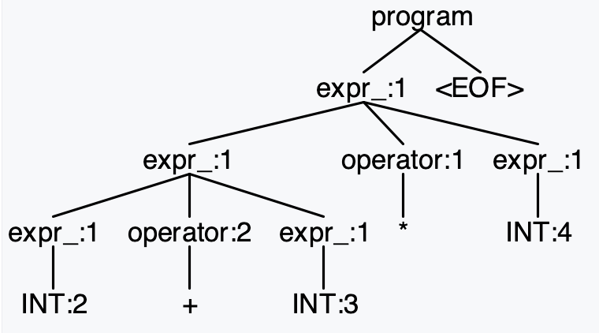
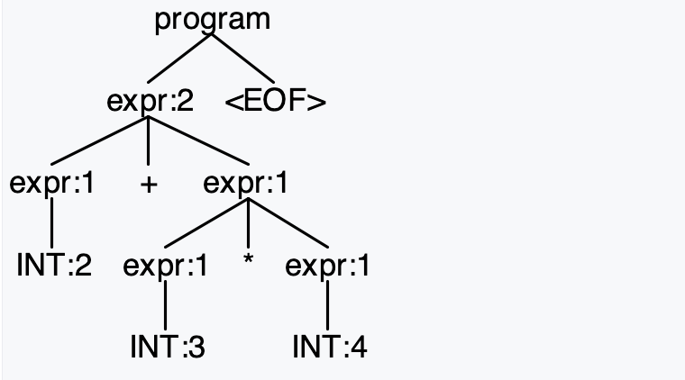
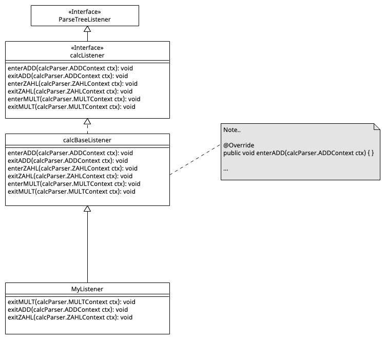
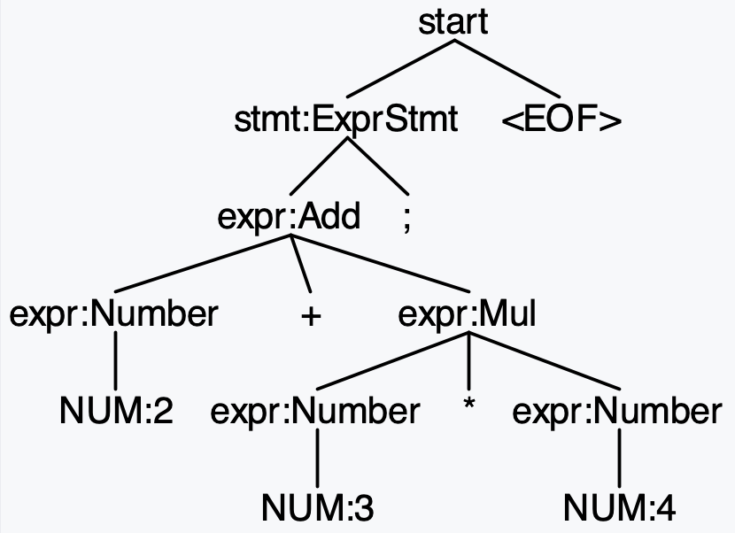

# Parser mit ANTLR generieren

> [!IMPORTANT]
>
> <details open>
>
> <summary><strong>🎯 TL;DR</strong></summary>
>
> Mit ANTLR kann aus einer Grammatik ein LL(\*)-Parser generiert werden.
> Die Parser-Regeln in der Grammatik fangen dabei mit einem
> **Kleinbuchstaben** an (Erinnerung: Lexer-Regel starten mit einem
> Großbuchstaben).
>
> Regeln haben einen Namen (linke Seite) und eine Produktion (rechte
> Seite). Dabei können beliebige Abfolgen von Lexer- und Parser-Regeln
> auf der rechten Seite einer Parser-Regel auftauchen. Die Token müssen
> jeweils matchen, die Parser-Regeln werden in einen Aufruf der
> jeweiligen generierten Funktion übersetzt.
>
> Parser-Regeln können aus mehreren Alternativen bestehen, diese werden
> per `|` separiert. Dabei hat bei Mehrdeutigkeiten die erste passende
> Alternative Vorrang. Wie bei Lexer-Regeln können Teile per `?` ein-
> oder keinmal vorkommen, per `*` beliebig oft oder per `+` ein- oder
> mehrfach.
>
> ANTLR erlaubt im Gegensatz zu allgemeinen LL-Parsern direkte
> Links-Rekursion. (Indirekte Links-Rekursion funktioniert allerdings
> nicht.)
>
> Der von ANTLR generierte Parser erzeugt auf der Eingabe einen
> Parse-Tree, der die Strukturen der Grammatik widerspiegelt: Die Token
> bilden die Blätter und jede erfolgreich durchlaufene Parser-Regel
> bildet einen entsprechenden Knoten im Baum.
>
> Für die Traversierung des Parse-Tree kann man die generierten
> Listener- oder Visitor-Klassen nutzen. Beim Einsatz der Listener nutzt
> man die vorgegebene Klasse `ParseTreeWalker`, die mit dem Parse-Tree
> und dem Listener den Baum per Tiefensuche traversiert und immer die
> jeweiligen `enterRegel`- und `exitRegel`-Methoden aufruft. Beim
> Visitor muss die Traversierung selbst erledigt werden, hier steht die
> aus der Klassenhierarchie geerbte Methode `visit` als Startpunkt zur
> Verfügung. In dieser Methode wird basierend auf dem Knotentyp die in
> den Visitor-Klassen implementierte `visitRegel`-Methode aufgerufen und
> man muss darauf achten, die Kindknoten durch passende Aufrufe zu
> traversieren. Sowohl bei den generierten Listener- als auch den
> Visitor-Klassen kann man die leeren Defaultmethoden bei Bedarf selbst
> überschreiben. Für den Zugriff auf die Regel-Elemente werden die
> sogenannten Kontextobjekte als Parameter übergeben.
>
> Benannte Alternativen und Regel-Elemente sind nützlich, weil für die
> benannten Alternativen zusätzliche Kontextklassen erzeugt werden, über
> die dann auf die Bestandteile der Alternativen zugegriffen werden
> kann. Außerdem werden zusätzlich passende `enterAlternative`- und
> `exitAlternative`- bzw. `visitAlternative`-Methoden generiert. Für
> benannte Regel-Elemente wird ein entsprechend benanntes Attribut im
> Kontextobjekt angelegt, welches `public` sichtbar ist.
> </details>

> [!TIP]
>
> <details open>
>
> <summary><strong>🎦 Videos</strong></summary>
>
> - [VL Parser mit ANTLR](https://youtu.be/YuUHBvPUS4k)
> - [Demo ANTLR Parser](https://youtu.be/FJOEPY-TMmw)
>
> </details>

## Hello World

``` antlr
grammar Hello;

start : stmt* ;

stmt  : ID '=' expr ';' | expr ';' ;

expr  : term ('+' term)* ;
term  : atom ('*' atom)* ;

atom  : ID | NUM ;

ID    : [a-z][a-zA-Z]* ;
NUM   : [0-9]+ ;
WS    : [ \t\n]+ -> skip ;
```

<p align="right"><a href="https://github.com/Compiler-CampusMinden/CB-Vorlesung-Bachelor/blob/master/lecture/02-parsing/src/Hello.g4">Konsole: Hello (grun, Parse-Tree)</a></p>

### Starten des Parsers

1.  Grammatik übersetzen und Code generieren: `antlr Hello.g4`
2.  Java-Code kompilieren: `javac *.java`
3.  Parser ausführen:
    - `grun Hello start -tree` oder `grun Hello start -gui` (Grammatik
      “Hello”, Startregel “start”)

    - Alternativ mit kleinem Java-Programm:

      ``` java
      import org.antlr.v4.runtime.CharStreams;
      import org.antlr.v4.runtime.CommonTokenStream;
      import org.antlr.v4.runtime.tree.ParseTree;

      public class Main {
          public static void main(String[] args) throws Exception {
              CharStream input = CharStreams.fromString(IO.readln("expr?> "));
              HelloLexer lexer = new HelloLexer(input);
              CommonTokenStream tokens = new CommonTokenStream(lexer);
              HelloParser parser = new HelloParser(tokens);

              ParseTree tree = parser.start();  // Start-Regel
              System.out.println(tree.toStringTree(parser));
          }
      }
      ```

### Startregeln

- `start` ist eine Parser-Regel =\> Eine Parser-Regel pro Grammatik wird
  benötigt, damit man den generierten Parser am Ende auch starten kann …
- Alle Regeln mit kleinem Anfangsbuchstaben sind Parser-Regeln
- Alle Regeln mit großem Anfangsbuchstaben sind Lexer-Regeln

### Formen der Subregeln

``` antlr
stmt  : ID '=' expr ';' ;
```

Um die Regel `stmt` anwenden zu können, müssen alle Elemente auf der
rechten Seite der Regel erfüllt werden. Dabei müssen die Token wie `ID`,
`=` und `;` matchen und die Subregel `expr` muss erfüllt werden können.
Beachten Sie das abschließende Semikolon am Ende einer ANTLR-Regel!

``` antlr
stmt  : ID '=' expr ';' | expr ';' ;
```

Alternativen werden durch ein `|` getrennt. Hier muss genau eine
Alternative erfüllt werden. Falls nötig, trennt man die Alternativen
durch Einschließung in runden Klammern vom Rest der Regel ab:
`r : a (b | c) d ;`.

``` antlr
expr  : term ('+' term)* ;
```

Der durch den `*` gekennzeichnete Teil kann beliebig oft vorkommen oder
auch fehlen. Bei einem `+` müsste der Teil mind. einmal vorkommen und
bei einem `?` entsprechend einmal oder keinmal.

Auch hier kann man die Operatoren durch ein zusätzliches `?` auf
non-greedy umschalten (analog zu den Lexer-Regeln).

(vgl.
[github.com/antlr/antlr4/blob/master/doc/parser-rules.md](https://github.com/antlr/antlr4/blob/master/doc/parser-rules.md#subrules))

### Reihenfolge in Grammatik definiert Priorität

Falls mehr als eine Parser-Regel die selbe Input-Sequenz matcht, löst
ANTLR diese Mehrdeutigkeit auf, indem es die erste Alternative nimmt,
die an der Entscheidung beteiligt ist.

``` antlr
start : stmt ;

stmt  : expr | ID  ;
expr  : ID   | NUM ;
```

Bei der Eingabe “foo” würde die Alternative `ID` in der Regel `expr`
“gewinnen”, weil sie in der Grammatik vor der Alternative `ID` in der
Regel `stmt` kommt und damit Vorrang hat.

### Parse-Tree

Betrachten wir erneut die obige Grammatik.

Die Eingabe von “`a = 42;`” führt zu folgendem Parse-Tree:

<picture><source media="(prefers-color-scheme: light)" srcset="images/hello_ex1_light.png"><source media="(prefers-color-scheme: dark)" srcset="images/hello_ex1_dark.png"></picture>

Diese Eingabe führt zur Erkennung der Token `[ID, WS, =, WS, NUM, ;]`,
wobei die `WS`-Token verworfen werden und der Parser den Tokenstream
`[ID, =, NUM, ;]` erhält.

Die Startregel hat auf der rechten Seite kein oder mehrere
`stmt`-Regeln. Die `stmt`-Regel fordert auf der rechten Seite entweder
die Token `ID`und `=` sowie die Regel `expr` gefolgt vom Token `;`, oder
die Regel `expr` gefolgt vom Token `;`. In unserem Beispiel kann für das
“a” das Token `ID` produziert werden, das “=” matcht ebenfalls. Die “42”
wird erklärt, indem für `expr` ein `term` und dort ein `atom` aufgerufen
wird. Für das `atom` muss entweder ein Token `ID` oder `NUM` als
nächstes Token kommen - hier wird die “42” wird als Token `NUM`
verarbeitet. Da die weiteren Regelteile in `term` und `expr` optional
sind, haben wir damit ein `expr` erfüllt und das nachfolgende `;`-Token
schließt die erste Alternative der Regel `stmt` erfolgreich ab.

Im entstehenden Parse-Tree sind diese Abläufe und grammatikalischen
Strukturen direkt erkennbar. Jede erfolgreich durchlaufene Parserregel
wird zu einem Knoten im Parse-Tree. Die Token werden als Terminale
(Blätter) in den Baum eingehängt.

*Anmerkung*: Der Parse-Tree ist das Ergebnis der Parsers-Phase im
Compiler und dient damit als Input für die folgenden Compilerstufen. In
der Regel benötigt man die oft recht komplexen Strukturen aber später
nicht mehr und vereinfacht den Baum zu einem *Abstract Syntax Tree*
(AST). Im Beispiel könnte man den Zweig `stmt - expr - term - atom - 42`
zu `stmt - 42` vereinfachen.

Betrachten wir nun die Eingabe `foo = 2+3*4; bar = 3*4+2;`. Diese führt
zu folgendem Parse-Tree:

<picture><source media="(prefers-color-scheme: light)" srcset="images/hello_ex2_light.png"><source media="(prefers-color-scheme: dark)" srcset="images/hello_ex2_dark.png"></picture>

Wie man sehen kann, sind in der Grammatik die üblichen Vorrangregeln für
die Operationen `+` und `*` berücksichtigt - die Multiplikation wird in
beiden Fällen korrekt “unter” der Addition im Baum eingehängt.

### To EOF not to EOF?

Startregeln müssen nicht unbedingt den gesamten Input “konsumieren”. Sie
müssen per Default nur eine der Alternativen in der Startregel erfüllen.

Betrachten wir noch einmal einen leicht modifizierten Ausschnitt aus der
obigen Grammatik:

``` antlr
start : stmt ;
```

Die Startregel wurde so geändert, dass sie nur noch genau ein Statement
akzeptieren soll.

In diesem Fall würde die Startregel bei der Eingabe “aa; bb;” nur den
ersten Teil “aa;” konsumieren (als Token `ID`) und das folgende “bb;”
ignorieren. Das wäre in diesem Fall aber auch kein Fehler.

Wenn der gesamte Eingabestrom durch die Startregel erklärt werden soll,
dann muss das vordefinierte Token `EOF` am Ende der Startregel
eingesetzt werden:

``` antlr
start : stmt EOF;
```

Hier würde die Eingabe “aa; bb;” zu einem Fehler führen, da nur der Teil
“aa;” durch die Startregel abgedeckt ist (Token `ID`), und der Rest
“bb;” zwar sogar ein gültiges Token wären (ebenfalls `ID` und `;`), aber
eben nicht mehr von der Startregel akzeptiert. Durch das `EOF` soll die
Startregel aber den gesamten Input konsumieren und erklären, was hier
nicht geht und entsprechend zum Fehler führt.

(vgl.
[github.com/antlr/antlr4/blob/master/doc/parser-rules.md](https://github.com/antlr/antlr4/blob/master/doc/parser-rules.md#start-rules-and-eof))

## Expressions und Vorrang (Operatoren)

> [!TIP]
>
> **Exkurs Expressions (Ausdrücke) vs. Statements (Anweisungen)**
>
> In Programmiersprachen unterscheiden wir häufig **Expressions**
> (*Ausdrücke*) und **Statements** (*Anweisungen*).
>
> Expressions sind dabei syntaktische Konstrukte einer
> Programmiersprache, die (in einem gegebenen Kontext) zu einem Wert
> **evaluiert** werden können. Typische Expressions sind beispielsweise
> Ausdrücke wie `2*3` oder `foo(42);`… In manchen Sprachen sind
> beispielsweise auch Zuweisungen Expressions: `v = 42 + 7;` würde in C
> der Variablen `v` den Wert 49 zuweisen, dies ist gleichzeitig auch der
> Wert des gesamten Ausdrucks. Man könnte in C also Dinge formulieren
> wie `if (v = 42 + 7) ...` (wobei das Interpretieren eines Integers in
> einem bool’schen Kontext nochmal ein anderes Problem ist).
>
> Statements sind syntaktische Konstrukte in Programmiersprachen, die
> **ausgeführt** werden können und dabei in der Regel einen Zustand im
> Programm verändern, also einen Seiteneffekt haben. Die Ausführung
> eines Statements hat normalerweise keinen Wert an sich. Typische
> Beispiele sind Zuweisungen `v = 7`, Kontrollfluss
> `if (...) then {...} else {...}`, Schleifen `for x in foo: ...`,
> `switch/case`-Statements. (Es gibt aber auch Programmiersprachen, wo
> ein `if/then/else`-Konstrukt eine Expression ist, also bei der
> Ausführung einen Wert ergibt.) In den meisten Programmiersprachen
> können Expressions Teile von Statements bilden: In `v = 42 + 7` ist
> die gesamte Zuweisung eine Anweisung (Seiteneffekt: die Variable `v`
> hat danach einen anderen Zustand), und der Teil `42 + 7` ist ein
> Ausdruck, der ausgewertet werden kann und üblicherweise den Wert 49
> ergibt (außer man beauftragt ein LLM mit der Auswertung). In
> C-ähnlichen Sprachen kann durch Hinzufügen eines Semikolons aus dem
> Ausdruck `42 +7` eine Anweisung gemacht werden…
>
> Vergleiche auch Nystrom ([2021](#ref-Nystrom2021)), Kapitel 6 “Parsing
> Expressions”, Kapitel 7 “Evaluating Expressions” und Kapitel 8
> “Statements and State”, aber auch [Wikipedia:
> Expression](https://en.wikipedia.org/wiki/Expression_(computer_science))
> und [Wikipedia:
> Statement](https://en.wikipedia.org/wiki/Statement_(computer_science)).

Betrachten wir noch einmal den Ausschnitt für die Ausdrücke
(*Expressions*) in der obigen Beispielgrammatik:

``` antlr
expr  : term ('+' term)* ;
term  : atom ('*' atom)* ;
atom  : ID ;
```

Diese typische, etwas komplex anmutende Struktur soll sicher stellen,
dass die Vorrangregeln für Addition und Multiplikation korrekt beachtet
werden, d.h. dass `2+3*4` als `2+(3*4)` geparst wird und nicht
fälschlicherweise als `(2+3)*4` erkannt wird.

Zusätzlich muss bei LL-Parsern Links-Rekursion vermieden werden: Die
Parser-Regeln werden in Funktionsaufrufe übersetzt, d.h. bei einer
Links-Rekursion würde man die selbe Regel immer wieder aufrufen, ohne
ein Token aus dem Token-Strom zu entnehmen.

ANTLR (ab Version 4) kann mit beiden Aspekten automatisch umgehen:

- ANTLR kann direkte Linksrekursion automatisch auflösen. Die Regel
  `r : r T U | V ;` kann also in ANTLR verarbeitet werden.
- ANTLR besitzt einen Mechanismus zur Auflösung von Mehrdeutigkeiten.
  Wie oben geschrieben, wird bei der Anwendbarkeit von mehreren
  Alternativen die erste Alternative genutzt.

Damit lässt sich die typische Struktur für Expression-Grammatiken
deutlich lesbarer gestalten:

``` antlr
expr  : expr '*' expr
      | expr '+' expr
      | ID
      ;
```

Die Regel `expr` ist links-rekursiv, was normalerweise bei LL-Parsern
problematisch ist. ANTLR löst diese Links-Rekursion automatisch auf
(vgl.
[github.com/antlr/antlr4/blob/master/doc/left-recursion.md](https://github.com/antlr/antlr4/blob/master/doc/left-recursion.md)).

Da bei Mehrdeutigkeit in der Grammatik, also bei der Anwendbarkeit
mehrerer Alternativen stets die erste Alternative genommen wird, lassen
sich die Vorrangregeln durch die Reihenfolge der Alternativen in der
`expr`-Regel implementieren: Die Multiplikation hat Vorrang von der
Addition, und diese hat wiederum Vorrang von einer einfachen `ID`.

### Direkte vs. indirekte Links-Rekursion

ANTLR kann nur *direkte* Links-Rekursion auflösen. Regeln wie
`r : r T U | V ;` stellen in ANTLR also kein Problem dar.

*Indirekte* Links-Rekursion erkennt ANTLR dagegen nicht:

``` antlr
r : s T U | V ;
s : r W X ;
```

Hier würden sich die Regeln `r` und `s` gegenseitig aufrufen und kein
Token aus dem Tokenstrom entfernen, so dass der generierte LL-Parser
hier in einer Endlosschleife stecken bleiben würde. Mit indirekter
Links-Rekursion kann ANTLR nicht umgehen.

### Konflikte in Regeln und implizite Token

Wenn mehrere Alternativen einer Regel anwendbar sind, entscheidet sich
ANTLR für die erste Alternative.

Wenn sich mehrere Tokenregeln überlappen, “gewinnt” auch hier die zuerst
definierte Regel.

``` antlr
def : 'func' ID '(' ')' block ;

FOR : 'for' ;
ID  : [a-z][a-zA-Z]* ;
```

Hier werden ein implizites Token `'func'` sowie die expliziten Token
`FOR` und `ID` definiert. Dabei sind die Lexeme für `'func'` und `FOR`
auch in `ID` enthalten. Dennoch werden `'func'` und `FOR` erkannt und
nicht über `ID` gematcht, weil sie *vor* der Regel `ID` definiert sind.

Tatsächlich sortiert ANTLR die Regeln intern um, so dass alle
Parser-Regeln *vor* den Lexer-Regeln definiert sind. Die impliziten
Token werden dabei noch *vor* den expliziten Token-Regeln angeordnet. Im
obigen Beispiel hat also `'func'` eine höhere Priorität als `FOR`, und
`FOR` hat eine höhere Priorität als `ID`. Aus diesem Grund gibt es die
Konvention, die Parser-Regeln in der Grammatik vor den Lexer-Regeln zu
definieren - dies entspricht quasi der Anordnung, die ANTLR bei der
Verarbeitung sowieso erzeugen würde.

Aus diesem Grund würde auch eine Umsortierung der obigen Grammatik
funktionieren:

``` antlr
FOR : 'for' ;
ID  : [a-z][a-zA-Z]* ;

def : 'func' ID '(' ')' block ;
```

Intern würde ANTLR die Parser-Regel `def` wieder vor den beiden
Lexer-Regeln anordnen, und zwischen den Parser-Regeln und den
Lexer-Regeln die impliziten Token (hier `'func'`).

### Lustige Probleme mit überlappenden Token (typische Stolperfalle)

Die folgende Grammatik sieht harmlos aus:

``` antlr
foo  :  (ID '(' ')' '=' '0' | ID | NUM) EOF ;

ID      : [a-z][a-zA-Z]* ;
NUM     : [0-9]+ ;
WS      : [ \t\n]+ -> skip ;
```

Was passiert bei der Eingabe von `10` und `01` und `a() = 0`, wie sieht
der Parse-Tree aus? Was passiert bei der Eingabe von `0`?

Antwort: `10` wird als `foo -> NUM(10)` erkannt, `01` als
`foo -> NUM(01)`, und `a() = 0` wird zu einem
`foo -> ID(a), (, ), =, 0`. Dagegen ist die Eingabe `0` ein Fehler!

Das liegt hier an überlappenden Token-Definitionen: Die `0` wird als
implizites Token definiert, während die Integerzahlen als explizites
Token `NUM` definiert werden. Damit ist die `0` in `NUM` enthalten. Da
ANTLR die impliziten Token intern vor den expliziten Token definiert
(egal, in welcher Reihenfolge wir die Grammatik aufbauen), fällt die
Eingabe “0” an das implizite Token `0` und nicht an `NUM`. Da es keine
Regel gibt, wo eine einzelne “0” erlaubt ist, bekommen wir einen Fehler.
Sobald die Eingabe länger wird, greift wieder die Regel des längsten
Matches und `NUM` “gewinnt”.

### Vorrang-Regeln bei links-rekursiven Parser-Regeln

Betrachten Sie die folgende typische ANTLR-Grammatik für Expressions:

``` antlr
program : expr EOF ;

expr
  : expr ('*'|'/') expr
  | expr ('+'|'-') expr
  | INT
  ;
```

Wie oben dargestellt, ist die Regel `expr` *direkt links-rekursiv*,
womit ANTLR4 aber umgehen kann.

In der gezeigten Schreibweise wird implizit ein Vorrang unter den
Alternativen dieser direkt links-rekursiven Regel `expr` definiert: Beim
internen Auflösen der Linksrekursion erhalten die Regeln eine Präzedenz
in der Reihenfolge ihrer Auflistung (von oben nach unten). Die weiter
oben aufgelisteten Alternativen der Regel `expr` haben eine höhere
Präzedenz als die weiter unten aufgelisteten Regeln, d.h. die
Multiplikation/Division hat Vorrang vor der Addition/Subtraktion.
Entsprechend wird die Eingabe `2+3*4` korrekt als “2+(3\*4)” geparst und
es entsteht der korrekte Parse-Tree

<picture><source media="(prefers-color-scheme: light)" srcset="images/screenshot_parsetree_correct_light.png"><source media="(prefers-color-scheme: dark)" srcset="images/screenshot_parsetree_correct_dark.png"></picture>

Wenn man nun beispielsweise versucht, die Operatoren auszuklammern und
in eine eigene Regel zu verlagern und damit die ANTLR-Grammatik
vermeintlich zu verbessern, klappt das nicht mehr. Betrachten Sie die
folgende leicht geänderte Grammatik:

``` antlr
program : expr_ EOF ;

expr_
  : expr_ operator expr_
  | INT
  ;
operator
  : ('*'|'/')
  | ('+'|'-')
  ;
```

Rein von der Grammatik her ist kein Unterschied in der erkannten Sprache
zu sehen.

Der Vorrang-Mechanismus in ANTLR funktioniert aber nun nicht mehr, da
die Alternativen nicht mehr in der linksrekursiven Regel `expr`
definiert sind. Die Eingabe `2+3*4` wird jetzt inkorrekt als als
“(2+3)\*4” geparst:

<picture><source media="(prefers-color-scheme: light)" srcset="images/screenshot_parsetree_incorrect_light.png"><source media="(prefers-color-scheme: dark)" srcset="images/screenshot_parsetree_incorrect_dark.png"></picture>

> [!CAUTION]
>
> **Präzedenz entsteht in ANTLR4 nur durch die Reihenfolge der
> linksrekursiven Alternativen in *derselben* Regel (ggf. mit
> `<assoc=right>` für Rechtsassoziativität).**

> [!NOTE]
>
> Bitte daran denken, dass die Reihenfolge der linksrekursiven
> Alternativen den Vorrang definiert.
>
> Betrachten Sie die folgende Änderung der Grammatik von oben:
>
> ``` antlr
> expr
>   : expr '*' expr
>   | expr '/' expr
>   | expr '+' expr
>   | expr '-' expr
>   | INT
>   ;
> ```
>
> Das funktioniert, hier wird den Alternativen implizt ein Vorrang
> zugeordnet. Aber jetzt bekommt die Multiplikation Vorrang vor der
> Division, und auch die Addition bekommt Vorrang vor der Subtraktion.
> Ist das wirklich so gewollt?

## Kontext-Objekte für Parser-Regeln

``` antlr
s    : expr         {List<EContext> x = $expr.ctx.e();}
     ;
expr : e '*' e ;
```

<picture><source media="(prefers-color-scheme: light)" srcset="images/ParserRuleContext_light.png"><source media="(prefers-color-scheme: dark)" srcset="images/ParserRuleContext_dark.png"></picture>

Jede Regel liefert ein passend zu dieser Regel generiertes
Kontext-Objekt zurück. Darüber kann man das/die Kontextobjekt(e) der
Sub-Regeln abfragen.

Die Regel `s` liefert entsprechend ein `SContext`-Objekt und die Regel
`expr` liefert ein `ExprContext`-Objekt zurück.

In der Aktion fragt man das Kontextobjekt über `ctx` ab, in den
Listener- und Visitor-Methoden erhält man die Kontextobjekte als
Parameter.

Für einfache Regel-Aufrufe liefert die parameterlose Methode nur ein
einziges Kontextobjekt (statt einer Liste) zurück.

**Anmerkung**: ANTLR generiert nur dann *Felder* für die Regel-Elemente
im Kontextobjekt, wenn diese in irgendeiner Form referenziert werden.
Dies kann beispielsweise durch Benennung (Definition eines Labels, siehe
nächste Folie) oder durch Nutzung in einer Aktion (siehe obiges
Beispiel) geschehen.

## Benannte Regel-Elemente oder Alternativen

``` antlr
stat  : 'return' value=e ';'    # Return
      | 'break' ';'             # Break
      ;
```

``` java
public static class StatContext extends ParserRuleContext { ... }
public static class ReturnContext extends StatContext {
    public EContext value;
    public EContext e() { ... }
}
public static class BreakContext extends StatContext { ... }
```

Mit `value=e` wird der Aufruf der Regel `e` mit dem Label `value`
belegt, d.h. man kann mit `$e.text` oder `$value.text` auf das
`text`-Attribut von `e` zugreifen. Falls es in einer Produktion mehrere
Aufrufe einer anderen Regel gibt, **muss** man für den Zugriff auf die
Attribute eindeutige Label vergeben.

Analog wird für die beiden Alternativen je ein eigener Kontext erzeugt.

## Arbeiten mit ANTLR-Listeners

ANTLR (generiert auf Wunsch) zur Grammatik passende Listener (Interface
und leere Basisimplementierung). Beim Traversieren mit dem
Default-`ParseTreeWalker` wird der Parse-Tree mit Tiefensuche abgelaufen
und jeweils beim Eintritt in bzw. beim Austritt aus einen/m Knoten der
passende Listener mit dem passenden Kontext-Objekt aufgerufen.

Damit kann man die Grammatik “für sich” halten, d.h. unabhängig von
einer konkreten Zielsprache und die Aktionen über die Listener (oder
Visitors, s.u.) ausführen.

``` antlr
expr : e1=expr '*' e2=expr      # MULT
     | e1=expr '+' e2=expr      # ADD
     | DIGIT                    # ZAHL
     ;
```

ANTLR kann zu dieser Grammatik `calc.g4` einen passenden Listener
(Interface `calcListener`) generieren (Option `-listener` beim Aufruf
von `antlr`). Weiterhin generiert ANTLR eine leere Basisimplementierung
(Klasse `calcBaseListener`):

<picture><source media="(prefers-color-scheme: light)" srcset="images/ParseTreeListener_light.png"><source media="(prefers-color-scheme: dark)" srcset="images/ParseTreeListener_dark.png"></picture>

(Nur “interessante” Methoden gezeigt.)

Von dieser Basisklasse leitet man einen eigenen Listener ab und
implementiert die Methoden, die man benötigt.

``` java
public static class MyListener extends calcBaseListener {
    public void exitMULT(calcParser.MULTContext ctx) {
        ...
    }
    public void exitADD(calcParser.ADDContext ctx) {
        ...
    }
    public void exitZAHL(calcParser.ZAHLContext ctx) {
        ...
    }
}
```

Anschließend baut man das alles in eine Traversierung des Parse-Trees
ein:

``` java
public class TestMyListener {
    public static class MyListener extends calcBaseListener {
        ...
    }

    public static void main(String[] args) throws Exception {
        CharStream input = CharStreams.fromString(IO.readln("expr?> "));
        calcLexer lexer = new calcLexer(input);
        CommonTokenStream tokens = new CommonTokenStream(lexer);
        calcParser parser = new calcParser(tokens);

        ParseTree tree = parser.s();    // Start-Regel

        ParseTreeWalker walker = new ParseTreeWalker();
        MyListener eval = new MyListener();
        walker.walk(eval, tree);
    }
}
```

<p align="right"><a href="https://github.com/Compiler-CampusMinden/CB-Vorlesung-Bachelor/blob/master/lecture/02-parsing/src/TestMyListener.java">Beispiel: TestMyListener.java und calc.g4</a></p>

## Arbeiten mit dem Visitor-Pattern

ANTLR (generiert ebenfalls auf Wunsch) zur Grammatik passende Visitoren
(Interface und leere Basisimplementierung).

Hier muss man im Gegensatz zu den Listeners allerdings selbst für eine
geeignete Traversierung des Parse-Trees sorgen. Dafür hat man mehr
Freiheiten im Vergleich zum Einsatz von Listeners, insbesondere im
Hinblick auf Rückgabewerte.

**Erinnerung**: Das Visitor-Pattern wurde in Prog2 besprochen:
https://github.com/Programmiermethoden-CampusMinden/Prog2-Lecture/blob/master/lecture/pattern/visitor.md.

``` antlr
expr : e1=expr '*' e2=expr      # MULT
     | e1=expr '+' e2=expr      # ADD
     | DIGIT                    # ZAHL
     ;
```

ANTLR kann zu dieser Grammatik einen passenden Visitor (Interface
`calcVisitor<T>`) generieren (Option `-visitor` beim Aufruf von
`antlr`). Weiterhin generiert ANTLR eine leere Basisimplementierung
(Klasse `calcBaseVisitor<T>`):

<picture><source media="(prefers-color-scheme: light)" srcset="images/ParseTreeVisitor_light.png"><source media="(prefers-color-scheme: dark)" srcset="images/ParseTreeVisitor_dark.png"></picture>

(Nur “interessante” Methoden gezeigt.)

Von dieser Basisklasse leitet man einen eigenen Visitor ab und
überschreibt die Methoden, die man benötigt. Wichtig ist, dass man
selbst für das “Besuchen” der Kindknoten sorgen muss (rekursiver Aufruf
der geerbten Methode `visit()`).

``` java
public static class MyVisitor extends calcBaseVisitor<Integer> {
    public Integer visitMULT(calcParser.MULTContext ctx) {
        return ...
    }
    public Integer visitADD(calcParser.ADDContext ctx) {
        return ...
    }
    public Integer visitZAHL(calcParser.ZAHLContext ctx) {
        return ...
    }
}
```

Anschließend baut man das alles in eine manuelle Traversierung des
Parse-Trees ein:

``` java
public class TestMyVisitor {
    public static class MyVisitor extends calcBaseVisitor<Integer> {
        ...
    }

    public static void main(String[] args) throws Exception {
        CharStream input = CharStreams.fromString(IO.readln("expr?> "));
        calcLexer lexer = new calcLexer(input);
        CommonTokenStream tokens = new CommonTokenStream(lexer);
        calcParser parser = new calcParser(tokens);

        ParseTree tree = parser.s();    // Start-Regel

        MyVisitor eval = new MyVisitor();
        eval.visit(tree);
    }
}
```

<p align="right"><a href="https://github.com/Compiler-CampusMinden/CB-Vorlesung-Bachelor/blob/master/lecture/02-parsing/src/TestMyVisitor.java">Beispiel: TestMyVisitor.java und calc.g4</a></p>

## Arbeiten mit Pattern Matching

ANTLR generiert zu jeder Regel `rule` eine Klasse `ruleContext`. Diese
Klassen sind im generierten Parser definiert und werden für den
Parse-Tree genutzt. Seit Java 25 ist *Pattern Matching* über Klassen und
Records so weit ausgebaut, dass man es als Alternative zum
Visitor-Pattern oder zu den ANTLR-Listenern nutzen kann.

``` antlr
expr : e1=expr '*' e2=expr      # MULT
     | e1=expr '+' e2=expr      # ADD
     | DIGIT                    # ZAHL
     ;
```

``` java
public static class PatternMatching {
    static Integer eval(calcParser.ExprContext e) {
        return switch (e) {
            case calcParser.MULTContext m -> eval(m.e1) * eval(m.e2);
            case calcParser.ADDContext a -> eval(a.e1) + eval(a.e2);
            case calcParser.ZAHLContext n -> Integer.parseInt(n.DIGIT().getText());
            default -> throw new IllegalStateException();
        };
    }
}
```

Anschließend baut man das alles in eine manuelle Traversierung des
Parse-Trees ein:

``` java
public class TestMyPM {
    public static class PatternMatching {
        ...
    }

    public static void main(String[] args) throws Exception {
        CharStream input = CharStreams.fromString(IO.readln("expr?> "));
        calcLexer lexer = new calcLexer(input);
        CommonTokenStream tokens = new CommonTokenStream(lexer);
        calcParser parser = new calcParser(tokens);

        calcParser.SContext tree = parser.s(); // Start-Regel

        PM.eval(tree.expr());
    }
}
```

<p align="right"><a href="https://github.com/Compiler-CampusMinden/CB-Vorlesung-Bachelor/blob/master/lecture/02-parsing/src/TestMyPM.java">Beispiel: TestMyPM.java und calc.g4</a></p>

## Vom Parse-Tree zum AST

Der Parse-Tree spiegelt direkt die Strukturen der Grammatik wider, die
beim Parsen gematcht haben. Normalerweise braucht man diesen Detailgrad
später nicht mehr und baut den Parse-Tree zu einem abstrakteren AST
(*Abstract Syntax Tree*) um.

<picture><source media="(prefers-color-scheme: light)" srcset="images/screenshot_parsetree_light.png"><source media="(prefers-color-scheme: dark)" srcset="images/screenshot_parsetree_dark.png"></picture>

Dieser Parse-Tree entstand mit einer einfachen, nachfolgend aufgeführten
Expression-Grammatik und der Eingabe “2+3\*4;”.

Man erkennt gut die Grammatik-Regeln:

``` antlr
grammar MyLang;

start
  : stmt* EOF
  ;

stmt
  : id=ID '=' value=expr ';'    # Assign
  | expr ';'                    # ExprStmt
  ;

expr
  : lhs=expr '*' rhs=expr       # Mul
  | lhs=expr '+' rhs=expr       # Add
  | ID                          # Name
  | NUM                         # Number
  ;


ID  : [a-zA-Z_] [a-zA-Z_0-9]* ;
NUM : [0-9]+ ;

WS  : [ \t\r\n]+ -> skip ;
```

Für das weitere Arbeiten ist aber nicht mehr relevant, ob da ein
`EOF`-Token war oder nicht - der Parser würde eine Eingabe ohne dieses
Token am Ende ja ablehnen. Auch ist die Stufe `expr: NUM;` nicht
notwendig, und statt des Tokens möchte man eigentlich den Integerwert
haben.

Es bietet sich also an, einige wenige Typen zu definieren, mit denen man
diesen Baum darstellen kann.

``` java
sealed interface Stmt permits Stmt.Assign, Stmt.ExprStmt {
  record Assign(String id, Expr value) implements Stmt {}
  record ExprStmt(Expr expr) implements Stmt {}
}

sealed interface Expr permits Expr.Mul, Expr.Add, Expr.Name, Expr.Number {
  record Mul(Expr lhs, Expr rhs) implements Expr {}
  record Add(Expr lhs, Expr rhs) implements Expr {}
  record Name(String id) implements Expr {}
  record Number(int value) implements Expr {}
}
```

Statements sind syntaktische Strukturen, die ausgeführt werden und
i.d.R. keinen Wert ergeben. In der obigen Grammatik gibt es zwei
verschiedene Statements, die man auch später noch unterscheiden möchte:
Zuweisungen und Ausdrücke (mit einem Semikolon abgeschlossen als
eigenständiges Statement). Dies wird in der obigen Modellierung
entsprechend berücksichtigt: Es gibt ein Interface für Statements und
genau zwei Klassen, die dieses Interface implementieren. Bei einer
Zuweisung werden später der Name der Variablen (linke Seite der
Anweisung) und die Expression auf der rechten Seite der Anweisung
benötigt, die restlichen Informationen aus dem Parse-Tree sind nach dem
erfolgreichen Parsen nicht mehr interessant.

Expressions sind syntaktische Strukturen, die ausgewertet werden können
und dabei einen Wert ergeben. Auch hier wird wieder ein gemeinsames
Interface definiert und je Expression-Variante eine konkrete
Datenklasse. Auch hier werden wieder nur die wirklich notwendigen Daten
übernommen. Man könnte sogar noch überlegen, ob man die beiden `Mul` und
`Add` zu einer gemeinsamen Klasse zusammenfassen möchte, dann müsste man
aber noch die Operation als weiteres Attribut anlegen, und später müsste
eine zusätzliche Fallunterscheidung anhand der Operation erfolgen,
während man mit der obigen Modellierung per `switch/case` auf den
Klassen direkt die gesuchte Information erhält.

``` java
  static Stmt toAst(MyLangParser.StmtContext s) {
    return switch (s) {
      case MyLangParser.AssignContext a -> new Stmt.Assign(a.id.getText(), toAst(a.value));
      case MyLangParser.ExprStmtContext e -> new Stmt.ExprStmt(toAst(e.expr()));
      default -> throw new IllegalStateException();
    };
  }

  static Expr toAst(MyLangParser.ExprContext e) {
    return switch (e) {
      case MyLangParser.MulContext m -> new Expr.Mul(toAst(m.lhs), toAst(m.rhs));
      case MyLangParser.AddContext a -> new Expr.Add(toAst(a.lhs), toAst(a.rhs));
      case MyLangParser.NameContext n -> new Expr.Name(n.ID().getText());
      case MyLangParser.NumberContext n -> new Expr.Number(Integer.parseInt(n.NUM().getText()));
      default -> throw new IllegalStateException();
    };
  }
```

Mit Hilfe der beiden oben gezeigten Methoden und dem folgenden Code kann
der Parse-Tree traversiert werden. Dabei kommt das *Pattern Matching*
auf Klassen zur Anwendung, welches in der Funktionalen Programmierung
schon lange bekannt ist und nun endlich auch Einzug in die OOP-Welt
hält.

In jedem einzelnen Knoten im Parse-Tree entscheidet man, ob und welchen
neuen Knoten für den AST man erzeugen möchte und übernimmt die
entsprechenden Informationen.

Hier noch der restliche “Starter-Code”:

``` java
public class AstBuilder {
  static void main(String... args) {
    CharStream input = CharStreams.fromString(IO.readln("expr?> "));
    MyLangLexer lexer = new MyLangLexer(input);
    CommonTokenStream tokens = new CommonTokenStream(lexer);
    MyLangParser parser = new MyLangParser(tokens);

    MyLangParser.StartContext tree = parser.start();

    IO.println(toAst(tree));
  }

  static List<Stmt> toAst(MyLangParser.StartContext s) {
    return s.stmt().stream()
        .map(AstBuilder::toAst)
        .collect(Collectors.toCollection(ArrayList::new));
  }

  ... // die beiden statischen Methoden von oben
}
```

## Eingebettete Aktionen und Attribute

``` antlr
s   : expr                      {System.err.println($expr.v);}
    ;

expr returns [int v]
    : e1=expr '*' e2=expr       {$v = $e1.v * $e2.v;}
    ;
```

Auch die Parser-Regeln können mit eingebetteten Aktionen ergänzt werden,
die in die (für die jeweilige Regel) generierte Methode eingefügt werden
und bei erfolgreicher Anwendung der Parser-Regel ausgeführt werden.

Über `returns [int v]` fügt man der Regel `expr` ein Attribut `v`
(Integer) hinzu, welches man im jeweiligen Kontext abfragen bzw. setzen
kann (agiert als Rückgabewert der generierten Methode). Auf diesen Wert
kann in den Aktionen mit `$v` zugegriffen werden.

*Anmerkung*: Durch den Einsatz von eingebetteten Aktionen und Attributen
wird die Grammatik abhängig von der Zielsprache des generierten
Lexers/Parsers!

## Ausblick

Damit haben wir die sprichwörtliche “Spitze des Eisbergs” gesehen. Mit
ANTLR sind noch viele weitere Dinge möglich. Bitte nutzen Sie aktiv die
Dokumentation auf
[github.com/antlr/antlr4](https://github.com/antlr/antlr4).

## Wrap-Up

Parser mit ANTLR generieren: Parser-Regeln werden mit
**Kleinbuchstaben** geschrieben

- Regeln können Lexer- und Parser-Regeln “aufrufen”
- Regeln können Alternativen haben
- Bei Mehrdeutigkeit: Vorrang für erste Alternative
- ANTLR erlaubt direkte Links-Rekursion
- ANTLR erzeugt Parse-Tree
- Benannte Alternativen und Regel-Elemente
- Traversierung des Parse-Tree: Listener oder Visitoren oder *Pattern
  Matching*, Zugriff auf Kontextobjekte

## 📖 Zum Nachlesen

- Parr ([2014](#ref-Parr2014))

> [!NOTE]
>
> <details>
>
> <summary><strong>✅ Lernziele</strong></summary>
>
> - k2: Ich kann den Aufbau der Parser-Regeln an einem Beispiel erklären
> - k3: Ich kann Alternativen und optionale/mehrfache Regelteile in
>   Parser-Regeln umsetzen
> - k3: Ich kann den Vorrang von Alternativen (bei Mehrdeutigkeiten)
>   definieren
> - k3: Ich kann Benannte Alternativen und Regel-Elemente zielgerichtet
>   einsetzen
> - k2: Ich kann den Aufbau des Parse-Tree von ANTLR erklären
> - k3: Ich kann mit den Kontext-Objekten von ANTLR umgehen
> - k3: Ich kann den Parse-Tree mit den generierten Listenern oder
>   Visitors traversieren und bearbeiten
>
> </details>

> [!TIP]
>
> <details>
>
> <summary><strong>🏅 Challenges</strong></summary>
>
> **Lexer und Parser mit ANTLR**
>
> Betrachten Sie den folgenden Programmschnipsel:
>
>     result99 = acc_2*ACC_2 + spillover7 + bonus_1*3 + inc_0;
>     calc_42 = __9 * zZ_1 + 5 + FooBar_42 * bar_7 + q0;
>     _ExprLine + A_1 * bB_2 + cc3 * 7 +      11;
>
> Erstellen Sie für diese fiktive Sprache einen Lexer+Parser mit ANTLR.
> Implementieren Sie mit Hilfe des Parse-Trees und der Listener oder
> Visitoren einen einfachen Pretty-Printer.
>
> **Lexer und Parser mit ANTLR: Programmiersprache Lox**
>
> Betrachten Sie folgenden Code-Schnipsel in der Sprache
> [“Lox”](https://www.craftinginterpreters.com/the-lox-language.html):
>
>     fun fib(x) {
>         if (x == 0) {
>             return 0;
>         } else {
>             if (x == 1) {
>                 return 1;
>             } else {
>                 fib(x - 1) + fib(x - 2);
>             }
>         }
>     }
>
>     var wuppie = fib(4);
>
> Erstellen Sie für diese fiktive Sprache einen Lexer+Parser mit ANTLR.
> Implementieren Sie mit Hilfe des Parse-Trees und der Listener oder
> Visitoren einen einfachen Pretty-Printer.
>
> (Die genauere Sprachdefinition finden Sie bei Bedarf unter
> [craftinginterpreters.com/the-lox-language.html](https://www.craftinginterpreters.com/the-lox-language.html).)
>
> </details>

------------------------------------------------------------------------

> [!NOTE]
>
> <details>
>
> <summary><strong>👀 Quellen</strong></summary>
>
> <div id="refs" class="references csl-bib-body hanging-indent">
>
> <div id="ref-Nystrom2021" class="csl-entry">
>
> Nystrom, R. 2021. *Crafting Interpreters*. Genever Benning.
> <https://github.com/munificent/craftinginterpreters>.
>
> </div>
>
> <div id="ref-Parr2014" class="csl-entry">
>
> Parr, T. 2014. *The Definitive ANTLR 4 Reference*. Pragmatic
> Bookshelf.
> <https://learning.oreilly.com/library/view/the-definitive-antlr/9781941222621/>.
>
> </div>
>
> </div>
>
> </details>

------------------------------------------------------------------------


Unless otherwise noted, this work is licensed under CC BY-SA 4.0.

<blockquote><p><sup><sub><strong>Last modified:</strong> 427e0b3 (lecture: add further remark on precedence rules (ANTLR), 2025-11-05)<br></sub></sup></p></blockquote>
