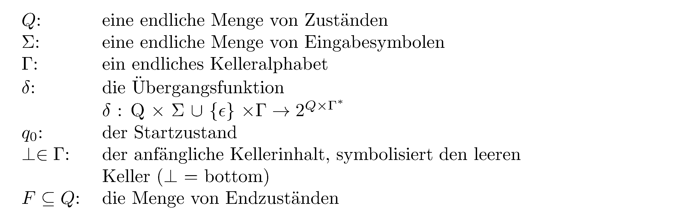
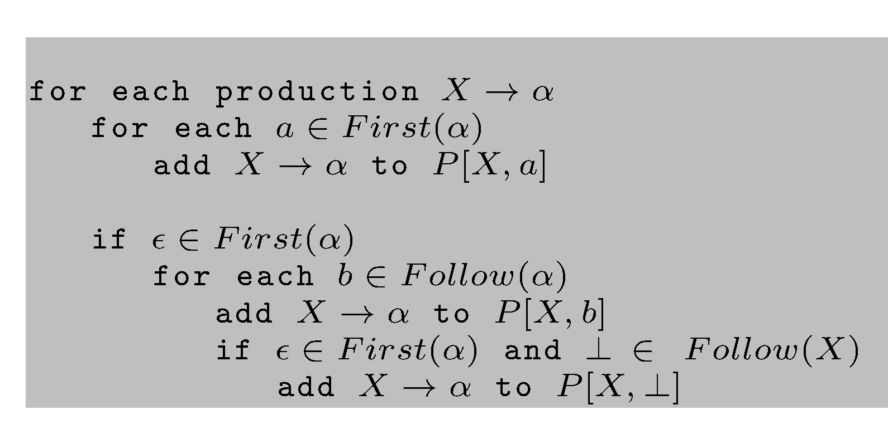
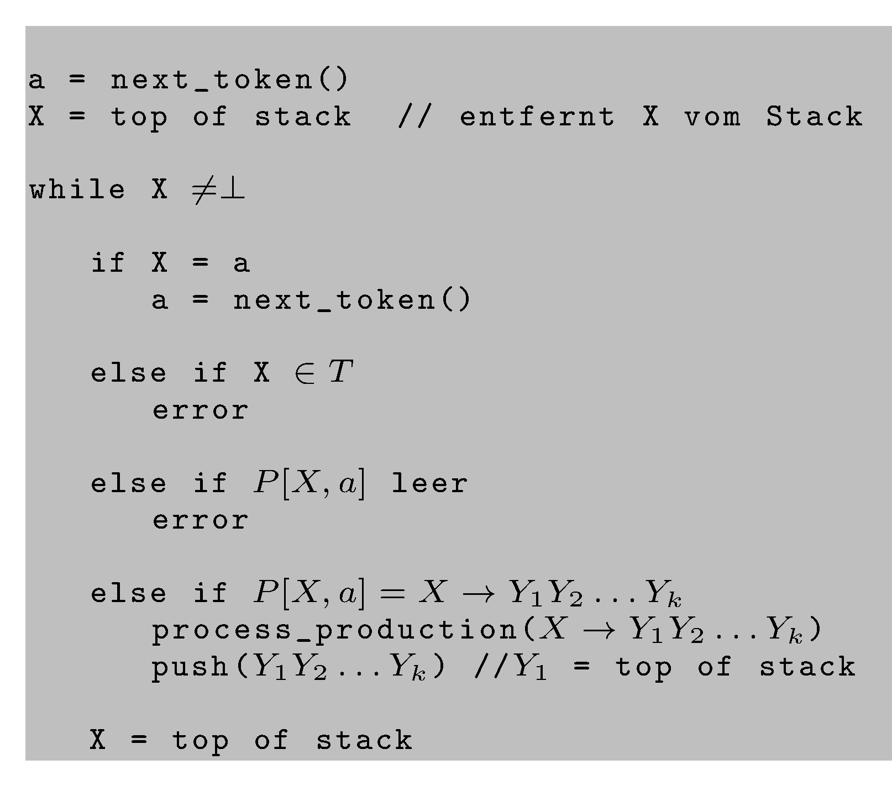

# Wiederholung

## Endliche Automaten, reguläre Ausdrücke, reguläre Grammatiken, reguläre Sprachen

*   Wie sind DFAs und NFAs definiert?
*   Was sind reguläre Ausdrücke?
*   Was sind formale und reguläre Grammatiken?
*   In welchem Zusammenhang stehen all diese Begriffe?
*   Wie werden DFAs und reguläre Ausdrücke im Compilerbau eingesetzt?

# Motivation

## Wofür reichen reguläre Sprachen nicht?

Für z. B. alle Sprachen, in deren Wörtern Zeichen über eine Konstante hinaus gezählt werden müssen. Diese Sprachen lassen sich oft mit Variablen im Exponenten beschreiben, die unendlich viele Werte annehmen können.

*    $a^ib^{2*i}$ ist nicht regulär
*    $a^ib^{2*i}$ für $0 \leq i \leq 3$ ist regulär

\smallskip

*    Wo finden sich die oben genannten Variablen bei einem DFA wieder?
*    Warum ist die erste Sprache oben nicht regulär, die zweite aber?

## Themen für heute

*   PDAs: mächtiger als DFAs, NFAs
*   kontextfreie Grammatiken und Sprachen: mächtiger als reguläre Grammatiken und Sprachen
*   DPDAs und deterministisch kontextfreie Grammatiken: die Grundlage der Syntaxanalyse im Compilerbau
*   Der Einsatz kontextfreier Grammatiken zur Syntaxanalyse mittels Top-Down-Techniken

## Einordnung: Erweiterung der Automatenklasse DFA, um komplexere Sprachen als die regulären akzeptieren zu können

Wir spendieren den DFAs einen möglichst einfachen, aber beliebig großen, Speicher, um zählen  und matchen zu können. Wir suchen dabei konzeptionell die "kleinstmögliche" Erweiterung, die die akzeptierte Sprachklasse gegenüber DFAs vergrößert.

*   Der konzeptionell einfachste Speicher ist ein Stack. Wir haben keinen wahlfreien Zugriff auf die gespeicherten Werte.

*   Es soll eine deterministische und eine indeterministische Variante der neuen Automatenklasse geben.

*   In diesem Zusammenhang wird der Stack auch Keller genannt.

## Kellerautomaten (Push-Down-Automata, PDAs)

**Def.:** Ein Kellerautomat (PDA) $P = (Q,\ \Sigma,\ \Gamma,\  \delta,\ q_0,\ \perp,\ F)$
ist ein Septupel mit:

{width="60%"}

Ein PDA ist per Definition nichtdeterministisch und kann spontane Zustandsübergänge durchführen.

## Was kann man damit akzeptieren?

Strukturen mit paarweise zu matchenden Symbolen.

Bei jedem Zustandsübergang wird ein Zeichen (oder $\epsilon$) aus der Eingabe gelesen, ein Symbol von Keller genommen. Diese und das Eingabezeichen bestimmen den Folgezustand und eine Zeichenfolge, die auf den Stack gepackt wird. Dabei wird ein Symbol, (z. B. eines, das später mit einem Eingabesymbol zu matchen ist,) auf den Stack gepackt. Soll das automatisch vom Stack genommene Symbol auf dem Stack bleiben, muss es wieder gepusht werden.

## Beispiel

Ein PDA für $L=\lbrace ww^{R}\mid w\in \lbrace a,b\rbrace^{\ast}\rbrace$:

{width="45%"}

## Deterministische PDAs

**Def.**  Ein PDA $P = (Q, \Sigma, \Gamma, \delta, q_0, \perp, F)$ ist *deterministisch*
$: \Leftrightarrow$

*   $\delta(q, a, X)$ hat höchstens ein Element für jedes $q \in Q, a \in\Sigma$ oder $(a = \epsilon$ und $X \in \Gamma)$.

*   Wenn $\delta (q, a, x)$ nicht leer ist für ein $a \in \Sigma$, dann muss $\delta (q, \epsilon, x)$ leer sein.

Deterministische PDAs werden auch *DPDAs* genannt.

## Der kleine Unterschied

**Satz:** Die von DPDAs akzeptierten Sprachen sind eine echte Teilmenge der von
PDAs akzeptierten Sprachen.

Die regulären Sprachen sind eine echte Teilmenge der von DPDAs akzeptierten Sprachen.

# Kontextfreie Grammatiken und Sprachen

## Kontextfreie Grammatiken

**Def.**   Eine *kontextfreie (cf-)* Grammatik ist ein 4-Tupel $G = (N, T, P, S)$ mit $N, T, S$ wie in
(formalen) Grammatiken und $P$ ist eine endliche Menge von Produktionen der Form:

$X \rightarrow Y$ mit $X \in N, Y \in {(N \cup T)}^{\ast}$.

$\Rightarrow, \overset{\ast}{\Rightarrow}$ sind definiert wie bei regulären Sprachen. Bei cf-Grammatiken nennt man die Ableitungsbäume oft *Parse trees*.

## Beispiel

\vspace{-2.5cm}

$S \rightarrow a \mid S\ +\  S\ |\  S \ast S$

Ableitungsbäume für $a + a \ast a$:
\vfill

:::notes
Hier entsteht ein Tafelbild.
:::

## Nicht jede kontextfreie Grammatik ist eindeutig

**Def.:** Gibt es in einer von einer kontextfreien Grammatik erzeugten Sprache ein
Wort, für das mehr als ein Ableitungsbaum existiert, so heißt diese Grammatik
*mehrdeutig*. Anderenfalls heißt sie *eindeutig*.

**Satz:** Es ist nicht entscheidbar, ob eine gegebene kontextfreie Grammatik eindeutig ist.

**Satz:** Es gibt kontextfreie Sprachen, für die keine eindeutige Grammatik existiert.

## Kontextfreie Grammatiken und PDAs

**Satz:** Die kontextfreien Sprachen und die Sprachen, die von PDAs akzeptiert werden, sind dieselbe Sprachklasse.

**Satz:** Eine von einem DPDA akzeptierteSprache hat eine eindeutige Grammatik.

Vorgehensweise im Compilerbau: Eine Grammatik für die gewünschte Sprache definieren und schauen, ob sich daraus ein DPDA generieren lässt (automatisch).

# Syntaxanalyse

## Was brauchen wir für die Syntaxanalyse von Programmen?

*   einen Grammatiktypen, aus dem sich manuell oder automatisiert ein Programm zur deterministischen Syntaxanalyse (=Parser) erstellen lässt

*   einen Algorithmus zum Parsen von Programmen mit Hilfe einer solchen Grammatik

## Syntax

Wir verstehen unter Syntax eine Menge von Regeln, die die Struktur von Daten (z. B. Programmen) bestimmen.

Diese vorgegebene Syntax wird im Compilerbau mit einer kontextfreien Grammatik beschrieben und mit einem sogenannten **Parser** analysiert.

Heute: LL-Parsing, mit dem man eine Teilmenge der eindeutigen kontextfreien Grammatiken syntaktich analysieren kann.

Dabei wird der Ableitungsbaum von oben nach unten aufgebaut.

## Ziele der Syntaxanalyse

*   Bestimmung der syntaktischen Struktur eines Programms

*   aussagekräftige Fehlermeldungen, wenn ein Eingabeprogramm syntaktisch nicht korrekt ist

*   Erstellung des AST (abstrakter Syntaxbaum): Der Parse Tree ohne Symbole, die nach der Syntaxanalyse inhaltlich irrelevant sind (z. B. Semikolons, manche Schlüsselwörter)

*   die Symboltablelle(n) mit Informationen bzgl. Bezeichner (Variable, Funktionen und Methoden, Klassen, benutzerdefinierte Typen, Parameter, ...), aber auch die Gültigkeitsbereiche.

# LL(k)-Grammatiken

## First-Mengen

$S \rightarrow A \ \vert \ B \ \vert \ C$

Welche Produktion nehmen?

Wir brauchen die "terminalen k-Anfänge" von Ableitungen von Nichtterminalen, um eindeutig die nächste zu benutzende Produktion festzulegen. $k$ ist dabei die Anzahl der Vorschautoken.

**Def.:** Wir definieren $First$ - Mengen einer Grammatik wie folgt:

*   $a \in T^\ast, |a| \leq k: {First}_k (a) = \lbrace a \rbrace$
*   $a \in T^\ast, |a| > k: {First}_k (a) = \lbrace v \in T^\ast \mid a = vw, |v| = k \rbrace$
*   $\alpha \in (N \cup T)^\ast \backslash T^\ast: {First}_k (\alpha) = \lbrace v \in T^\ast \mid  \alpha \overset{\ast}{\Rightarrow} w,\text{mit}\ w \in T^\ast, First_k(w) = \lbrace v \rbrace \rbrace$

## Linksableitungen

**Def.:** Bei einer kontextfreien Grammatik $G$ ist die *Linksableitung* von $\alpha \in (N \cup T)^{\ast}$ die Ableitung, die man erhält, wenn in jedem Schritt das am weitesten links stehende Nichtterminal in $\alpha$ abgeleitet wird.

Man schreibt $\alpha \overset{\ast}{\Rightarrow}_l \beta.$

## LL(k)-Grammatiken

**Def.:** Eine kontextfreie Grammatik $G = (N, T, P, S)$ ist genau dann eine *LL(k)*-Grammatik, wenn für alle Linksableitungen der Form:

$S \overset{\ast}{\Rightarrow}_l\ wA \gamma\ {\Rightarrow}_l\ w\alpha\gamma \overset{\ast}{\Rightarrow}_l wx$

und

$S \overset{\ast}{\Rightarrow}_l wA \gamma {\Rightarrow}_l w\beta\gamma \overset{\ast}{\Rightarrow}_l wy$

mit $(w, x, y \in T^\ast, \alpha, \beta, \gamma \in (N \cup T)^\ast, A \in N)$ und $First_k(x) = First_k(y)$
gilt:

$\alpha = \beta$

## LL(1)-Grammatiken

:::notes
Hier entsteht ein Tafelbild.
:::

## LL(k)-Sprachen

Die von *LL(k)*-Grammatiken erzeugten Sprachen sind eine echte Teilmenge der deterministisch parsbaren Sprachen.

Die von *LL(k)*-Grammatiken erzeugten Sprachen sind eine echte Teilmenge der von *LL(k+1)*-Grammatiken erzeugten Sprachen.

Für eine kontextfreie Grammatik $G$ ist nicht entscheidbar, ob es eine *LL(1)* - Grammatik $G'$ gibt mit $L(G) = L(G')$.

In der Praxis reichen *LL(1)* - Grammatiken oft. Hier gibt es effiziente Parsergeneratoren (hier: ANTLR), deren Eingabe eine LL-Grammatik ist, und die als Ausgabe den Quellcode eines (effizienten) tabellengesteuerten Parsers generieren.

## Was brauchen wir zur Erzeugung eines LL(k)-Parsers?

*   eine *LL(k)*-Grammatik
*   die $First_k$-Mengen der rechten Seiten aller Produktionsregeln
*   die $Follow_k$-Mengen aller Nichtterminale und der rechten Seiten aller Produktionsregeln
*   das Endezeichen $\perp$ hinter dem Eingabewort

**Def.:** Wir definieren $Follow$ - Mengen einer Grammatik wie folgt:

$Follow_k(\beta) = \lbrace w \in T^\ast\ |\ \exists \alpha, \gamma \in (N \cup T)^\ast\ \text{mit}\ S \overset{\ast}{\Rightarrow}_l\ \alpha \beta \gamma\ \text{und}\ w \in First_k(\gamma) \rbrace$

## Beispiel: First- und Follow-Mengen

:::notes
Hier entsteht ein Tafelbild.
:::

##  Algorithmus: Konstruktion einer LL-Parsertabelle {.fragile}

**Eingabe:** Eine  Grammatik $G = (N, T, P, S)$

**Ausgabe:** Eine Parsertabelle $P$

{width="60%"}

Statt $First_1(\alpha)$ wird oft nur $First(\alpha)$ geschrieben.

## Beispiel: LL-Parsertabellen

:::notes
Hier entsteht ein Tafelbild.
:::

## LL-Parser

Rekursive Programmierung bedeutet, dass das Laufzeitsystem einen Stack benutzt. Diesen Stack kann man auch "selbst programmieren", d. h. einen PDA implementieren. Dabei wird ebenfalls die oben genannte Tabelle zur Bestimmung der nächsten anzuwendenden Produktion benutzt. Der Stack enthält die zu erwartenden Eingabezeichen, wenn immer eine Linksableitung gebildet wird. Diese Zeichen im Stack werden mit dem Input gematcht.

## Algorithmus: Tabellengesteuertes LL-Parsen mit einem PDA {.fragile}

**Eingabe:** Eine  Grammatik $G = (N, T, P, S)$, eine Parsertabelle $P$ mit "$w\perp$" als initialem Kellerinhalt

**Ausgabe:** Wenn $w \in L(G)$,  eine Linksableitung von $w$, Fehler sonst

{width="49%"}

## Beispiel: LL-Parsen
:::notes
Hier entsteht ein Tafelbild.
:::

## Ergebnisse der Syntaxanalyse

*   eventuelle  Syntaxfehler mit Angabe der Fehlerart und des -Ortes

*   Format für die Weiterverarbeitung:
    *   Ableitungsbaum oder Syntaxbaum oder Parse Tree
    *   abstrakter Syntaxbaum (AST): Der Parse Tree ohne Symbole, die nach der Syntaxanalyse inhaltlich irrelevant sind (z. B. ;, Klammern, manche Schlüsselwörter, $\ldots$)

# Wrap-Up

## Das sollen Sie mitnehmen

*   Die Struktur von gängigen Programmiersprachen lässt sich nicht mit regulären Ausdrücken beschreiben und damit nicht mit DFAs akzeptieren.
*   Das Automatenmodell der DFAs wird um einen endlosen Stack erweitert, das ergibt PDAs.
*   Kontextfreie Grammatiken (CFGs) erweitern die regulären Grammatiken.
*   Deterministisch parsebare Sprachen haben eine eindeutige kontextfreie Grammatik.
*   Es ist nicht entscheidbar, ob eine gegebene kontextfreie Grammatik eindeutig ist.
*   Syntaxanalyse wird mit deterministisch kontextfreien Grammatiken durchgeführt.
*   Eine Teilmenge der dazu gehörigen Sprachen lässt sich top-down parsen.
*   Ein effizienter LL(k)-Parser realisiert einen DPDA und kann automatisch aus einer LL(k)-Grammatik generiert werden.
*   Der Parser liefert in der Regel einen abstrakten Syntaxbaum.

<!-- ADD
- mehr Inhalte für CFGs (vertiefendere Erklärungen)
- spezifisches Wrap-up für CFGs
ADD -->

<!-- DO NOT REMOVE - THIS IS A LAST SLIDE TO INDICATE THE LICENSE AND POSSIBLE EXCEPTIONS (IMAGES, ...). -->
::: slides
## LICENSE

Unless otherwise noted, this work is licensed under CC BY-SA 4.0.
:::
