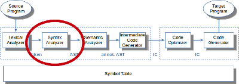

# LL-Parser selbst implementiert

> [!IMPORTANT]
>
> <details open>
>
> <summary><strong>🎯 TL;DR</strong></summary>
>
> <picture><source media="(prefers-color-scheme: light)" srcset="images/architektur_cb_parser_light.png"><source media="(prefers-color-scheme: dark)" srcset="images/architektur_cb_parser_dark.png"></picture>
>
> LL-Parser können über einen “rekursiven Abstieg” direkt aus einer
> Grammatik implementiert werden:
>
> - Zu jeder Produktionsregel erstellt man eine gleichnamige Funktion.
> - Wenn in der Produktionsregel andere Regeln “aufgerufen” werden,
>   erfolgt in der Funktion an dieser Stelle der entsprechende
>   Funktionsaufruf.
> - Bei Terminalsymbolen wird das erwartete Token geprüft.
>
> Dabei findet man wie bereits im Lexer die Funktionen `match` und
> `consume`, die sich hier aber auf den Tokenstrom beziehen.
> LL(1)-Parser schauen dabei immer das nächste Token an, LL(k) haben ein
> entsprechendes Look-Ahead von $`k`$ Token. Dies kann man mit einem
> Ringpuffer für die Token realisieren.
>
> Zur Beachtung der Vorrang- und Assoziativitätsregeln muss die
> Grammatik entsprechend umgebaut werden. LL-Parser haben durch die
> Betrachtung des aktuellen Vorschau-Tokens ein Problem mit
> Linksrekursion in der Grammatik, diese muss zunächst beseitigt werden.
> (ANTLR bietet hier gewisse Vereinfachungen an, kann aber mit
> indirekter Linksrekursion auch nicht umgehen.)
>
> Eine gute Darstellung, die sich am zeichen- bzw. tokenweisen Einlesen
> orientiert, finden Sie in ([Parr 2010](#ref-Parr2010)) (Kapitel 2).
> Eine weitere sehr gut lesbare Darstellung ist in \[Nystrom2021\]
> (Kapitel 4, 5 und 6) zu finden. Dort wird die Eingabe komplett
> eingelesen und daraus eine Liste aller Token erzeugt, auf der der
> Parser operiert. Der Beispiel-Code in dieser Vorlesung orientiert sich
> an der zeichenweisen bzw. tokenweisen Verarbeitung.
> </details>

> [!TIP]
>
> <details open>
>
> <summary><strong>🎦 Videos</strong></summary>
>
> - [VL LL-Parser selbst implementiert](https://youtu.be/3djLtMtW82k)
>
> </details>

## Erinnerung Lexer: Zeichenstrom =\> Tokenstrom

``` python
def nextToken():
    while (peek != EOF):  # globale Variable, über consume()
        switch (peek):
            case ' ': case '\t': case '\n': WS(); continue
            case '[': consume(); return Token(LBRACK, '[')
            ...
            default: raise Error("invalid character: "+peek)
    return Token(EOF_Type, "<EOF>")

def match(c):   # Lookahead: Ein Zeichen
    consume()
    if (peek == c): return True
    else: rollBack(); return False

def consume():
    peek = buffer[start]
    start = (start+1) mod 2n
    if (start mod n == 0):
        fill(buffer[start:start+n-1])
        end = (start+n) mod 2n
```

Erinnerung: Der Lexer arbeitet direkt auf dem Zeichenstrom und versucht
über längste Matches daraus einen Tokenstrom zu erzeugen. Dabei wird
immer das nächste Zeichen angeschaut (Funktion `match`) und mit
`consume` das aktuelle Zeichen “verbraucht” und das nächste Zeichen
geladen. Hier kann man über die Doppel-Puffer-Strategie das Einlesen
einzelner Zeichen aus einer Datei vermeiden und immer blockweise in den
Puffer einlesen.

## Grundidee LL-Parser

Grammatik:

``` antlr
r : X s ;
```

LL-Implementierung:

``` python
def r():
    match(X)
    s()
```

- Für jede Regel in der Grammatik wird eine Methode/Funktion mit dem
  selben Namen definiert
- Referenzen auf ein Token `T` werden durch den Aufruf der Methode
  `match(T)` aufgelöst
  - `match(T)` “konsumiert” das aktuelle Token, falls dieses mit `T`
    übereinstimmt
  - Anderenfalls löst `match()` eine Exception aus
- Referenzen auf Regeln `s` werden durch Methodenaufrufe `s()` aufgelöst

*Erinnerung*: In ANTLR werden Parser-Regeln (non-Terminale) mit einem
kleinen und Lexer-Regeln (Terminale/Token) mit einem großen
Anfangsbuchstaben geschrieben.

## Alternative Subregeln

    a | b | c

kann zu einem `switch`-Konstrukt aufgelöst werden:

``` python
switch (lookahead):
    case predicting_a:
        a(); break;
    case predicting_b:
        b(); break;
    ...
    default: raise Error()
```

Dabei ist `lookahead` eine globale Variable, die das zu betrachtende
Token enthält (vergleichbar mit `peek` beim Lexer).

Das Prädikat `predicting_a` soll andeuten, dass man mit dem aktuellen
Token eine Vorhersage für die Regel `a` versucht (hier kommen die FIRST-
und FOLLOW-Mengen ins Spiel …). Wenn das der Fall ist, springt man
entsprechend in die Funktion bzw. Methode `a()`.

## Optionale Subregeln: Eins oder keins

    (T)?

wird zu einem `if` ohne `else`-Teil:

``` python
if lookahead.predicting_T: match(T)
```

## Optionale Subregeln: Mindestens eins

    (T)+

wird zu einer `do-while`-Schleife (mind. ein Durchlauf):

``` python
while True:
    match(T)
    if not lookahead.predicting_T: break
```

## LL(1)-Parser

Beispiel: Parsen von Listen, also Sequenzen wie `[1,2,3,4]`:

``` antlr
list     : '[' elements ']' ;
elements : INT (',' INT)* ;

INT      : ('0'..'9')+ ;
```

Formal berechnet man die Lookahead-Mengen mit `FIRST` und `FOLLOW`, um
eine Entscheidung für die nächste Regel zu treffen. Praktisch betrachtet
kann man sich fragen, welche(s) Token eine Phrase in der aktuellen
Alternative starten können.

Für LL(1)-Parser betrachtet man immer das **aktuelle** Token (**genau
*EIN* Lookahead-Token**), um eine Entscheidung zu treffen.

``` python
def list():
    match(LBRACK); elements(); match(RBRACK);

def elements():
    match(INT)
    while lookahead == COMMA:  # globale Variable, über consume()
        match(COMMA); match(INT)
```

## Detail: *match()* und *consume()*

``` python
def match(x):
    if lookahead == x: consume()
    else: raise Exception()

def consume():
    lookahead = lexer.nextToken()
```

Quelle: Eigener Code basierend auf einer Idee nach ([Parr
2010](#ref-Parr2010), p. 43)

Dabei setzt man in der Klasse `Parser` zwei Attribute voraus:

``` python
class Parser:
    Lexer lexer
    Token lookahead
```

Starten würde man den Parser nach dem Erzeugen einer Instanz (dabei wird
ein Lexer mit durchgereicht) über den Aufruf der Start-Regel, also
beispielsweise `parser.list()`.

*Anmerkung*: Mit dem generierten Parse-Tree bzw. *AST* beschäftigen wir
uns später (=\> [AST-basierte
Interpreter](../06-interpretation/astdriven-part1.md)).

## Vorrangregeln

    1+2*3 == 1+(2*3) != (1+2)*3

Die Eingabe `1+2*3` muss als `1+(2*3)` interpretiert werden, da `*`
Vorrang vor `+` hat.

Dies formuliert man üblicherweise in der Grammatik:

``` antlr
expr : expr '+' term
     | term
     ;
term : term '*' INT
     | INT
     ;
```

ANTLR nutzt die Strategie des [“*precedence
climbing*”](https://www.antlr.org/papers/Clarke-expr-parsing-1986.pdf)
und löst nach der *Reihenfolge der Alternativen* in einer Regel auf.
Entsprechend könnte man die obige Grammatik unter Beibehaltung der
Vorrangregeln so in ANTLR (v4) formulieren:

``` antlr
expr : expr '*' expr
     | expr '+' expr
     | INT
     ;
```

## Linksrekursion

Normalerweise sind linksrekursive Grammatiken nicht mit einem LL-Parser
behandelbar. Man muss die Linksrekursion manuell auflösen und die
Grammatik umschreiben.

**Beispiel**:

``` antlr
expr : expr '*' expr | expr '+' expr | INT ;
```

Diese linksrekursive Grammatik könnte man (unter Beachtung der
Vorrangregeln) etwa so umformulieren:

``` antlr
expr     : addExpr ;
addExpr  : multExpr ('+' multExpr)* ;
multExpr : INT ('*' INT)* ;
```

ANTLR (v4) kann Grammatiken mit *direkter* Linksrekursion auflösen. Für
frühere Versionen von ANTLR muss man die Rekursion manuell beseitigen.

Vergleiche [“ALL(\*)” bzw. “Adaptive
LL(\*)”](https://www.antlr.org/papers/allstar-techreport.pdf).

**Achtung**: Mit *indirekter* Linksrekursion kann ANTLR (v4) *nicht*
umgehen:

``` antlr
expr : expM | ... ;
expM : expr '*' expr ;
```

=\> *Nicht* erlaubt!

## Assoziativität

Die Eingabe `2^3^4` sollte als `2^(3^4)` geparst werden. Analog sollte
`a=b=c` in C als `a=(b=c)` verstanden werden.

Per Default werden Operatoren wie `+` in ANTLR *links-assoziativ*
behandelt, d.h. die Eingabe `1+2+3` wird als `(1+2)+3` gelesen. Für
*rechts-assoziative* Operatoren muss man ANTLR dies in der Grammatik
mitteilen:

``` antlr
expr : expr '^'<assoc=right> expr
     | INT
     ;
```

*Anmerkung*: Laut
[Doku](https://github.com/antlr/antlr4/blob/master/doc/left-recursion.md)
gilt die Angabe `<assoc=right>` immer für die jeweilige Alternative und
muss seit Version 4.2 an den Alternativen-Operator `|` geschrieben
werden. In der Übergangsphase sei die Annotation an Tokenreferenzen noch
zulässig, würde aber ignoriert?!

## LL(k)-Parser

``` antlr
expr : ID '++'    // x++
     | ID '--'    // x--
     ;
```

Die obige Regel ist für einen LL(1)-Parser nicht deterministisch
behandelbar, da die Alternativen mit dem selben Token beginnen (die
Lookahead-Mengen überlappen sich). Entweder benötigt man zwei
Lookahead-Tokens, also einen LL(2)-Parser, oder man muss die Regel in
eine äquivalente LL(1)-Grammatik umschreiben:

``` antlr
expr : ID ('++' | '--') ;    // x++ oder x--
```

## LL(k)-Parser: Implementierung mit Ringpuffer

Für einen größeren Lookahead benötigt man einen Puffer für die Token.
Für einen Lookahead von $`k`$ Token (also einen LL(k)-Parser) würde man
einen Puffer mit $`k`$ Plätzen anlegen und diesen wie einen Ringpuffer
benutzen. Dabei ist `start` der Index des aktuellen Lookahead-Tokens.
Über die neue Funktion `lookahead(1)` ist dieses aktuelle
Lookahead-Token abrufbar.

``` python
class Parser:
    Lexer lexer
    k = 3               # Lookahead: 3 Token => LL(3)
    start = 0           # aktuelle Tokenposition im Ringpuffer
    Token[k] lookahead  # Ringpuffer mit k Plätzen (vorbefüllt via Konstruktor)
```

``` python
def match(x):
    if lookahead(1) == x: consume()
    else: raise Exception()

def consume():
    lookahead[start] = lexer.nextToken()
    start = (start+1) % k

def lookahead(i):
    return lookahead[(start+i-1) % k]  # i==1: start
```

Quelle: Eigener Code basierend auf einer Idee nach ([Parr
2010](#ref-Parr2010), p. 47)

## Wrap-Up

- LL(1) und LL(k) mit festem Lookahead
- Implementierung von Vorrang- und Assoziativitätsregeln
- Beachtung und Auflösung von Linksrekursion

## 📖 Zum Nachlesen

- Nystrom ([2021](#ref-Nystrom2021)): Kapitel 5 und 6
- Parr ([2010](#ref-Parr2010)): Kapitel 2 (“Pattern 3: LL(1)
  Recursive-Decent Parser”)

> [!NOTE]
>
> <details>
>
> <summary><strong>✅ Lernziele</strong></summary>
>
> - k2: Ich kann den prinzipiellen Aufbau von LL-Parsern am Beispiel
>   erklären
> - k3: Ich kann LL(1)- und LL(k)-Parser implementieren
> - k3: Ich kann Vorrang und Assoziativität bei der Implementierung
>   korrekt umsetzen
> - k3: Ich kann mit Linksrekursion umgehen und diese ggf. auflösen
>
> </details>

> [!TIP]
>
> <details>
>
> <summary><strong>🏅 Challenges</strong></summary>
>
> **Quizzfragen**:
>
> - Wie kann man aus einer LL(1)-Grammatik einen LL(1)-Parser mit
>   rekursivem Abstieg implementieren? Wie “übersetzt” man dabei Token
>   und Regeln?
> - Wie geht man mit Alternativen um? Wie mit optionalen Subregeln?
> - Warum ist Linksrekursion i.A. bei LL-Parsern nicht erlaubt? Wie kann
>   man Linksrekursion beseitigen?
> - Wie kann man Vorrangregeln implementieren?
> - Wann braucht man mehr als ein Token Lookahead? Geben Sie ein
>   Beispiel an.
>
> **Manuell implementierter Parser**
>
> Betrachten Sie erneut die folgende einfache Sprache:
>
>     a = 10 - 5     # Zuweisung des Ausdruckes 10-5 (Integer-Wert 5) an Variable a
>     b = a + 2 * 3  # Zuweisung von 16 an Variable b
>     c = a != b     # Zuweisung eines boolschen Werts an c
>
> Es gibt nur Statements und Expressions:
>
> - Statement: Zuweisung; jedes Statement endet mit einem NL
> - Expression: Zahl, Variable, Addition, Subtraktion, Multiplikation
>   (mit üblichem Vorrang), Vergleich
>
> **Aufgaben**:
>
> In den Challenges von [LL Lexer](../01-lexing/recursive.md) haben Sie
> eine Grammatik definiert und einen Lexer implementiert.
>
> - Geben Sie nun geeignete Datenstrukturen für den AST an.
> - Implementieren Sie analog zum Vorgehen in der Vorlesung einen Parser
>   mit *recursive descent* für diese Sprache.
> - Was müssten Sie anpassen bzw. ergänzen, wenn Sie beispielsweise
>   weitere Statements wie eine `if`-Abfrage oder eine `while`-Schleife
>   mit einbauen wollten?
>
> </details>

------------------------------------------------------------------------

> [!NOTE]
>
> <details>
>
> <summary><strong>👀 Quellen</strong></summary>
>
> <div id="refs" class="references csl-bib-body hanging-indent">
>
> <div id="ref-Nystrom2021" class="csl-entry">
>
> Nystrom, R. 2021. *Crafting Interpreters*. Genever Benning.
> <https://github.com/munificent/craftinginterpreters>.
>
> </div>
>
> <div id="ref-Parr2010" class="csl-entry">
>
> Parr, T. 2010. *Language Implementation Patterns*. Pragmatic
> Bookshelf.
> <https://learning.oreilly.com/library/view/language-implementation-patterns/9781680500097/>.
>
> </div>
>
> </div>
>
> </details>

------------------------------------------------------------------------


Unless otherwise noted, this work is licensed under CC BY-SA 4.0.

<blockquote><p><sup><sub><strong>Last modified:</strong> 66d4de6 (lecture: fix readings (LL Parser), 2025-10-20)<br></sub></sup></p></blockquote>
