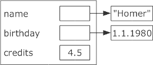
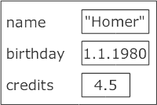

::: tldr
Klassen werden in C++ mit dem Schlüsselwort `class` definiert. Dabei müssen Klassendefinitionen immer mit einem
Semikolon abgeschlossen werden(!). Bei Trennung von Deklaration und Implementierung muss die Definition der Methoden mit
dem Namen der Klasse als Namespace erfolgen:

``` cpp
// .h
class Fluppie {
public:
    int wuppie(int c=0);
};

// .cpp
int Fluppie::wuppie(int c) { ... }
```

Die Sichtbarkeiten für die Attribute und Methoden werden blockweise definiert. Für die Klassen selbst gibt es keine
Einstellungen für die Sichtbarkeit.

Objekt-Layout: Die Daten (Attribute) liegen direkt im Objekt (anderenfalls Pointer nutzen). Sofern der Typ der Attribute
eine Klasse ist, kann man diese Attribute nicht mit `NULL` initialisieren (kein Pointer, keine Referenz).

Für den Aufruf eines Konstruktors ist kein `new` notwendig, es sei denn, man möchte das neue Objekt auf dem Heap haben
(inkl. Pointer auf das Objekt).

Beachten Sie den Unterschied der Initialisierung der Attribute bei einer Initialisierung im Body des Konstruktors
vs. der Initialisierung über eine **Initialisierungsliste**. (Nutzen Sie in C++ nach Möglichkeit
Initialisierungslisten.)
:::

::: youtube
-   [VL C++: Klassen](https://youtu.be/4xAYFHWvBGc)
:::

# OOP in C++

\bigskip

::::: columns
::: {.column width="60%"}
``` java
public abstract class Dummy {
    public Dummy(int v) { value = v; }
    public abstract int myMethod();

    private int value;
}
```
:::

::: {.column width="40%"}
\vspace{40mm}

``` cpp
class Dummy {
public:
    Dummy(int v = 0);
    int myMethod();
    virtual ~Dummy();
private:
    int value;
};
```
:::
:::::

::: notes
## OOP in C++: Unterschiede zu Java

-   Klassendefinition muss mit Semikolon beendet werden
-   Sichtbarkeit wird immer blockweise eingestellt (per Default immer `private`)
-   Wie bei Funktionen: Deklaration muss vor Verwendung (= Aufruf) bekannt sein
-   `this` ist keine Referenz, sondern ein **Pointer** auf das eigene Objekt

## Objektlayout: Java vs. C++

### Java: Referenzen auf Objekte

``` java
class Student {
    String name;
    Date birthday;
    double credits;
}
```



In Java werden im Objektlayout lediglich die primitiven Attribute direkt gespeichert.

Für Objekte wird nur eine Referenz auf die Objekte gehalten. Die Attribute selbst liegen aber außerhalb der Klasse,
dadurch benötigt das Objekt selbst nur relativ wenig Platz im Speicher.

### C++: Alles direkt im Objekt

``` cpp
class Student {
    string name;
    Date birthday;
    double credits;
};
```



In C++ werden alle Attribute innerhalb des Objektlayouts gespeichert. Ein Objekt mit vielen oder großen Feldern braucht
also auch entsprechend viel Platz im Speicher.

Wollte man eine Java-ähnliche Lösung aufbauen, müsste man in C++ entsprechend Pointer einsetzen:

``` cpp
class Student {
private:
    string *name;
    Date *birthday;
    double credits;
}
```

**Warum nicht Referenzen?**
:::

# Objekte erzeugen mit Konstruktoren

``` cpp
class Dummy {
public:
    Dummy(int c=0) { credits = c; }
private:
    int credits;
};
```

\smallskip

[**Erzeugen neuer Objekte**:]{.notes}

``` cpp
Dummy a;
Dummy b(37);
Dummy c=99;
```

\bigskip
\bigskip

**=\> Kein Aufruf von `new`!**

[(`new` würde zwar auch ein neues Objekt anlegen, aber **auf dem Heap**!)]{.notes}

::: notes
# Default-Konstruktoren

Der C++-Compiler generiert einen **parameterlosen Defaultkonstruktor** - sofern man nicht selbst mindestens einen
Konstruktor definiert.

Dieser parameterlose Defaultkonstruktor wendet für jedes Attribut dessen parameterlosen Konstruktor an, für primitive
Typen erfolgt keine garantierte Initialisierung!

**Achtung**: Default-Konstruktor wird ohne Klammern aufgerufen!

``` cpp
Dummy a;    // Korrekt
Dummy a();  // FALSCH!!! (Deklaration einer Funktion `a()`, die ein `Dummy` zurueckliefert)
```
:::

# C++: Trennung .h und .cpp

``` cpp
// .h
class Dummy {
public:
    Dummy(int c=0);
private:
    int credits;
};
```

\bigskip

``` cpp
// .cpp
Dummy::Dummy(int c) {
    credits = c;
}
```

[Klassenname ist der Scope für die Methoden]{.notes}

# Konstruktoren: Normale (Java-like) Initialisierung

``` cpp
class Student {
public:
    Student(const string &n, const Date &d, double c) {
        name = n;
        birthday = d;
        credits = c;
    }
private:
    string name;
    Date birthday;
    double credits;
};
```

::: notes
Hier erfolgt die Initialisierung in **zwei** Schritten:

1.  Attribut wird angelegt und mit Defaultwert/-konstruktor des Datentyps initialisiert
2.  Anschließend wird die Zuweisung im Body des Konstruktors ausgeführt

Das klappt natürlich nur, wenn es einen parameterlosen Konstruktor für das Attribut gibt.

Beispiel oben: Beim Anlegen von `birthday` im Speicher wird der **Defaultkonstruktor** für `Date` aufgerufen. Danach
wird im Body der übergebene Datumswert **zugewiesen**.
:::

[Konsole: studiInitBody.cpp]{.ex
href="https://github.com/Compiler-CampusMinden/CB-Vorlesung-Bachelor/blob/master/lecture/99-languages/src/studiInitBody.cpp"}

# Konstruktoren: Initialisierungslisten

``` cpp
class Student {
public:
    Student(const string &n, const Date &d, double c)
    : name(n), birthday(d), credits(c)
    {}
private:
    string name;
    Date birthday;
    double credits;
};
```

::: notes
In diesem Fall erfolgt die Initialisierung in nur einem Schritt:

1.  Attribut wird angelegt und direkt mit übergebenen Wert (Kopie) initialisiert

Das klappt natürlich nur, wenn ein passender Konstruktor für das Attribut existiert.

**Achtung**: Die Reihenfolge der Auswertung der Initialisierungslisten wird durch die Reihenfolge der
Attribut-Deklarationen in der Klasse bestimmt!!!

Beispiel oben: Beim Anlegen von `birthday` im Speicher wird direkt der übergebene Wert **kopiert**.
:::

[Konsole: studiInitListe.cpp (ohne/mit `-Wall`)]{.ex
href="https://github.com/Compiler-CampusMinden/CB-Vorlesung-Bachelor/blob/master/lecture/99-languages/src/studiInitListe.cpp"}

::: notes
# Zwang zu Initialisierungslisten

In manchen Fällen **muss** man die Initialisierung der Attribute per Initialisierungsliste durchführen.

Hier einige Beispiele:

-   Attribut **ohne parameterfreien Konstruktor**

    Bei "normaler" Initialisierung würde zunächst der parameterfreie Konstruktor für das Attribut aufgerufen, bevor der
    Wert zugewiesen wird. Wenn es keinen parameterfreien Konstruktor für das Attribut gibt, bekommt man beim Kompilieren
    einen Fehler.

-   **Konstante** Attribute

    Bei "normaler" Initialisierung würde das Attribut zunächst per parameterfreiem Konstruktor angelegt (s.o.), danach
    existiert es und ist konstant und darf nicht mehr geändert werden (müsste es aber, um die eigentlich gewünschten
    Werte im Body zu setzen) ...

-   Attribute, die **Referenzen** sind

    Referenzen müssen direkt beim Anlegen initialisiert werden.
:::

::: notes
# C++11 und delegierende Konstruktoren

``` cpp
class C {
    // 1: Normaler Konstruktor
    C(int x) { }

    // 2: Delegiert zu (1)
    C() : C(42) { }

    // 3: Rekursion mit (4)
    C(char c) : C(42.0) { }

    // 4: Rekursion mit (3)
    C(double d) : C('a') { }
};
```

Delegierende Konstruktoren gibt es ab C++11:

-   Vor C++11: Ein Objekt ist fertig konstruiert, wenn der Konstruktor durchgelaufen ist
-   Ab C++11: Ein Objekt ist fertig konstruiert, wenn der **erste** Konstruktor fertig ausgeführt ist =\> Jeder weitere
    aufgerufene Konstruktor agiert auf einem "fertigen" Objekt.
-   Vorsicht mit rekursiven Aufrufen: Compiler *kann* warnen, muss aber nicht.
:::

# C++ und explizite Konstruktoren

-   Implizite Konvertierung mit einelementigen Konstruktoren:

    ``` cpp
    class Dummy {
    public:
        Dummy(int c=0);
    };

    Dummy a;
    a = 37;     // Zuweisung(!)
    ```

    ::: notes
    Auf der linken Seite der Zuweisung steht der Typ `Dummy`, rechts ein `int`. Der Compiler sucht nach einem Weg, aus
    einem `int` einen `Dummy` zu machen und hat durch die Gestaltung des Konstruktors von `Dummy` diese Möglichkeit.
    D.h. in dieser Zuweisung wird implizit aus der 37 ein Objekt vom Typ `Dummy` gebaut (Aufruf des Konstruktors) und
    dann die Zuweisung ausgeführt.

    Dieses Verhalten ist in vielen Fällen recht praktisch, kann aber auch zu unerwarteten Problemen führen. Zur Abhilfe
    gibt es das Schlüsselwort `explicit`.
    :::

\bigskip

-   Falls unerwünscht: Schlüsselwort `explicit` nutzen

    ``` cpp
    explicit Dummy(int c=0);
    ```

# Wrap-Up

-   Klassendefinition mit Semikolon abschließen (!)
-   Sichtbarkeiten blockweise, keine für Klasse
-   Daten liegen direkt im Objekt (anderenfalls Pointer nutzen)
-   Attribute sind echte Objekte: Initialisieren mit `NULL` nicht möglich
-   Konstruktoren: Kein `new` nötig (würde Objekt auf Heap anlegen und Pointer liefern)

::: readings
-   @Breymann2011
-   @cppreference.com
-   @cprogramming.com
:::

::: outcomes
-   k2: Attribute von C++-Klassen sind Speicherplatz im Objekt
-   k2: Explizite Konstruktoren
-   k2: Problematik mit Defaultkonstruktoren/-operatoren (Pointer)
-   k3: Konstruktoren (eigene, Default)
-   k3: Unterschied Initialisierungslisten vs. Initialisierung im Body
:::

::: challenges
**C++: Klassen**

Erklären Sie die Unterschiede zwischen den Klassendefinitionen (Java, C++):

``` java
class Student {
    private String name;
    private Date birthday;
    private double credits;
}
```

``` cpp
class Student {
private:
    string name;
    Date birthday;
    double credits;
};
```

**Konstruktoren**

-   Wie kann der implizite Aufruf eines Konstruktors verhindert werden (beispielsweise in `Dummy b; b=3;`)?
-   In welchen Fällen muss eine Initialisierung von Attributen in der Initialisierungsliste stattfinden?
-   Wie können/müssen `static` Attribute initialisiert werden?
:::
