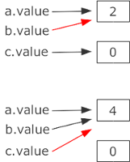

# C++: Big 3

> [!IMPORTANT]
>
> <details open>
>
> <summary><strong>🎯 TL;DR</strong></summary>
>
> Für C++-Klassen kann man Destruktoren, Copy-Konstruktoren und
> Zuweisungsoperatoren definieren. Wenn man keine eigenen definiert,
> erzeugt C++ Default-Varianten. Diese bereiten u.U. Probleme, wenn man
> Pointertypen für die Attribute verwendet: Dann werden u.U. nur flache
> Kopien erzeugt bzw. es wird u.U. der Platz auf dem Heap nicht
> freigegeben.
>
> Der Default-Destruktor ruft die Destruktoren der Objekt-Attribute auf.
> Der Copy-Konstruktor wird aufgerufen, wenn die linke Seite (einer
> scheinbaren “Zuweisung”) ein unfertiges Objekt ist (noch zu bauen) und
> die rechte Seite ein fertiges Objekt ist. Der Zuweisungs-Operator wird
> dagegen aufgerufen, wenn auf beiden Seiten ein fertiges Objekt
> vorliegt.
>
> Innerhalb einer Klasse kann man über den **Pointer `this`** auf das
> eigene Objekt zugreifen (analog zu `self` in Python oder `this` in
> Java, dort aber Referenzen).
>
> Bei statischen Methoden und Attributen wird die Deklaration als
> `static` **nicht** in der Implementierung wiederholt! Statische
> Attribute müssen außerhalb der Klassendefinition einmal initialisiert
> werden!
>
> Methoden können als “konstant” ausgezeichnet werden (`const` rechts
> von der Parameterliste). Das `const` gehört zur Signatur der Methode!
> Konstante Methoden dürfen auf konstanten Objekten/Referenzen
> aufgerufen werden.
> </details>

> [!TIP]
>
> <details open>
>
> <summary><strong>🎦 Videos</strong></summary>
>
> - [VL C++: Big 3](https://youtu.be/PaBK04Jks58)
>
> </details>

## Big Three

Neben dem eigentlichen Konstruktor existieren in C++ weitere wichtige
Konstruktoren/Operatoren: die sogenannten “Big Three”:

- Copy-Konstruktor
- Destruktor: Gegenstück zum Konstruktor
- Zuweisungsoperator (`operator=`)

*Anmerkung*: Für Fortgeschrittenere sei hier auf die in C++11
eingeführte und den Folgeversionen verbesserte und verfeinerte
[Move-Semantik](https://en.wikipedia.org/wiki/C%2B%2B11#Rvalue_references_and_move_constructors)
und die entsprechenden Varianten der Konstruktoren und Operatoren
verwiesen. Man spricht deshalb mittlerweile auch gern von den “Big Five”
bzw. der [“rule of
five”](https://en.wikipedia.org/wiki/Rule_of_three_(C%2B%2B_programming)).

``` cpp
class Dummy {
public:
    Dummy(int a=0);
    Dummy(const Dummy &d);
    ~Dummy();
    Dummy &operator=(const Dummy &d);
private:
    int value;
};
```

``` cpp
Dummy::Dummy(int a): value(a) {}
Dummy::Dummy(const Dummy &d): value(d.value) {}
Dummy::~Dummy() {}
Dummy::Dummy &operator=(const Dummy &d) {
    if (this != &d) { value = d.value; }
    return *this;
}
```

### Big Three: Destruktor

- Syntax: `Dummy::~Dummy();` (Konstruktor mit vorgesetzter Tilde)
- Wird aufgerufen:
  - wenn ein Objekt seinen Scope verlässt, oder
  - wenn explizit `delete` für einen Pointer auf ein Objekt (auf dem
    Heap!) aufgerufen wird
- Default-Destruktor ruft Destruktoren der Objekt-Attribute auf

<p align="right"><a href="https://github.com/Compiler-CampusMinden/CB-Vorlesung-Bachelor/blob/master/lecture/99-languages/src/destruktor.cpp">Konsole: destruktor.cpp</a></p>

### Big Three: Copy-Konstruktor

- Syntax: `Dummy::Dummy(const Dummy &);`
- Wird aufgerufen bei:
  - Deklaration mit Initialisierung mit Objekt
  - Objektübergabe und -rückgabe mit Call-by-Value
  - Nicht bei Zuweisung
- Default-Copy-Konstruktor kopiert einfach elementweise =\> bei Pointern
  also nur **flache Kopie**

“**Merkregel**”: Linke Seite unfertiges Objekt (noch zu bauen), rechte
Seite fertiges Objekt.

<p align="right"><a href="https://github.com/Compiler-CampusMinden/CB-Vorlesung-Bachelor/blob/master/lecture/99-languages/src/copyKonstruktor.cpp">Konsole: copyKonstruktor.cpp</a></p>

### Big Three: Zuweisungsoperator

- Syntax: `Dummy &Dummy::operator=(const Dummy &)`
- Wird aufgerufen:
  - bei Zuweisung bereits initialisierter Objekte
- Default-Zuweisungsoperator kopiert einfach elementweise =\> bei
  Pointern also nur **flache Kopie**

“**Merkregel**”: Linke Seite fertiges Objekt, rechte Seite fertiges
Objekt.

<p align="right"><a href="https://github.com/Compiler-CampusMinden/CB-Vorlesung-Bachelor/blob/master/lecture/99-languages/src/zuweisungsOperator.cpp">Konsole: zuweisungsOperator.cpp</a></p>

### Big Three: Defaults

Analog zum Default-Konstruktor kann der Compiler auch Defaults für die
Big Three (Copy-Konstruktor, Destruktor, Zuweisungsoperator) generieren.
Das funktioniert nur, so lange Sie nicht selbst einen Copy-Konstruktor,
Destruktor oder Zuweisungsoperator definiert haben.

Diese Defaults passen normalerweise, wenn die Data-Member vom Typ `int`,
`double`, `vector<int>`, `string`, `vector<string>` o.ä. sind.

Problematisch wird es, wenn Pointer dabei sind: Dann werden flache
Kopien erzeugt bzw. Speicher auf dem Heap nicht oder mehrfach
freigegeben! Sobald Sie für die Attribute Pointer verwenden, sollten Sie
eigene Konstruktoren, Copy-Konstruktoren, Destruktoren und
Zuweisungsoperatoren definieren!

Hier ein Beispiel für die Wirkung:

``` cpp
class Dummy {
public:
    Dummy(int initValue = 0) {
        value = new int(initValue);
    }

    int getValue() {
        return *value;
    }
    void setValue(int a) {
        *value = a;
    }
private:
    int *value;
};

void main() {
    // oberer Teil der Abbildung
    Dummy a(2);
    Dummy b = a;
    Dummy c;

    // unterer Teil der Abbildung
    c=b;
    a.setValue(4);
}
```

<picture><source media="(prefers-color-scheme: light)" srcset="images/bigthreeDefaults_light.png"><source media="(prefers-color-scheme: dark)" srcset="images/bigthreeDefaults_dark.png"></picture>

Analyse:

1.  Es sind Pointer im Spiel. Es wurde ein eigener Konstruktor
    definiert, aber kein Copy-Konstruktor, d.h. diesen “spendiert” der
    Compiler.
2.  Beim Anlegen von `a` wird auf dem Heap Speicher für einen `int`
    reserviert und dort der Wert `2` hineingeschrieben.
3.  Beim Anlegen von `b` wird der Default-Copy-Konstruktor verwendet,
    der einfach elementweise kopiert. Damit zeigt der Pointer `value` in
    `b` auf den selben Speicher wie der Pointer `value` in `a`.
4.  Der Ausdruck `c=b` ist eine Zuweisung (warum?). Auch hier wird der
    vom Compiler bereitgestellte Default genutzt (elementweise
    Zuweisung). Damit zeigt nun auch der Pointer `value` in `c` auf den
    selben Speicher wie die `value`-Pointer in `a` und `b`.

### Hinweis Abarbeitungsreihenfolge

``` cpp
Dummy a(0); Dummy b(1); Dummy c(2); Dummy d(3);
a = b = c = d; // entspricht: a.operator=(b.operator=(c.operator=(d)));
```

## delete this?

Erinnerung:

- `this` ist ein Pointer auf das eigene Objekt
- `delete` darf nur für Pointer auf Objekte, die mit `new` angelegt
  wurden, aufgerufen werden =\> Freigabe von Objekten auf dem Heap!
- `delete` ruft den Destruktor eines Objekts auf …

Frage: Ist das folgende Konstrukt sinnvoll? Ist es überhaupt erlaubt?
Was passiert dabei?

``` cpp
class Foo {
public:
    ~Foo() {
        delete this;
    }
};
```

Analyse: Wir haben hier gleich zwei Probleme:

1.  `delete` ruft den Destruktor des verwiesenen Objekts auf. Da `this`
    ein Pointer auf das eigene Objekt ist, ruft `delete this;` den
    eigenen Destruktor auf, der dann wiederum `delete this;` aufruft und
    so weiter. =\> Endlosschleife!

2.  Außerdem wissen wir im Destruktor bzw. im Objekt gar nicht, ob das
    Objekt wirklich mit `new` auf dem Heap angelegt wurde! D.h. wenn wir
    nicht in die Endlosschleife eintreten würden, würde das Programm
    abstürzen.

Der Destruktor wird aufgerufen, wenn ein Objekt zerstört wird, d.h. wenn
ein Objekt seine Lebensdauer beendet (Verlassen des Scopes, in dem das
Objekt definiert wurde) bzw. wenn explizit ein `delete` auf das Objekt
aufgerufen wird (d.h. `delete` auf einen Pointer auf das Objekt, wobei
dieses mit `new` angelegt wurde).

Im Destruktor sollten **durch das Objekt verwaltete Resourcen
freigegeben** werden, d.h. sämtliche im Objekt mit `new` oder `malloc`
allozierten Resourcen auf dem Heap müssen freigegeben werden. Außerdem
sollten ggf. offene Verbindungen (offene Dateien, Datenbankverbindungen,
Kommunikation, …) geschlossen werden, wenn sie durch das Objekt geöffnet
wurden bzw. in der Verantwortung des Objekts stehen. Einfache Datentypen
oder Objekte, die nicht per Referenz oder Pointer im Objekt verwaltet
werden, werden automatisch freigegeben (denken Sie an das
Speichermodell - diese Daten “stehen” direkt im Speicherbereich des
Objekts).

Der Speicherbereich für das Objekt selbst wird nach Beendigung des
Destruktors automatisch freigegeben (auf dem Stack wegen des Verlassen
des Scopes (=\> automatische Variable), auf dem Heap durch das vorherige
Aufrufen von `delete` auf den Pointer auf das Objekt im Heap), d.h. Sie
brauchen im Destruktor **kein** `delete` auf “sich selbst” (das ist wie
oben demonstriert sogar schädlich)!

> [!WARNING]
>
> Auch wenn es zunächst irgendwie sinnvoll aussieht - rufen Sie
> **niemals nie** `delete this` im Destruktor auf!

<p align="right"><a href="https://github.com/Compiler-CampusMinden/CB-Vorlesung-Bachelor/blob/master/lecture/99-languages/src/deletethis.cpp">Konsole: deletethis.cpp</a></p>

## C++11: *default* und *delete*

``` cpp
class Dummy {
public:
    Dummy() = default;
    Dummy(int a) { value = a; }
    Dummy(const Dummy &a) = delete;

private:
    int value;
    Dummy &operator=(const Dummy &d);
};
```

- C++ erzeugt etliche triviale Methoden/Operatoren, sofern man diese
  nicht selbst definiert:
  - Methoden:
    - Standardkonstruktor
    - Copy-Konstruktor
    - Zuweisungsoperator
    - Destruktor
  - Operatoren:
    - Operator `new`
    - Operator `delete`
    - Adresse von
    - Indirektion
    - Elementzugriff
    - Elementindirektion
- Vor C++11: Default-Methode/-Operator verbieten: Sichtbarkeit auf
  `private` setzen (Definition nicht nötig)
- Ab C++11: Schlüsselwort `delete`: Entfernt Default-Methode/-Operator
- C++11: Default-Methode/-Operator zusätzlich zu selbst implementierten:
  Schlüsselwort `default`

## Statische Methoden und Attribute

``` cpp
class Studi {
    static int getCount();
    static int count;
};
```

``` cpp
int Studi::count = 0;

int Studi::getCount() {
    return Studi::count;
}
```

- Deklaration als `static` **nicht** in Implementierung wiederholen
- Statische Attribute: Initialisierung **immer** außerhalb der Klasse!

<p align="right"><a href="https://github.com/Compiler-CampusMinden/CB-Vorlesung-Bachelor/blob/master/lecture/99-languages/src/Studi.cpp">Konsole: Studi.cpp (static)</a></p>

## Konstante Methoden und Kontexte

``` cpp
class Studi {
    int getCredits() const;
    int getCredits();
};
```

``` cpp
int Studi::getCredits() const {
    return credits;
}

int Studi::getCredits() {
    return credits;
}
```

Das `const` gehört zur Signatur der Methode!

So wie im Beispiel gezeigt, gibt es jetzt zwei Methoden `getCredits()` -
eine davon ist konstant. Konstante Methoden dürfen auf konstanten
Objekten/Referenzen aufgerufen werden.

Was passiert, wenn das `const` auf der linken Seite steht? Dann bezieht
es sich auf den Rückgabewert:

``` cpp
const foo wuppie(foo&, foo&);
```

Hier darf der Rückgabewert nicht als L-Wert benutzt werden:
`wuppie(a,b) = c;` ist verboten.

<p align="right"><a href="https://github.com/Compiler-CampusMinden/CB-Vorlesung-Bachelor/blob/master/lecture/99-languages/src/Studi.cpp">Konsole: Studi.cpp (const)</a></p>

## Wrap-Up

- Klassen: Destruktoren, Copy-Konstruktor, Zuweisungsoperator
- Vorsicht mit Default-\*struktoren/-operatoren
- Statische Methoden und Attribute:
  - Deklaration als `static` **nicht** in Implementierung wiederholen
  - Statische Attribute: Initialisierung außerhalb der Klasse!
- Konstante Methoden und Kontexte
  - `const` gehört zur Signatur der Methode!
  - Konstante Methoden dürfen auf konstanten Objekten/Referenzen
    aufgerufen werden

## 📖 Zum Nachlesen

- Breymann ([2011](#ref-Breymann2011))
- „C and C++ Reference“ ([o. J.](#ref-cppreference.com))
- Allain und Hoffer ([o. J.](#ref-cprogramming.com))

> [!NOTE]
>
> <details>
>
> <summary><strong>✅ Lernziele</strong></summary>
>
> - k2: Ich kann die Problematik mit Defaultkonstruktoren/-operatoren
>   bei der Verwendung von Pointern an einem Beispiel erklären
> - k2: Ich kann die Problematik konstanter Funktionen erklären und
>   weiss, wann diese aufgerufen werden
> - k3: Ich kann die ‘Big Three’ in eigenen Programmen definieren und
>   aufrufen
>
> </details>

> [!TIP]
>
> <details>
>
> <summary><strong>🏅 Challenges</strong></summary>
>
> **Konstruktor, Copy-Konstruktor, Zuweisungsoperator?**
>
> - Erklären Sie die folgenden Anweisungen, worin liegt der Unterschied?
>
>   ``` cpp
>   Dummy a;
>   Dummy b = 3;
>   Dummy c(4);
>   ```
>
> - Erklären Sie die folgenden Anweisungen:
>
>   ``` cpp
>   Dummy a;
>   Dummy b = 3;
>   Dummy c(4);
>   Dummy d = b;
>   Dummy e(b);
>   Dummy f;
>   f = b;
>   ```
>
> **Destruktor**
>
> - Erklären Sie die Wirkungsweise eines Destruktors.
> - Wann wird ein Destruktor aufgerufen?
> - Warum ist `delete this` keine gute Idee (nicht nur im Destruktor)?!
> - Was sollten Sie im Destruktor aufräumen, was nicht?
>
> **Die “Großen Drei”**
>
> 1.  Beschreiben Sie den Unterschied der folgenden beiden Codeblöcke
>     (`A` sei eine beliebige Klasse):
>
>     ``` cpp
>     A a, b = a;
>     ```
>
>     ``` cpp
>     A a, b; b = a;
>     ```
>
> 2.  Erläutern Sie an einem **Beispiel** die Regel der “Big Three”:
>
>     > Ist ein Copy-Konstruktor, ein Destruktor oder ein eigener
>     > Zuweisungsoperator notwendig, muss man in der Regel die jeweils
>     > anderen beiden ebenfalls bereit stellen.
>
> 3.  Beim Zuweisungsoperator werden Selbstzuweisungen, d.h. ein Objekt
>     soll an sich selbst zugewiesen werden, üblicherweise durch eine
>     entsprechende Prüfung vermieden.
>
>     Begründen Sie diese Praxis, indem Sie ein **Beispiel
>     konstruieren**, bei dem es zu Datenverlust kommt, wenn die
>     Selbstzuweisung nicht unterbunden wird.
>
>     <details>
>
>     Wenn vor der Wertzuweisung der alte Inhalt freigegeben werden
>     muss, führt Selbstzuweisung zum Fehler.
>
>     Können Sie ein konkretes Beispiel angeben?
>
>     </details>
>
> **Quiz: Was passiert bei den folgenden Aufrufen?**
>
> ``` cpp
> class Foo {
> public:
>     const Foo &bar(const vector<Foo> &a) { return a[0]; }
> };
>
> int main() {
>     Foo f;  vector<Foo> a = {"hello", "world", ":)"};
>
>     Foo s1 = f.bar(a);
>     const Foo &s2 = f.bar(a);
>     Foo &s3 = f.bar(a);
>     Foo s4;
>     s4 = f.bar(a);
>
>     return EXIT_SUCCESS;
> }
> ```
>
> </details>

------------------------------------------------------------------------

> [!NOTE]
>
> <details>
>
> <summary><strong>👀 Quellen</strong></summary>
>
> <div id="refs" class="references csl-bib-body hanging-indent">
>
> <div id="ref-cprogramming.com" class="csl-entry">
>
> Allain, A., und A. Hoffer. o. J. „C Programming and C++ Programming“.
> Zugegriffen 16. September 2024. <https://www.cprogramming.com/>.
>
> </div>
>
> <div id="ref-Breymann2011" class="csl-entry">
>
> Breymann, U. 2011. *Der C++ Programmierer*. 2. Auflage. Hanser.
>
> </div>
>
> <div id="ref-cppreference.com" class="csl-entry">
>
> „C and C++ Reference“. o. J. Cppreference.com. Zugegriffen 16.
> September 2024. <https://en.cppreference.com/w/>.
>
> </div>
>
> </div>
>
> </details>

------------------------------------------------------------------------


Unless otherwise noted, this work is licensed under CC BY-SA 4.0.

<blockquote><p><sup><sub><strong>Last modified:</strong> 1064824 (lecture: rework outcomes (09/CPP3), 2025-08-21)<br></sub></sup></p></blockquote>
