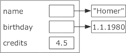

## OOP in C++

\bigskip

:::::: columns
::: {.column width="60%"}

```java
public abstract class Dummy {
    public Dummy(int v) { value = v; }
    public abstract int myMethod();

    private int value;
}
```

:::
::: {.column width="40%"}

\vspace{40mm}

```cpp
class Dummy {
public:
    Dummy(int v = 0);
    int myMethod();
    virtual ~Dummy();
private:
    int value;
};
```

:::
::::::

::: notes
### OOP in C++: Unterschiede zu Java

-   Klassendefinition hat selbst keine Angaben bzgl. Sichtbarkeit
-   Klassendefinition muss mit Semikolon beendet werden
-   Sichtbarkeit wird immer blockweise eingestellt
    (per Default immer `private`)
-   Konstruktoren dürfen sich nicht gegenseitig aufrufen
    (ab C++11 ist das erlaubt)
-   Wie bei Funktionen: Deklaration muss vor Verwendung bekannt sein
:::

## Objektlayout: Java vs. C++

\bigskip

:::::: columns
::: {.column width="50%"}

```java
class Student {
    String name;
    Date birthday;
    double credits;
}
```

\bigskip



:::
::: {.column width="40%"}

```cpp
class Student {
    string name;
    Date birthday;
    double credits;
};
```

\bigskip


:::
::::::

::: notes
-   Java: Objekte per Referenz
    (gilt auch für Komposition)
-   C++: Objekte werden direkt gespeichert

\smallskip

-   Java-ähnliche Lösung: [Pointer]{.alert}

    ```cpp
    class Student {
    private:
        string *name;
        Date *birthday;
        double credits;
    }
    ```

    [**Warum nicht Referenzen?**]{.alert}
:::

[Hinweis: `this` ist keine Referenz, sondern ein **Pointer** auf das eigene Objekt]{.notes}

## C++: Eigene Konstruktoren

```cpp
class Dummy {
public:
    Dummy(int c=0) { credits = c; }
private:
    int credits;
};
```

\smallskip

[**Erzeugen neuer Objekte**:]{.notes}

```cpp
Dummy a;
Dummy b(37);
Dummy c=99;
```

\bigskip
\bigskip
=> Kein Aufruf von `new`!
[(`new` würde zwar auch ein neues Objekt anlegen, aber auf dem Heap!)]{.notes}

::: notes
## C++: Default-Konstruktoren

-   _Kein_ eigener Konstruktor implementiert? \newline
    => **parameterloser Default-Konstruktor** _automatisch_ erzeugt
    -   Wendet für jedes Attribut dessen parameterlosen Konstruktor an
    -   Für primitive Typen keine garantierte Initialisierung!

-   [**Achtung**]{.alert}: Default-Konstruktor wird ohne Klammern aufgerufen!

    ```cpp
    Dummy a;    // Korrekt
    Dummy a();  // FALSCH!!! (Deklaration einer Funktion `a()`, die ein `Dummy` zurueckliefert)
    ```
:::

## C++: Trennung .h und .cpp

```cpp
// .h
class Dummy {
public:
    Dummy(int c=0);
private:
    int credits;
};
```

\bigskip

```cpp
// .cpp
Dummy::Dummy(int c) {
    credits = c;
}
```

[Klassenname ist der Scope für die Methoden]{.notes}

## Konstruktoren: Normale (Java-like) Initialisierung

```cpp
class Student {
public:
    Student(const string &n, const Date &d, double c) {
        name = n;
        birthday = d;
        credits = c;
    }
private:
    string name;
    Date birthday;
    double credits;
};
```

::: notes
1.  Attribut wird angelegt, mit [Defaultwert/-konstruktor]{.alert} des Datentyps
    initialisiert

2.  [Anschließend]{.alert} wird die [Zuweisung]{.alert} im Body des Konstruktors
    ausgeführt

    Beispiel oben:
    Beim Anlegen von `birthday` im Speicher wird der **Defaultkonstruktor** für
    `Date` aufgerufen. Danach wird im Body der übergebene Datumswert **zugewiesen**
:::

[Konsole: studiInitBody.cpp]{.bsp}

## Konstruktoren: Initialisierungslisten

```cpp
class Student {
public:
    Student(const string &n, const Date &d, double c)
    : name(n), birthday(d), credits(c)
    {}
private:
    string name;
    Date birthday;
    double credits;
};
```

::: notes
1.  Attribut wird angelegt und [direkt]{.alert} mit übergebenen Wert
    ([Kopie]{.alert}) initialisiert

2.  Reihenfolge der Auswertung der Initialisierungslisten wird durch die
    Reihenfolge der Attribut-Deklarationen in der Klasse bestimmt!!!

    Beispiel oben:
    Beim Anlegen von `birthday` im Speicher wird direkt der übergebene Wert **kopiert**
:::

[Konsole: studiInitListe.cpp (ohne/mit `-Wall`)]{.bsp}

## Zwang zu Initialisierungslisten

\pause

::: notes
In manchen Fällen **muss** man die Initialisierung der Attribute per
Initialisierungsliste durchführen.

Hier einige Beispiele:
:::

-   Attribute **ohne parameterfreien Konstruktor**

    [Bei "normaler" Initialisierung würde zunächst der parameterfreie Konstruktor für das Attribut aufgerufen, bevor die Werte gesetzt werden. Dieser existiert aber in diesem Fall nicht ...]{.notes}

\smallskip

-   **Konstante** Attribute

    [Bei "normaler" Initialisierung würde das Attribut zunächst per parameterfreiem Konstruktor angelegt (s.o.), danach ist es konstant und darf nicht mehr geändert werden (müsste es aber, um die eigentlich gewünschten Werte im Body zu setzen) ...]{.notes}

\smallskip

-   Attribute, die **Referenzen** sind

    [Referenzen müssen direkt beim Anlegen initialisiert werden.]{.notes}

<!-- XXX Grund???
*   Geerbte Komponenten einer Superklasse ohne Default-Konstruktor

    Analoge Überlegung zu Attributen ohne parameterfreien Konstruktor ...
-->

## C++11 und Initialisiererlisten ("Uniforme Initialisierung")

[Ab C++11 "uniforme Initialisierung" von Objekten mit Initialisiererlisten:]{.notes}

```cpp
int f[] = { 1, 2 };

int x = 0;
int y(0);
int z{ 0 };

vector<int> myVec1(10);    // Vektor mit 10 Elementen
vector<int> myVec2{10};    // Vektor mit 1 Element (Wert 10)
```

::: notes
-   Zusätzlich Template für Initialisiererlisten: `std::initializer_list`
-   Damit können ab C++11 sogenannte "Sequenzkonstruktoren" erzeugt werden
-   Regeln beim Aufruf (vgl. @Grimm2014):
    -   Im Konstruktoraufruf wird eine Initialisiererliste verwendet:
    -   Falls sowohl der Sequenzkonstruktor als auch der klassische
        Konstruktor angewandt werden kann, wird der Sequenzkonstruktor
        vorgezogen
    -   Falls der Sequenzkonstruktor nicht angewandt werden kann (z.B.
        Typinkompatibilität), werden die klassischen Konstruktoren angewendet
    -   Im Konstruktoraufruf wird keine Initialisiererliste genutzt:
        Nutzung der herkömmlichen Konstruktoren
:::

[Konsole: uniformInitialisation.cpp]{.bsp}

::: notes
## C++11 und delegierende Konstruktoren

```cpp
class C {
    // 1: Normaler Konstruktor
    C(int x) { }

    // 2: Delegiert zu (1)
    C() : C(42) { }

    // 3: Rekursion mit (4)
    C(char c) : C(42.0) { }

    // 4: Rekursion mit (3)
    C(double d) : C('a') { }
};
```

-   Delegierende Konstruktoren gibt es ab C++11
-   Vor C++11: Ein Objekt ist fertig konstruiert, wenn der Konstruktor durchgelaufen ist
-   Ab C++11: Ein Objekt ist fertig konstruiert, wenn der **erste** Konstruktor fertig ausgeführt ist
    => Jeder weitere aufgerufene Konstruktor agiert auf einem "fertigen" Objekt.
-   Vorsicht mit rekursiven Aufrufen: Compiler _kann_ warnen, muss aber nicht.
:::

## C++ und explizite Konstruktoren

-   Implizite Konvertierung mit einelementigen Konstruktoren:

    ```cpp
    class Dummy {
    public:
        Dummy(int c=0);
    };

    Dummy a;
    a = 37;     // Zuweisung(!)
    ```

    ::: notes
    Auf der linken Seite der Zuweisung steht der Typ `Dummy`, rechts ein `int`.
    Der Compiler sucht nach einem Weg, aus einem `int` einen `Dummy` zu machen
    und hat durch die Gestaltung des Konstruktors von `Dummy` diese Möglichkeit.
    D.h. in dieser Zuweisung wird implizit aus der 37 ein Objekt vom Typ `Dummy`
    gebaut (Aufruf des Konstruktors) und dann die Zuweisung ausgeführt.

    Dieses Verhalten ist in vielen Fällen recht praktisch, kann aber auch zu
    unerwarteten Problemen führen. Zur Abhilfe gibt es das Schlüsselwort `explicit`.
    :::

\bigskip

-   Falls unerwünscht: Schlüsselwort `explicit` nutzen

    ```cpp
    explicit Dummy(int c=0);
    ```

## Wrap-Up

-   Klassen in C++:
    -   Klassendefinition mit Semikolon abschließen (!)
    -   Sichtbarkeiten blockweise, keine für Klasse
    -   Daten liegen direkt im Objekt (anderenfalls Pointer nutzen)
    -   Attribute sind echte Objekte: Initialisieren mit `NULL` nicht möglich
    -   Rückgabe mit Call-by-Value: zwei Kopien (Rückgabe, dann Zuweisung)
    -   Vorsicht mit Default-\*struktoren/-operatoren
    -   Konstruktoren: Kein `new` nötig (würde Objekt auf Heap anlegen und Pointer liefern)


<!-- DO NOT REMOVE - THIS IS A LAST SLIDE TO INDICATE THE LICENSE AND POSSIBLE EXCEPTIONS (IMAGES, ...). -->
::: slides
## LICENSE


Unless otherwise noted, this work is licensed under CC BY-SA 4.0.
:::
