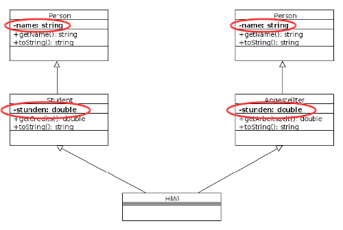

# C++: Vererbung und Polymorphie

> [!IMPORTANT]
>
> <details open>
>
> <summary><strong>🎯 TL;DR</strong></summary>
>
> Vererbung analog zu Java passiert in C++ über die
> “`public`-Vererbung”: `Subklasse : public Superklasse`. Dabei gibt es
> in C++ **keine** gemeinsame Oberklasse wie `Object` und entsprechend
> kein `super`. (Es kann auch private Vererbung geben.)
>
> Operatoren und \*struktoren werden in den vom Compiler erzeugten
> Defaults richtig verkettet. Bei der eigenen Implementierung von
> Operatoren und Konstruktoren muss zunächst der Operator/Konstruktor
> der Basisklasse aufgerufen werden (Basisklassen-Konstruktoren dabei in
> der Initialisierungsliste!), danach erfolgt die Implementierung für
> die eigenen Attribute der abgeleiteten Klasse. Der Zugriff auf die
> Elemente der Elternklasse erfolgt dabei über den Namen der
> Elternklasse und den Scope-Operator (nicht mit `super`!). Destruktoren
> von abgeleiteten Klassen müssen sich dagegen nur um die zusätzlichen
> Attribute der abgeleiteten Klasse kümmern, der Basisklassendestruktor
> wird automatisch verkettet bzw. aufgerufen.
>
> Abstrakte Klassen in C++ haben mindestens eine abstrakte Methode. Eine
> Methode ist abstrakt, wenn sie als “`virtual`” deklariert ist **und**
> der Deklaration ein “`=0`” folgt.
>
> In C++ hat man aus Effizienzgründen per Default statische Polymorphie.
> Bei der Zuweisung eines Objekts einer abgeleiteten Klasse (rechte
> Seite) an ein Objekt vom Typ der Oberklasse (linke Seite) erfolgt
> dabei “Slicing”, d.h. alle zusätzlichen Eigenschaften der abgeleiteten
> Klasse gehen dabei verloren. Dynamische Polymorphie kann man in C++
> nutzen, indem man (a) die gewünschten Methoden in der Basisklasse als
> `virtual` deklariert und (b) für den Zugriff auf die Objekte der
> abgeleiteten Klasse Pointer oder Referenzen vom Basisklassen-Typ
> benutzt.
>
> In C++ ist Mehrfachvererbung möglich, d.h. eine Klasse kann von
> mehreren anderen Klassen erben. Damit erbt sie auch das Objekt-Layout
> aller Elternklassen.
>
> Bei rautenförmigen Vererbungsbeziehung führt dies zu Problemen, da
> Attribute und Methoden der gemeinsamen Basisklasse mehrfach vorhanden
> (über jeden Zweig der Raute).
>
> Zur Umgehung des Problems kann man die gemeinsam genutzten
> Basisklassen “`virtual`” deklarieren. Dadurch sind gemeinsam genutzte
> Attribute und Methoden nur noch einfach vorhanden. Da die Klassen “in
> der Raute” ihrerseits den Konstruktor der Basisklasse aufrufen
> (könnten) und es dadurch zu Konflikten beim Setzen der Attribute der
> Basisklasse kommen kann, gelten bei virtueller Ableitung Sonderregeln:
> Für die virtuelle Basisklasse wird die Weiterleitung der Werte
> aufgehoben (es muss also ein parameterloser Konstruktor existieren,
> der durch die direkten Unterklassen aufgerufen wird) und die Klasse am
> “unteren Ende der Raute” kann direkt den Konstruktor der virtuellen
> Basisklasse am “oberen Ende der Raute” aufrufen.
> </details>

> [!TIP]
>
> <details open>
>
> <summary><strong>🎦 Videos</strong></summary>
>
> - [VL C++: Vererbung und Polymorphie](https://youtu.be/yiIXDWRpKU4)
>
> </details>

## Vererbung: “IS-A”-Beziehung zw. Klassen

``` cpp
class Student : public Person { ... }
```

``` cpp
Student(const string &name = "", double c = 0.0)
: Person(name), credits(c) { }

Student(const Student &s)
: Person(s), credits(s.credits) { }
```

Analog zu Java:

- `Student`: abgeleitete Klasse
- `Person`: Basisklasse
- `: public`: Vererbungsbeziehung (analog zu `extends` in Java)
- `public`-Vererbung: Verhalten wie in Java
- Hinweis: Es gibt weitere Spielarten (`protected`, `private`), vgl.
  Semesterliteratur
- Ab C++11:
  - Schlüsselwort `override`: Die Methode muss eine virtuelle Methode
    der Klassenhierarchie überschreiben.
  - Schlüsselwort `final`: Die virtuelle Methode darf nicht in
    abgeleiteten Klassen überschrieben werden.

### Vererbung und Konstruktoren

- Defaultkonstruktoren werden automatisch richtig verkettet
  - zuerst Aufruf des Basisklassen-Konstruktors
  - anschließend Behandlung der zusätzlichen Attribute
- Eigene Konstruktoren verketten:
  - Zuerst Basisklassen-Konstruktor aufrufen (in Initialisierungsliste!)
    =\> Konkreten Konstruktor nehmen, nicht `super` wie in Java

### Vererbung und Destruktoren

- Defaultdestruktoren werden automatisch richtig verkettet
  - zuerst werden die Destruktoren der zusätzlichen Attribute aufgerufen
  - dann der Destruktor der Basisklasse
- Eigene Destruktoren werden automatisch verkettet
- Destruktor abgeleiteter Klasse muss sich nur um zusätzliche Attribute
  kümmern

### Vererbung und Operatoren

- Defaultoperatoren werden automatisch richtig verkettet
  - zuerst Aufruf des Basisklassen-Operators
  - anschließend Behandlung der zusätzlichen Attribute
- Eigene Operatoren am Beispiel Zuweisungsoperator:
  - Zuerst den Zuweisungsoperator der Basisklasse aufrufen

  - Zugriff über Superklassennamen und Scope-Operator (nicht mit
    `super`!)

    ``` cpp
    const Student &operator=(const Student &s) {
        if (this != &s) {
            Person::operator=(s);
            credits = s.credits;
        }
        return *this;
    }
    ```

### Vererbung von Freundschaften

- Freundschaften werden nicht vererbt!
- `friends` der Basisklasse haben keinen Zugriff auf zusätzliche private
  Attribute/Methoden der Unterklassen
- Aber: weiterhin Zugriff auf die geerbten privaten Elemente!

## Abstrakte Klassen

- Eine **Klasse** ist abstrakt, wenn sie mindestens eine abstrakte
  Methode hat
- Eine **Methode** ist in C++ abstrakt, wenn sie
  1.  als virtuell deklariert ist, **und**
  2.  der Deklaration ein “`=0`” folgt

Abstrakte Methoden können Implementierung haben! =\> Implementierung
außerhalb der Klassendeklaration

``` cpp
class Person {
public:
    virtual string toString() const = 0;
...
};

string Person::toString() const { ... }  // Implementierung :-)
```

## Polymorphie: Was passiert im folgenden Beispiel?

IS-A Beziehung: Objekte können als Objekte ihrer Oberklasse behandelt
werden

``` cpp
class Person { ... }
class Student : public Person { ... }

Student s("Heinz", "heizer");
Person &p = s;

cout << s.toString() << endl;
cout << p.toString() << endl;
```

<p align="right"><a href="https://github.com/Compiler-CampusMinden/CB-Vorlesung-Bachelor/blob/master/lecture/99-languages/src/polyStat.cpp">Konsole: polyStat.cpp</a></p>

Antwort: Es wird die falsche Methode aufgerufen!

- `s.toString()` =\> `Student::toString()` =\> wie erwartet
- `p.toString()` =\> `Person::toString()` =\> **unerwartet**!

## Polymorphie: statisch und dynamisch

- C++ entscheidet zur **Kompilierzeit**, welche Methode aufgerufen wird
  - `p` ist vom Typ `Person` =\> `p.toString()` =\> `Person::toString()`
  - Dieses Verhalten wird **statisches Binden** genannt.

<!-- -->

- Von Java her bekannt: **dynamisches Binden**
  - Typ eines Objektes wird zur **Laufzeit** ausgewertet

## Dynamisches Binden geht auch in C++ …

Für dynamische Polymorphie müssen in C++ drei Bedingungen erfüllt sein:

1.  Methoden in **Basisklasse** als **virtuelle Funktion** deklarieren
    =\> Schlüsselwort `virtual`

<!-- -->

1.  Virtuelle Methoden in Subklasse normal überschreiben (gleiche
    Signatur)

    Zusätzlich muss der Rückgabetyp exakt übereinstimmen (Ausnahme:
    Rückgabe Pointer/Referenz auf *abgeleitete* Klasse)

<!-- -->

1.  Objekte mittels Basisklassen-Referenzen bzw. -Pointer zugreifen
    (siehe nächste Folie)

``` cpp
class Person {
    virtual string toString() const { ... }
};
```

<p align="right"><a href="https://github.com/Compiler-CampusMinden/CB-Vorlesung-Bachelor/blob/master/lecture/99-languages/src/polyDyn.cpp">Konsole: polyDyn.cpp</a></p>

## Vorsicht Slicing

``` cpp
Student s("Heinz", 10.0);
Person p("Holger");

p = s;
cout << "Objekt s (Student): " << s.toString() << endl;
cout << "Objekt p (Person):  " << p.toString() << endl;
```

<p align="right"><a href="https://github.com/Compiler-CampusMinden/CB-Vorlesung-Bachelor/blob/master/lecture/99-languages/src/polySlicing.cpp">Konsole polySlicing.cpp</a></p>

=\> `p` ist vom Typ `Person`

- Zuweisung von Objekten vom Typ `Student` ist erlaubt (Polymorphie)
- `p` hat aber nur Speicherplatz für genau eine `Person` =\>
  “Abschneiden” aller Elemente, die nicht Bestandteil von `Person` sind!
- Slicing passiert immer beim Kopieren/Zuweisen von Objekten

=\> **Dyn. Polymorphie** in C++ immer über **Referenzen** (bzw. Pointer)
**und** **virtuelle Methoden**

Wir hatten die Methode `toString` in der Basisklasse `Person` zwar als
`virtual` deklariert, und wir hatten diese Methode in der ableitenden
Klasse `Studi` passend überschrieben.

Damit haben wir aber nur zwei der drei Bedingungen für dynamische
Polymorphie in C++ erfüllt. Wenn wir Objekte vom Typ `Studi` über eine
normale Variable vom Typ `Person` handhaben, haben wir immer noch
statische Polymorphie - uns stehen also nur die Methoden aus und in
`Person` zur Verfügung.

Zusätzlich haben wir durch die Zuweisung `p = s;` das Objekt `s` in den
Speicherbereich von `p` “gequetscht”. Dieses ist vom Typ `Person` und
hat auch nur (Speicher-) Platz für Elemente dieses Typs. Alles andere
wird bei der Zuweisung “abgeschnitten”, d.h. `p` ist immer noch ein
Objekt vom Typ `Person`, der zusätzliche Rest aus `Studi` fehlt …

Wir könnten das durch Pointer oder Referenzen heilen:

``` cpp
// Variante mit Basisklassen-Pointer
Student s("Heinz", 10.0);
Person *p;

p = &s;
cout << "Objekt s (Student): " << s.toString()  << endl;
cout << "Objekt p (Person):  " << p->toString() << endl;
```

*Anmerkung*: Der Operator `->` ist die zusammengefasste Dereferenzierung
des Pointers und der nachfolgende Zugriff auf Methoden oder Attribute.
Man könnte also entsprechend auch `(*p).toString()` statt
`p->toString()` schreiben.

``` cpp
// Variante mit Basisklassen-Referenz
Student s("Heinz", 10.0);
Person &p = s;

cout << "Objekt s (Student): " << s.toString() << endl;
cout << "Objekt p (Person):  " << p.toString() << endl;
```

Erst damit erfüllen wir die dritte Bedingung und haben echte dynamische
Polymorphie in C++.

## Anmerkungen zu Polymorphie in C++

- **Gestaltung der API**:
  - Zum Überschreiben gedachte Methoden als virtuell deklarieren
  - Nicht virtuelle Methoden aus der Basisklasse nicht überschreiben
- Trennung von Deklaration und Implementierung:
  - Deklaration als virtuelle Funktion nur im Deklarationsteil
  - Keine Wiederholung im Implementierungsteil (analog zu Defaultwerten)
- “Virtualität vererbt sich”:
  - Virtuelle Funktionen sind virtuell in der Vererbungshierarchie hinab
    ab der ersten Deklaration als virtuell
- Virtualität ist “teuer”: Es muss eine Tabelle aller virtuellen
  Funktionen aufgebaut werden und zur Laufzeit geprüft werden, welche
  Funktion genommen werden soll

## Mehrfachvererbung in C++

``` cpp
class HiWi: public Student, public Angestellter {...};
```

<picture><source media="(prefers-color-scheme: light)" srcset="images/mehrfachvererbung-studi_new_light.png"><source media="(prefers-color-scheme: dark)" srcset="images/mehrfachvererbung-studi_new_dark.png"></picture>

<p align="right">Hinweis Speicherlayout …</p>

### Problem 1: Gleichnamige Methoden aus Basisklassen geerbt

<picture><source media="(prefers-color-scheme: light)" srcset="images/mehrfachvererbung-namenskollision_new_light.png"><source media="(prefers-color-scheme: dark)" srcset="images/mehrfachvererbung-namenskollision_new_dark.png"></picture>

Namenskollision bei Mehrfachvererbung auflösen:

- Scope-Operator `::` nutzen:

  ``` cpp
  HiWi h("Anne", 23.0, 40.0);

  cout << h.Student::toString() << endl;
  cout << h.Angestellter::toString() << endl;
  cout << h.Student::getName() << endl;
  cout << h.Angestellter::getName() << endl;
  ```

- Methode in abgeleiteter Klasse überschreiben

  ``` cpp
  HiWi h("Anne", 23.0, 40.0);

  cout << h.toString() << endl;
  cout << h.Student::toString() << endl;
  cout << h.Angestellter::toString() << endl;
  ```

<p align="right"><a href="https://github.com/Compiler-CampusMinden/CB-Vorlesung-Bachelor/blob/master/lecture/99-languages/src/vererbungMultiMethoden.cpp">Konsole vererbungMultiMethoden.cpp</a></p>

### Problem 2: Gemeinsam geerbte Attribute sind mehrfach vorhanden

<picture><source media="(prefers-color-scheme: light)" srcset="images/mehrfachvererbung-attributkollision_new_light.png"><source media="(prefers-color-scheme: dark)" srcset="images/mehrfachvererbung-attributkollision_new_dark.png"></picture>

<p align="right"><a href="https://github.com/Compiler-CampusMinden/CB-Vorlesung-Bachelor/blob/master/lecture/99-languages/src/vererbungMultiAttribute.cpp">Konsole vererbungMultiAttribute.cpp</a></p>

## Mehrfachvererbung in C++: Virtuelle Basisklassen

``` cpp
class Angestellter: virtual public Person {...};
class Student: virtual public Person {...};

class HiWi: public Student, public Angestellter {...};
```

- `Person` ist jetzt eine virtuelle Basisklasse
- Auswirkungen erst in Klasse `HiWi`
- Dadurch sind gemeinsam genutzte Anteile nur einfach vorhanden

``` cpp
Student s("Heinz", 10.0);           // wie vorher: nur EIN name-Feld
Angestellter a("Holger", 80.5);     // wie vorher: nur EIN name-Feld

HiWi h("Anne", 23.0, 40.0);         // jetzt auch nur EIN name-Feld
```

<p align="right"><a href="https://github.com/Compiler-CampusMinden/CB-Vorlesung-Bachelor/blob/master/lecture/99-languages/src/vererbungMultiVirtual.cpp">Konsole vererbungMultiVirtual.cpp</a></p>

## Sonderregeln bei virtueller Ableitung

Virtuelle Ableitung: Potentiell Konflikte zwischen Konstruktoren!

- Gemeinsam geerbtes Attribut nur noch einmal vorhanden
- Konstruktoren werden nacheinander aufgerufen, alle wollen das
  gemeinsame Attribut initialisieren (durch Aufruf des Konstruktors der
  jeweiligen Basisklasse)
- Zuletzt aufgerufener Konstruktor würde “gewinnen”

Deshalb gibt es bei virtueller Ableitung folgende Sonderregeln:

1.  Für virtuelle Basisklassen ist **Mechanismus des Weiterreichens**
    von Initialisierungswerten **deaktiviert**

2.  Konstruktor einer virtuellen Basisklasse kann in
    Initialisierungsliste von indirekten Unterklassen aufgerufen werden

    Sonst wird der Defaultkonstruktor der virtuellen Basisklasse
    genutzt!

<p align="right"><a href="https://github.com/Compiler-CampusMinden/CB-Vorlesung-Bachelor/blob/master/lecture/99-languages/src/vererbungMultiVirtual.cpp">Konsole vererbungMultiVirtual.cpp (Basiskonstruktor)</a></p>

## Mehrfachvererbung in C++ ist ein recht kompliziertes Thema

Warum ist die Möglichkeit dennoch nützlich?

- In Java kann man nur von einer Klasse erben, aber viele Interfaces
  implementieren. In C++ gibt es keine Interfaces …

  =\> Interfaces mit abstrakten Klassen Interfaces simulieren

  =\> Mehrfachvererbung!

Tatsächlich dürfen Java-Interfaces mittlerweile auch Verhalten
implementieren und vererben, wodurch eine ähnliche Situation wie hier in
C++ entsteht und es ausgefeilte Regeln für die Konfliktauflösung
braucht. Allerdings ist das in Java auf Verhalten beschränkt, d.h.
Attribute (Zustand) ist in Java-Interfaces (noch) nicht erlaubt.

## Wrap-Up

- `public`-Vererbung in C++: `Subklasse : public Superklasse`
- Keine gemeinsame Oberklasse wie `Object`, kein `super`
- Verkettung von Operatoren und \*struktoren
- Abstrakte Klassen in C++

<!-- -->

- Statische und dynamische Polymorphie in C++
  - Methoden in Basisklasse als `virtual` deklarieren
  - Dyn. Polymorphie nur mittels Pointer/Referenzen
  - Slicing in C++ (bei Call-by-Value)

<!-- -->

- Konzept der Mehrfachvererbung
- Problem bei rautenförmiger Vererbungsbeziehung: Attribute und Methoden
  mehrfach vorhanden
- Virtuelle Basisklassen: Gemeinsam genutzte Attribute nur noch einfach
  vorhanden

## 📖 Zum Nachlesen

- Breymann ([2011](#ref-Breymann2011))
- „C and C++ Reference“ ([o. J.](#ref-cppreference.com))
- Allain und Hoffer ([o. J.](#ref-cprogramming.com))

> [!NOTE]
>
> <details>
>
> <summary><strong>✅ Lernziele</strong></summary>
>
> - k2: Ich kann den Unterschied zw. Überladen und Überschreiben an
>   einem Beispiel erklären
> - k2: Ich kann das “Slicing” in C++ erklären
> - k2: Ich kann typische Probleme bei Mehrfachvererbung erklären
> - k2: Ich kann den Einsatz und die Wirkung virtueller Basisklassen
>   erklären
> - k3: Ich kann `public`-Vererbung in C++ in eigenen Programmen nutzen
> - k3: Ich kann Operatoren und \*struktoren verketten und kenne die
>   Defaultregeln
> - k3: Ich kann statische und dynamische Polymorphie in C++ einsetzen
> - k3: Ich kann abstrakte Klassen in C++ definieren
>
> </details>

> [!TIP]
>
> <details>
>
> <summary><strong>🏅 Challenges</strong></summary>
>
> **Destruktoren und Vererbung**
>
> Welcher Destruktor würde im folgenden Beispiel aufgerufen?!
>
> ``` cpp
> Student *s3 = new Student("Holger", 1.0);
> Person  *p  = s3;
>
> delete p;
> ```
>
> **Vererbung**
>
> - Welche Formen der (einfachen) Vererbung gibt es in C++ neben der
>   `public`-Form noch? Was bewirken diese Formen?
> - Warum wird in C++ die `public`-Form der Vererbung vorgezogen
>   (zumindest, wenn man dynamische Polymorphie nutzen will)?
> - Wie müssen Konstruktoren/Destruktoren richtig verkettet werden?
> - Arbeiten Sie das Beispiel auf S. 274 im Breymann
>   ([2011](#ref-Breymann2011)): “Der C++ Programmierer” durch.
>
> **Virtuelle Methoden, Dynamische Polymorphie in C++**
>
> 1.  Was sind virtuelle Methoden und wie setze ich diese ein?
> 2.  Wozu brauche ich in C++ virtuelle Klassen? Was muss beachtet
>     werden?
> 3.  Was passiert in C++, wenn eine virtuelle Methode innerhalb von
>     Konstruktoren verwendet wird? Schreiben Sie ein kurzes Programm
>     zur Verdeutlichung.
> 4.  Wie verhält es sich mit der Problematik aus (a) in Java?
> 5.  Wie unterscheiden sich in C++ virtuelle und nicht virtuelle
>     Destruktoren? Schreiben Sie ein kurzes Programm zur
>     Verdeutlichung.
> 6.  Was passiert, wenn in C++ aus einem Destruktor heraus eine
>     virtuelle Methode aufgerufen wird?
>
> *Hinweis:* Möglicherweise müssen jeweils mehrere Fälle betrachtet
> werden!
>
> </details>

------------------------------------------------------------------------

> [!NOTE]
>
> <details>
>
> <summary><strong>👀 Quellen</strong></summary>
>
> <div id="refs" class="references csl-bib-body hanging-indent">
>
> <div id="ref-cprogramming.com" class="csl-entry">
>
> Allain, A., und A. Hoffer. o. J. „C Programming and C++ Programming“.
> Zugegriffen 16. September 2024. <https://www.cprogramming.com/>.
>
> </div>
>
> <div id="ref-Breymann2011" class="csl-entry">
>
> Breymann, U. 2011. *Der C++ Programmierer*. 2. Auflage. Hanser.
>
> </div>
>
> <div id="ref-cppreference.com" class="csl-entry">
>
> „C and C++ Reference“. o. J. Cppreference.com. Zugegriffen 16.
> September 2024. <https://en.cppreference.com/w/>.
>
> </div>
>
> </div>
>
> </details>

------------------------------------------------------------------------


Unless otherwise noted, this work is licensed under CC BY-SA 4.0.

<blockquote><p><sup><sub><strong>Last modified:</strong> 445357e (lecture: rework outcomes (09/CPP5), 2025-08-21)<br></sub></sup></p></blockquote>
