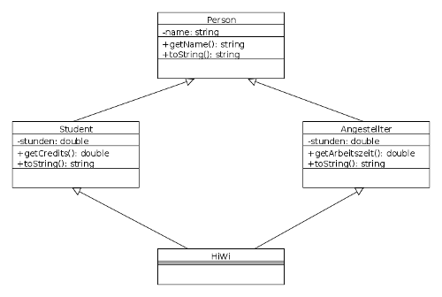
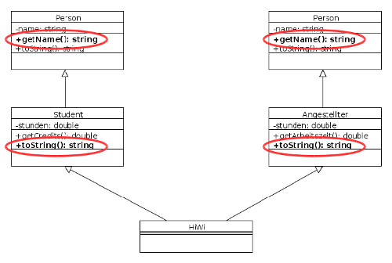

## Vererbung: "IS-A"-Beziehung zw. Klassen

```cpp
class Student : public Person { ... }
```

\pause
\bigskip

```cpp
Student(const string &name = "", double c = 0.0)
: Person(name), credits(c) { }

Student(const Student &s)
: Person(s), credits(s.credits) { }
```

::: notes
Analog zu Java:

-   `Student`: abgeleitete Klasse
-   `Person`: Basisklasse
-   `: public`: Vererbungsbeziehung (analog zu `extends` in Java)
-   `public`-Vererbung: Verhalten wie in Java
-   Hinweis: Es gibt weitere Spielarten (`protected`, `private`), vgl. Semesterliteratur
-   Ab C++11:
    -   Schlüsselwort `override`:
        Die Methode muss eine virtuelle Methode der Klassenhierarchie überschreiben.
    -   Schlüsselwort `final`:
        Die virtuelle Methode darf nicht in abgeleiteten Klassen überschrieben werden.
:::

::::::::: notes
### Vererbung und Konstruktoren

-   Defaultkonstruktoren werden automatisch richtig verkettet
    -   zuerst Aufruf des Basisklassen-Konstruktors
    -   anschließend Behandlung der zusätzlichen Attribute

-   Eigene Konstruktoren verketten:
    -   [Zuerst]{.alert} Basisklassen-Konstruktor aufrufen (in
        Initialisierungsliste!) \newline
        => Konkreten Konstruktor nehmen, nicht `super` wie in Java
:::::::::

::::::::: notes
### Vererbung und Destruktoren

-   Defaultdestruktoren werden automatisch richtig verkettet
    -   zuerst werden die Destruktoren der zusätzlichen Attribute aufgerufen
    -   dann der Destruktor der Basisklasse

-   Eigene Destruktoren werden automatisch verkettet
-   Destruktor abgeleiteter Klasse muss sich nur um zusätzliche Attribute kümmern
:::::::::

::::::::: notes
### Vererbung und Operatoren

-   Defaultoperatoren werden automatisch richtig verkettet
    -   zuerst Aufruf des Basisklassen-Operators
    -   anschließend Behandlung der zusätzlichen Attribute

-   Eigene Operatoren am Beispiel Zuweisungsoperator:
    -   Zuerst den Zuweisungsoperator der Basisklasse aufrufen
    -   Zugriff über Superklassennamen und Scope-Operator (nicht mit `super`!)

        ```cpp
        const Student &operator=(const Student &s) {
            if (this != &s) {
                Person::operator=(s);
                credits = s.credits;
            }
            return *this;
        }
        ```
:::::::::

::::::::: notes
### Vererbung von Freundschaften

-   Freundschaften werden nicht vererbt!
-   `friends` der Basisklasse haben keinen Zugriff auf zusätzliche
    private Attribute/Methoden der Unterklassen
-   Aber: weiterhin Zugriff auf die geerbten privaten Elemente!
:::::::::


::::::::: notes
## Abstrakte Klassen

-   Eine **Klasse** ist [abstrakt]{.alert}, wenn sie mindestens eine abstrakte Methode hat
-   Eine **Methode** ist in C++ [abstrakt]{.alert}, wenn sie
    1.  als [virtuell]{.alert} deklariert ist, **und**
    2.  der Deklaration ein "`=0`" folgt

[Abstrakte Methoden]{.alert} können [Implementierung]{.alert} haben! => Implementierung [außerhalb]{.alert} der Klassendeklaration

```cpp
class Person {
public:
    virtual string toString() const = 0;
...
};

string Person::toString() const { ... }  // Implementierung :-)
```
:::::::::


## Polymorphie: Was passiert im folgenden Beispiel?

::: notes
IS-A Beziehung: Objekte können als Objekte ihrer Oberklasse behandelt werden
:::

```cpp
class Person { ... }
class Student : public Person { ... }

Student s("Heinz", "heizer");
Person &p = s;

cout << s.toString() << endl;
cout << p.toString() << endl;
```

[Konsole: polyStat.cpp]{.bsp href="https://github.com/Compiler-CampusMinden/CB-Vorlesung-Bachelor/blob/master/lecture/99-languages/src/polyStat.cpp"}

::: notes
Antwort: Es wird die falsche Methode aufgerufen!

-   `s.toString()` => `Student::toString()` => wie erwartet
-   `p.toString()` => `Person::toString()` => [**unerwartet**]{.alert}!
:::


## Polymorphie: statisch und dynamisch

-   C++ entscheidet zur [**Kompilierzeit**]{.alert}, welche Methode aufgerufen wird
    -   `p` ist vom Typ `Person` => `p.toString()`
        => `Person::toString()`
    -   Dieses Verhalten wird **statisches Binden** genannt.

\bigskip

-   Von Java her bekannt: **dynamisches Binden**
    -   Typ eines Objektes wird zur **Laufzeit** ausgewertet


## Dynamisches Binden geht auch in C++ ...

1.  Methoden in **Basisklasse** als **virtuelle Funktion** deklarieren \newline
    => Schlüsselwort `virtual`

\smallskip

2.  Virtuelle Methoden in Subklasse normal überschreiben (gleiche Signatur)
    -   Zusätzlich muss der Rückgabetyp exakt übereinstimmen \newline
        (Ausnahme: Rückgabe Pointer/Referenz auf _abgeleitete_ Klasse)

\smallskip

::: notes
3.  Objekte mittels Basisklassen-Referenzen bzw. -Pointer zugreifen (siehe nächste Folie)
:::

\bigskip

```cpp
class Person {
    virtual string toString() const { ... }
};
```

[Konsole: polyDyn.cpp]{.bsp href="https://github.com/Compiler-CampusMinden/CB-Vorlesung-Bachelor/blob/master/lecture/99-languages/src/polyDyn.cpp"}


## Vorsicht Slicing

```cpp
Student s("Heinz", 10.0);
Person p("Holger");

p = s;
cout << "Objekt s (Student): " << s.toString() << endl;
cout << "Objekt p (Person):  " << p.toString() << endl;
```

[Konsole polySlicing.cpp]{.bsp href="https://github.com/Compiler-CampusMinden/CB-Vorlesung-Bachelor/blob/master/lecture/99-languages/src/polySlicing.cpp"}

\pause

::: notes
=> `p` ist vom Typ `Person`

-   Zuweisung von Objekten vom Typ `Student` ist erlaubt (Polymorphie)
-   `p` hat aber nur Speicherplatz für genau eine `Person`
    => "Abschneiden" aller Elemente, die nicht Bestandteil von
    `Person` sind!
-   Slicing passiert immer beim [Kopieren/Zuweisen]{.alert} von Objekten
:::

\bigskip
=> **Dyn. Polymorphie** in C++ immer über [**Referenzen**]{.alert}
(bzw. Pointer) **und** [**virtuelle Methoden**]{.alert}


::: notes
## Anmerkungen zu Polymorphie in C++

-   **Gestaltung der API**:
    -   Zum Überschreiben gedachte Methoden als virtuell deklarieren
    -   Nicht virtuelle Methoden aus der Basisklasse nicht überschreiben
-   Trennung von Deklaration und Implementierung:
    -   Deklaration als virtuelle Funktion nur im Deklarationsteil
    -   Keine Wiederholung im Implementierungsteil (analog zu Defaultwerten)
-   "Virtualität vererbt sich":
    -   Virtuelle Funktionen sind virtuell in der Vererbungshierarchie hinab ab
        der ersten Deklaration als virtuell
-   Virtualität ist "teuer": Es muss eine Tabelle aller virtuellen Funktionen aufgebaut werden und zur
    Laufzeit geprüft werden, welche Funktion genommen werden soll
:::


## Mehrfachvererbung in C++

\bigskip
\bigskip

```cpp
class HiWi: public Student, public Angestellter {...};
```

\pause
\bigskip

{width="50%"}

[Hinweis Speicherlayout ...]{.bsp}

::::::::: notes
### Problem 1: Gleichnamige Methoden aus Basisklassen geerbt

{width="50%"}

Namenskollision bei Mehrfachvererbung auflösen:

-   Scope-Operator `::` nutzen:

    ```cpp
    HiWi h("Anne", 23.0, 40.0);

    cout << h.Student::toString() << endl;
    cout << h.Angestellter::toString() << endl;
    cout << h.Student::getName() << endl;
    cout << h.Angestellter::getName() << endl;
    ```

-   Methode in abgeleiteter Klasse überschreiben

    ```cpp
    HiWi h("Anne", 23.0, 40.0);

    cout << h.toString() << endl;
    cout << h.Student::toString() << endl;
    cout << h.Angestellter::toString() << endl;
    ```

[Konsole vererbungMultiMethoden.cpp]{.bsp href="https://github.com/Compiler-CampusMinden/CB-Vorlesung-Bachelor/blob/master/lecture/99-languages/src/vererbungMultiMethoden.cpp"}

### Problem 2: Gemeinsam geerbte Attribute sind mehrfach vorhanden

{width="50%"}

[Konsole vererbungMultiAttribute.cpp]{.bsp href="https://github.com/Compiler-CampusMinden/CB-Vorlesung-Bachelor/blob/master/lecture/99-languages/src/vererbungMultiAttribute.cpp"}
:::::::::


## Mehrfachvererbung in C++: Virtuelle Basisklassen

```cpp
class Angestellter: virtual public Person {...};
class Student: virtual public Person {...};

class HiWi: public Student, public Angestellter {...};
```

\bigskip

-   `Person` ist jetzt eine [virtuelle Basisklasse]{.alert}
-   Auswirkungen erst in Klasse `HiWi`
-   Dadurch sind gemeinsam genutzte Anteile nur einfach vorhanden

::: notes
```cpp
Student s("Heinz", 10.0);           // wie vorher: nur EIN name-Feld
Angestellter a("Holger", 80.5);     // wie vorher: nur EIN name-Feld

HiWi h("Anne", 23.0, 40.0);         // jetzt auch nur EIN name-Feld
```
:::

[Konsole vererbungMultiVirtual.cpp]{.bsp href="https://github.com/Compiler-CampusMinden/CB-Vorlesung-Bachelor/blob/master/lecture/99-languages/src/vererbungMultiVirtual.cpp"}


::::::::: notes
## Sonderregeln bei virtueller Ableitung

Virtuelle Ableitung: Potentiell Konflikte zwischen Konstruktoren!

-   Gemeinsam geerbtes Attribut nur noch [einmal]{.alert} vorhanden
-   Konstruktoren werden [nacheinander]{.alert} aufgerufen, alle wollen das
    gemeinsame Attribut initialisieren (durch Aufruf des Konstruktors der
    jeweiligen Basisklasse)
-   Zuletzt aufgerufener Konstruktor würde "gewinnen"

Deshalb gibt es bei virtueller Ableitung folgende Sonderregeln:

1.  Für virtuelle Basisklassen ist **Mechanismus des Weiterreichens** von
    Initialisierungswerten [**deaktiviert**]{.alert}

2.  Konstruktor einer virtuellen Basisklasse kann in Initialisierungsliste von
    indirekten Unterklassen aufgerufen werden

    Sonst wird der Defaultkonstruktor der virtuellen Basisklasse genutzt!

[Konsole vererbungMultiVirtual.cpp (Basiskonstruktor)]{.bsp href="https://github.com/Compiler-CampusMinden/CB-Vorlesung-Bachelor/blob/master/lecture/99-languages/src/vererbungMultiVirtual.cpp"}
:::::::::


::::::::: notes
## Mehrfachvererbung in C++ ist ein recht kompliziertes Thema

Warum ist die Möglichkeit dennoch nützlich?

-   In Java kann man nur von einer Klasse erben, aber viele [Interfaces]{.alert}
    implementieren. In C++ gibt es keine Interfaces ...

    => Interfaces mit abstrakten Klassen Interfaces simulieren

    => Mehrfachvererbung!

Tatsächlich dürfen Java-Interfaces mittlerweile auch Verhalten implementieren
und vererben, wodurch eine ähnliche Situation wie hier in C++ entsteht und es
ausgefeilte Regeln für die Konfliktauflösung braucht. Allerdings ist das in
Java auf Verhalten beschränkt, d.h. Attribute (Zustand) ist in Java-Interfaces
(noch) nicht erlaubt.
:::::::::


## Wrap-Up

-   [`public`-Vererbung in C++:]{.notes} `Subklasse : public Superklasse`
-   Keine gemeinsame Oberklasse wie `Object`, kein `super`
-   Verkettung von Operatoren und \*struktoren
-   Abstrakte Klassen in C++

\smallskip

-   Statische und dynamische Polymorphie in C++
    -   Methoden in Basisklasse als `virtual` deklarieren
    -   Dyn. Polymorphie nur mittels Pointer/Referenzen
    -   Slicing in C++ (bei Call-by-Value)

\smallskip

-   Konzept der Mehrfachvererbung
-   Problem bei rautenförmiger Vererbungsbeziehung: Attribute und Methoden mehrfach vorhanden
-   Virtuelle Basisklassen: Gemeinsam genutzte Attribute nur noch einfach vorhanden


<!-- DO NOT REMOVE - THIS IS A LAST SLIDE TO INDICATE THE LICENSE AND POSSIBLE EXCEPTIONS (IMAGES, ...). -->
::: slides
## LICENSE


Unless otherwise noted, this work is licensed under CC BY-SA 4.0.
:::
