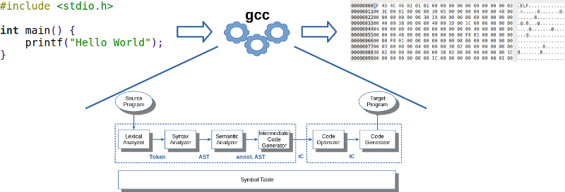

<!--  pandoc -s -f markdown -t markdown+smart-grid_tables-multiline_tables-simple_tables --columns=94  readme.md  -o xxx.md  -->

{width="80%"}

# Kursbeschreibung

Der Compiler ist das wichtigste Werkzeug in der Informatik. In der Königsdisziplin der
Informatik schließt sich der Kreis, hier kommen die unterschiedlichen Algorithmen und
Datenstrukturen und Programmiersprachenkonzepte zur Anwendung.

In diesem Modul geht es um ein grundlegendes Verständnis für die wichtigsten Konzepte
im Compilerbau. Wir schauen uns dazu relevante aktuelle Tools und Frameworks an und
setzen diese bei der Erstellung eines kleinen Compiler-Frontends für C++ ein.

# Überblick Modulinhalte

1.  Lexikalische Analyse: Scanner/Lexer
    *   Reguläre Sprachen
    *   Generierung mit ANTLR
2.  Syntaxanalyse: Parser
    *   Kontextfreie Grammatiken (CFG)
    *   LL-Parser (Top-Down-Parser)
    *   Generierung mit ANTLR
3.  Semantische Analyse: Attributierte Grammatiken und Symboltabellen
    *   Namen und Scopes
    *   Typen, Klassen, Polymorphie
4.  Zwischencode: Intermediate Representation (IR), LLVM-IR
5.  Backend:
    *   LLVM
    *   Interpreter: AST-Traversierung
6.  C++ als zu verarbeitende Programmiersprache

# Team

*   [BC George](https://www.hsbi.de/minden/ueber-uns/personenverzeichnis/birgit-christina-george)
*   [Carsten Gips](https://www.hsbi.de/minden/ueber-uns/personenverzeichnis/carsten-gips) (Sprechstunde nach Vereinbarung)

# Kursformat

| Vorlesung (2 SWS)            | Praktikum (2 SWS)                        |
|:-----------------------------|:-----------------------------------------|
| Mo, 09:00 - 10:30 Uhr (Zoom) | G1: Fr, 09:45 - 11:15 Uhr (Zoom)         |
|                              | G2: Fr, 11:30 - 13:00 Uhr (Zoom)         |
|                              | G3: Fr, 09:45 - 11:15 Uhr (Präsenz J101) |
|                              | G4: Fr, 11:30 - 13:00 Uhr (Präsenz J101) |

Durchführung der Vorlesung als *Flipped Classroom* (Carsten) bzw. als *reguläre Vorlesung* (BC).
Zugangsdaten Zoom siehe [ILIAS](https://www.hsbi.de/elearning/goto.php?target=crs_1400597&client_id=FH-Bielefeld).

# Fahrplan

Hier finden Sie einen abonnierbaren [Google Kalender](https://calendar.google.com/calendar/ical/07021c87022fe3f132fa2e2e799b230b5ab9c7088c85d152f2beab8f1b5218af%40group.calendar.google.com/public/basic.ics) mit allen Terminen der Veranstaltung zum Einbinden in Ihre Kalender-App.

Abgabe der Übungsblätter jeweils **Montag bis 09:00 Uhr** im [ILIAS](https://www.hsbi.de/elearning/goto.php?target=exc_1420724&client_id=FH-Bielefeld). Vorstellung der Lösung im jeweiligen Praktikum in der Abgabewoche.

| Monat                | Woche | Vorlesung                                                                                                                                     | Lead        | Abgabe Aufgabenblatt           | Vorstellung Praktikum                                    |
|:---------------------|:------|:----------------------------------------------------------------------------------------------------------------------------------------------|:------------|:-------------------------------|:---------------------------------------------------------|
| Oktober              | 41    | 09.: [Orga] (*Zoom*); [Überblick], [Sprachen], [Anwendungen]                                                                                  | Carsten, BC |                                |                                                          |
|                      | 42    | 16.: [Reguläre Sprachen]                                                                                                                      | BC          |                                |                                                          |
|                      | 43    | 23.: [CFG]                                                                                                                                    | BC          | 21.: [B01] Reguläre Sprachen   | 21. / 22. / 25. (BC, *Präsenz*)                          |
|                      | 44    | 29.: **18:00 - 19:30 Uhr (online): Edmonton I: ANTLR + Live-Coding**                                                                          | _Edmonton_  |                                |                                                          |
|                      | 44    | 30.: [Lexer mit ANTLR], [Parser mit ANTLR]                                                                                                    | Carsten     |                                |                                                          |
| November             | 45    | 06.: *Dienstbesprechung*                                                                                                                      |             | 04.: [B02] CFG                 | ~~04.~~ **07. 08:00** / 05. / 08. (BC, *Präsenz*)        |
|                      | 46    | 13.: [Überblick Symboltabellen], [Symboltabellen: Scopes], [Symboltabellen: Funktionen], [Symboltabellen: Klassen]                            | Carsten     | 11.: [B03] ANTLR               | 11. / 12. / 15. (Carsten, *online*)                      |
|                      | 47    | 20.: **A-L: 09:45 - 10:30 Uhr, M-Z: 10:45 - 11:30 Uhr (B40): Parcoursprüfung: Station 1 ILIAS (Grammar, Lexing, Parsing), siehe Ankündigung** |             | 18.: [B04] Semantische Analyse | 18. / 19. / 22. (Carsten, *online*)                      |
|                      | 48    | 26.: **18:00 - 19:30 Uhr (online): Edmonton II: Vorträge Mindener Projekte**                                                                  | _Minden_    |                                |                                                          |
|                      | 48    | 27.: [Überblick Zwischencode], [Überblick Backend (LLVM)]                                                                                     | BC, Carsten |                                |                                                          |
| Dezember             | 49    | 03.: **18:00 - 19:30 Uhr (online): Edmonton III: Vorträge Edmontoner Projekte**                                                               | _Edmonton_  |                                |                                                          |
|                      | 49    | 04.: [AST-basierte Interpreter 1], [AST-basierte Interpreter 2]                                                                               | Carsten     |                                |                                                          |
|                      | 50    | 11.: C++ I: [Basics], [Pointer & Referenzen], [Klassen], [Big 3]                                                                              | Carsten     | 09.: [B05] Interpreter         | 09. / 10. / 13. (Carsten, *online*)                      |
|                      | 51    | 18.: ~~Projektwoche Semester 1+3~~ C++ II: [Operatoren], [Vererbung & Polymorphie], [Templates]                                               |             |                                |                                                          |
|                      | 52    | 25.: _Weihnachtspause_                                                                                                                        |             |                                |                                                          |
| Januar               | 01    | 01.: _Weihnachtspause_                                                                                                                        |             |                                |                                                          |
|                      | 02    | 08.: _Sprechstunde/Freies Arbeiten_                                                                                                           | Carsten     | 06.: [B06] C++                 | 06. / 07. / 10. (Carsten, *online*)                      |
|                      | 03    | 15.: _Freies Arbeiten/Puffer_                                                                                                                 |             |                                |                                                          |
|                      | 04    | 22.: **Parcoursprüfung: Station 2 [B07] (VL- und Praktika-Slots, siehe Ankündigung)**                                                         | Carsten, BC | 20.: [B07] Mini-Projekt        | 20. / 21. / 24. (**15:00-16:30**) (Carsten/BC, *online*) |
| _(Prüfungsphase I)_  | 05    | 30.: **Feedback-Gespräche (15:30 - 18:00 Uhr, online)**                                                                                       |             |                                |                                                          |
| _(Prüfungsphase II)_ |       | **Parcoursprüfung: Do, 27. Mar 2025, 08-18 Uhr, mdl. Prüfung (alle Themen)** (je Prüfung ca. 45', Vergabe ca. 2 Wochen vorher)                |             |                                |                                                          |

[Orga]: https://www.hsbi.de/elearning/data/FH-Bielefeld/lm_data/lm_1360443/index.html#überblick-modulinhalte

[Überblick]: lecture/00-intro/overview.md
[Sprachen]: lecture/00-intro/languages.md
[Anwendungen]: lecture/00-intro/applications.md

[Reguläre Sprachen]: lecture/01-lexing/regular.md
[Lexer mit ANTLR]: lecture/01-lexing/antlr-lexing.md

[CFG]: lecture/02-parsing/cfg.md
<!-- [LL-Parser]: lecture/02-parsing/ll-parser.md -->
[Parser mit ANTLR]: lecture/02-parsing/antlr-parsing.md
<!-- [Grenze Lexer und Parser]: lecture/02-parsing/finalwords.md -->

<!-- [Attributierte Grammatiken]: lecture/03-semantics/attribgrammars.md -->
[Überblick Symboltabellen]: lecture/03-semantics/symbtab0-intro.md
[Symboltabellen: Scopes]: lecture/03-semantics/symbtab1-scopes.md
[Symboltabellen: Funktionen]: lecture/03-semantics/symbtab2-functions.md
[Symboltabellen: Klassen]: lecture/03-semantics/symbtab3-classes.md

[Überblick Zwischencode]: lecture/04-intermediate/intro-ir.md
[Überblick Backend (LLVM)]: lecture/04-intermediate/llvm-ir.md

<!-- [Syntaxgesteuerte Interpreter]: lecture/06-interpretation/syntaxdriven.md -->
[AST-basierte Interpreter 1]: lecture/06-interpretation/astdriven-part1.md
[AST-basierte Interpreter 2]: lecture/06-interpretation/astdriven-part2.md

<!-- [Builder für Mini-Python]: lecture/07-codegen/minipython-builder.md -->

[Basics]: lecture/99-languages/cpp0-basics.md
[Pointer & Referenzen]: lecture/99-languages/cpp1-pointer.md
[Klassen]: lecture/99-languages/cpp2-classes.md
[Big 3]: lecture/99-languages/cpp3-big3.md
[Operatoren]: lecture/99-languages/cpp4-operators.md
[Vererbung & Polymorphie]: lecture/99-languages/cpp5-inheritance.md
[Templates]: lecture/99-languages/cpp6-templates.md

[B01]: homework/sheet01.md
[B02]: homework/sheet02.md
[B03]: homework/sheet03.md
[B04]: homework/sheet04.md
[B05]: homework/sheet05.md
[B06]: homework/sheet06.md
[B07]: homework/sheet07.md

# Prüfungsform, Note und Credits

**Parcoursprüfung plus Testat**, 5 ECTS

*   **Testat**: Vergabe der Credit-Points
    1.  Mindestens 4 der Übungsblätter [B01], [B02], [B03], [B04], [B05] und [B06] erfolgreich bearbeitet, **und**
    2.  **aktive** Teilnahme an allen 3 Edmonton-Terminen.

    ("erfolgreich bearbeitet": Bearbeitung in 3er Teams, je mindestens 60% bearbeitet,
    fristgerechte Abgabe der Lösungen im ILIAS, Vorstellung der Lösungen im Praktikum)

## Prüfung im ersten Zeitraum

*   **Stationen**:
    1.  ILIAS-Test (einzeln, 20.11.)
    2.  Vorstellung Mini-Projekt [B07] (3er Teams, letzte VL-Woche)

    Note für das Modul: Beide Stationen ergeben zu **je 50%** *oder* in der Gewichtung
    **30 Punkte (Station I) und 50 Punkte (Station II)** die Gesamtnote (individuelle
    Günstigerprüfung).

    Für Station I werden 3 Punkte Überhang gewährt: Von den 33 maximal erreichbaren
    Punkten werden 30 Punkte als 100% gewertet, darüber hinausgehende Punkte bleiben
    als Bonuspunkte erhalten.

## Prüfung im zweiten Zeitraum

*   **Stationen**:
    1.  Mündliche Prüfung (individuell, ca. 45 Minuten, zweiter Prüfungszeitraum)

    Die Note der mündlichen Prüfung ergibt die Gesamtnote.

# Materialien

1.  ["**Compilers: Principles, Techniques, and Tools**"](https://learning.oreilly.com/library/view/compilers-principles-techniques/9789357054881/).
    Aho, A. V. und Lam, M. S. und Sethi, R. und Ullman, J. D. and Bansal, S., Pearson India, 2023.
    ISBN [978-9-3570-5488-1](https://fhb-bielefeld.digibib.net/openurl?isbn=978-9-3570-5488-1).
    [Online](https://learning.oreilly.com/library/view/compilers-principles-techniques/9789357054881/) über die [O'Reilly-Lernplattform](https://www.oreilly.com/library-access/).
2.  ["**Crafting Interpreters**"](https://github.com/munificent/craftinginterpreters).
    Nystrom, R., Genever Benning, 2021.
    ISBN [978-0-9905829-3-9](https://fhb-bielefeld.digibib.net/openurl?isbn=978-0-9905829-3-9).
    [Online](https://www.craftinginterpreters.com/).
3.  ["**The Definitive ANTLR 4 Reference**"](https://learning.oreilly.com/library/view/the-definitive-antlr/9781941222621/).
    Parr, T., Pragmatic Bookshelf, 2014. ISBN [978-1-9343-5699-9](https://fhb-bielefeld.digibib.net/openurl?isbn=978-1-9343-5699-9).
    [Online](https://learning.oreilly.com/library/view/the-definitive-antlr/9781941222621/) über die [O'Reilly-Lernplattform](https://www.oreilly.com/library-access/).
4.  ["Writing a C Compiler"](https://learning.oreilly.com/library/view/writing-a-c/9781098182229/).
    Sandler, N., No Starch Press, 2024. ISBN [978-1-0981-8222-9](https://fhb-bielefeld.digibib.net/openurl?isbn=978-1-0981-8222-9).
    [Online](https://learning.oreilly.com/library/view/writing-a-c/9781098182229/) über die [O'Reilly-Lernplattform](https://www.oreilly.com/library-access/).

# Förderungen und Kooperationen

## Kooperation mit University of Alberta, Edmonton (Kanada)

Über das Projekt ["We CAN virtuOWL"] der Fachhochschule Bielefeld ist im Frühjahr 2021 eine
Kooperation mit der [University of Alberta] (Edmonton/Alberta, Kanada) im Modul "Compilerbau"
gestartet.

Wir freuen uns, auch in diesem Semester wieder drei gemeinsame Sitzungen für beide
Hochschulen anbieten zu können. (Diese Termine werden in englischer Sprache durchgeführt.)

["We CAN virtuOWL"]: https://www.uni-bielefeld.de/international/profil/netzwerk/alberta-owl/we-can-virtuowl/
[University of Alberta]: https://www.hsbi.de/en/international-office/alberta-owl-cooperation

---

# LICENSE

Unless otherwise noted, [this work](https://github.com/Compiler-CampusMinden/CB-Vorlesung-Bachelor) by [BC George](https://github.com/bcg7), [Carsten Gips](https://github.com/cagix) and [contributors](https://github.com/Compiler-CampusMinden/CB-Vorlesung-Bachelor/graphs/contributors) is licensed under [CC BY-SA 4.0](https://github.com/Compiler-CampusMinden/CB-Vorlesung-Bachelor/blob/master/LICENSE.md). See the [credits](CREDITS.md) for a detailed list of contributing projects.
