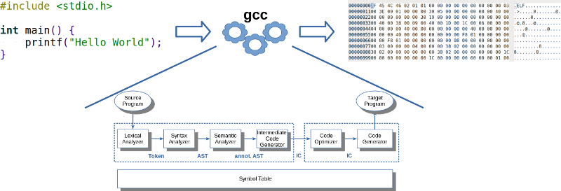

# Syllabus

{width="80%"}

## Kursbeschreibung

Der Compiler ist das wichtigste Werkzeug in der Informatik. In der Königsdisziplin
der Informatik schließt sich der Kreis, hier kommen die unterschiedlichen
Algorithmen und Datenstrukturen und Programmiersprachenkonzepte zur Anwendung.

In diesem Modul geht es um ein grundlegendes Verständnis für die wichtigsten
Konzepte im Compilerbau. Wir schauen uns dazu relevante aktuelle Tools und
Frameworks an und setzen diese bei der Erstellung eines kleinen Compiler-Frontends
für C++ ein.

## Überblick Modulinhalte

1.  Lexikalische Analyse: Scanner/Lexer
    -   Reguläre Sprachen
    -   Generierung mit ANTLR
2.  Syntaxanalyse: Parser
    -   Kontextfreie Grammatiken (CFG)
    -   LL-Parser (Recursive-Descent-Parser)
    -   Generierung mit ANTLR
3.  Semantische Analyse: Symboltabellen, Name-Resolving, Type-Checking
    -   Namen und Scopes
    -   Typen, Klassen, Polymorphie
4.  Interpreter: AST-Traversierung
5.  C++ als zu verarbeitende Programmiersprache

## Team

-   [BC
    George](https://www.hsbi.de/minden/ueber-uns/personenverzeichnis/birgit-christina-george)
-   [Carsten
    Gips](https://www.hsbi.de/minden/ueber-uns/personenverzeichnis/carsten-gips)
    (Sprechstunde nach Vereinbarung)
-   Alesia Herbertz, Vivien Traue, Jonathan Hauer (Tutor:innen)

## Kursformat

| Vorlesung (2 SWS)            | Praktikum (2 SWS)                       |
|:-----------------------------|:----------------------------------------|
| Mo, 15:45 - 17:15 Uhr (Zoom) | G1: Mi, 11:30 - 13:00 Uhr (Zoom)        |
|                              | G2: Mi, 14:00 - 15:30 Uhr (Zoom)        |
|                              | G3: Mi, 11:30 - 13:00 Uhr (Präsenz B40) |
|                              | G4: Mi, 14:00 - 15:30 Uhr (Präsenz B40) |

Durchführung der Vorlesung als *Flipped Classroom* (Carsten) bzw. als *reguläre
Vorlesung* (BC). **Zugangsdaten Zoom siehe
[ILIAS](https://www.hsbi.de/elearning/goto.php/crs/1555855)**.

## Fahrplan

Abgabe der Post Mortems jeweils **Montag bis 09:00 Uhr** im
[ILIAS](https://www.hsbi.de/elearning/goto.php/exc/1582799). Vorstellung der Lösung
im jeweiligen Praktikum in der Abgabewoche.

| Monat    | Woche vom | Vorlesung (Mo)                                                                                                                                                              | Praktikum (Mi)                 | Edmonton/Minden-Meetings                                           |
|:---------|:----------|:----------------------------------------------------------------------------------------------------------------------------------------------------------------------------|:-------------------------------|:-------------------------------------------------------------------|
| Oktober  | 12.10     | [Orga](readme.md) \|\| [Überblick](lecture/00-intro/overview.md) \| [Programmiersprachen](lecture/00-intro/languages.md) \| [Anwendungen](lecture/00-intro/applications.md) | \-                             |                                                                    |
|          | 19.10.    | [Reguläre Sprachen 1](lecture/01-lexing/regular1.md)                                                                                                                        | [B01](homework/sheet01.md)     |                                                                    |
|          | 26.10.    | [Reguläre Sprachen 2](lecture/01-lexing/regular2.md) \|\| [CFG](lecture/02-parsing/cfg.md)                                                                                  | [B02](homework/sheet02.md)     |                                                                    |
| November | 02.11.    | [LL-Parser (Theorie)](lecture/02-parsing/ll-parser.md)                                                                                                                      | \-                             | **Di, 03.11., 17:00 - 18:00 Uhr (online): ANTLR + Live-Coding**    |
|          | 09.11.    | [L-Int (Teil 1)](lecture/02-lint/readme.md)                                                                                                                                 | **Station 1**                  |                                                                    |
|          | 16.11.    | [L-Int (Teil 2)](lecture/02-lint/readme.md)                                                                                                                                 | C-Int                          |                                                                    |
|          | 23.11.    | [L-Expr](lecture/03-lexpr/readme.md)                                                                                                                                        | C-Expr                         |                                                                    |
| Dezember | 30.11.    | [L-Var](lecture/04-lvar/readme.md)                                                                                                                                          | **Station 2**                  | **Mo, 30.11., 17:00 - 18:00 Uhr (online): Minden Presentations**   |
|          | 07.12.    | [L-If](lecture/05-lif/readme.md)                                                                                                                                            | C-Var, C-If                    | **Mo, 07.12., 17:00 - 18:00 Uhr (online): Edmonton Presentations** |
|          | 14.12.    | [L-Fun](lecture/06-lfun/readme.md)                                                                                                                                          | C-Fun                          |                                                                    |
|          | *21.12.*  | **Weihnachtspause**                                                                                                                                                         | \-                             |                                                                    |
|          | *28.12.*  | **Weihnachtspause**                                                                                                                                                         | \-                             |                                                                    |
| Januar   | 04.01.    | [L-Class](lecture/07-lclass/readme.md)                                                                                                                                      | **Station 3**                  |                                                                    |
|          | 11.01.    | [L-Inherit](lecture/08-linherit/readme.md)                                                                                                                                  | C-Class, C-Inherit             |                                                                    |
|          | 18.01.    | [L-Self](lecture/09-lself/readme.md)                                                                                                                                        | C-Self, Snake                  |                                                                    |
|          | 25.01.    | Rückblick                                                                                                                                                                   | **Projektvorstellung** (Video) |                                                                    |

## Prüfungsform, Note und Credits

**(Digitale) Klausur plus Studienleistung (Portfolio)**, 5 ECTS

-   **Studienleistung**: "Portfolio" - Kriterien je Person:

    1.  Teilnahme an mind. zwei Edmonton/Minden-Terminen mit aktiver Beteiligung
    2.  Mind. vier der Übungsblätter B01..B07 erfolgreich bearbeitet
    3.  Abschlussvortrag zum erfolgreich bearbeiteten Mini-Projekt (B08) am
        Semesterende (21.01.) a 15 Minuten (pro Team)

    Je Kriterium: Abgabe eines Post Mortem im ILIAS (**jede Person individuell**)

-   **Gesamtnote**: (Digitale) Klausur im B40 (90 Minuten)

::: {.details title="Hinweise"}
-   Die Bearbeitung der Leistungen erfolgt im Team.
-   Ein Team umfasst 3 Personen.
-   Die Post Mortems sind individuell zu erstellen und abzugeben.
-   "Aktive Beteiligung" umfasst Anwesenheit und sachbezogene Beiträge;
    Anwesenheit/Beteiligung werden dokumentiert.
-   "Erfolgreiche Bearbeitung" eines Blattes umfasst Bearbeitung im Team,
    Bearbeitung aller Aufgaben des Blattes, fristgerechte Abgabe des ausreichenden
    Post Mortems im ILIAS. Die intensive Beschäftigung mit den Aufgaben muss
    erkennbar sein.

\smallskip

-   **Post Mortem**: Jede Person beschreibt individuell(!) die Bearbeitung des
    jeweiligen Kriteriums bzw. die Teilnahme an den Edmonton/Minden-Meetings
    zurückblickend mit mind. 150 bis max. 400 Wörtern (Nutzlast; Überschriften und
    Links zählen nicht mit). Gehen Sie dabei aussagekräftig und nachvollziehbar auf
    folgende Punkte ein:

    1.  Zusammenfassung: Was wurde gemacht bzw. was wurde auf dem Meeting
        besprochen?
    2.  Details: Kurze Beschreibung besonders interessanter Aspekte.
    3.  Reflexion: Was war der schwierigste Teil? Wie haben Sie dieses Problem
        gelöst?
    4.  Reflexion: Was haben Sie gelernt oder (besser) verstanden?
    5.  Team: Mit wem haben Sie zusammengearbeitet?
    6.  Link zu Ihrem Repo mit den relevanten Artefakten (Lösung, Slides für den
        Vortrag, ...).

    Für die Edmonton/Minden-Meetings passen Sie bitte die Punkte (1) bis (4)
    entsprechend inhaltlich an, (5) und (6) entfallen.

    Die Post Mortems geben Sie bitte pro Person bis spätestens zur jeweiligen
    Deadline im [ILIAS](https://www.hsbi.de/elearning/goto.php/exc/1582799) ab.

    Siehe auch
    https://github.com/Compiler-CampusMinden/CB-Vorlesung-Bachelor-W25/discussions/3.
:::

## Materialien

1.  ["**Crafting
    Interpreters**"](https://github.com/munificent/craftinginterpreters). Nystrom,
    R., Genever Benning, 2021. ISBN
    [978-0-9905829-3-9](https://fhb-bielefeld.digibib.net/openurl?isbn=978-0-9905829-3-9).
    [Online](https://www.craftinginterpreters.com/).
2.  ["**Introduction to Compiler
    Design**"](https://doi.org/10.1007/978-3-031-46460-7). Mogensen, T.A., Springer
    International, 2024. ISBN
    [978-3-031-46460-7](https://fhb-bielefeld.digibib.net/openurl?isbn=978-3-031-46460-7).

## Förderungen und Kooperationen

### Kooperation mit University of Alberta, Edmonton (Kanada)

Über das Projekt ["We CAN
virtuOWL"](https://www.uni-bielefeld.de/international/profil/netzwerk/alberta-owl/we-can-virtuowl/)
der Fachhochschule Bielefeld ist im Frühjahr 2021 eine Kooperation mit der
[University of
Alberta](https://www.hsbi.de/en/international-office/alberta-owl-cooperation)
(Edmonton/Alberta, Kanada) im Modul "Compilerbau" gestartet.

Wir freuen uns, auch in diesem Semester wieder drei gemeinsame Sitzungen für beide
Hochschulen anbieten zu können. (Diese Termine werden in englischer Sprache
durchgeführt.)

------------------------------------------------------------------------------------

## LICENSE

Unless otherwise noted, [this
work](https://github.com/Compiler-CampusMinden/CB-Vorlesung-Bachelor) by [BC
George](https://github.com/bcg7), [Carsten Gips](https://github.com/cagix) and
[contributors](https://github.com/Compiler-CampusMinden/CB-Vorlesung-Bachelor/graphs/contributors)
is licensed under [CC BY-SA
4.0](https://github.com/Compiler-CampusMinden/CB-Vorlesung-Bachelor/blob/master/LICENSE.md).
See the
[credits](https://github.com/Compiler-CampusMinden/CB-Vorlesung-Bachelor/blob/master/CREDITS.md)
for a detailed list of contributing projects.
